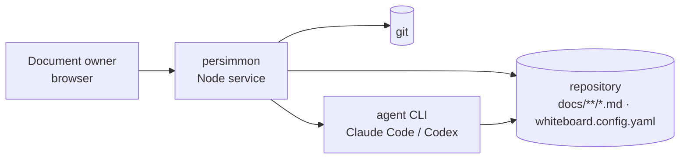
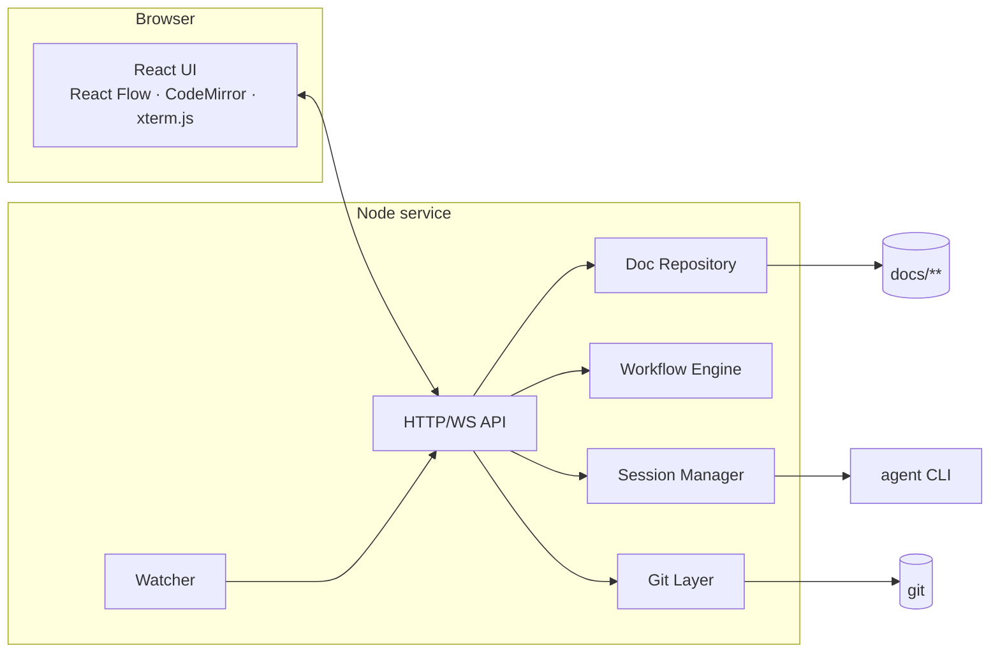

# Architecture Overview

persimmon is a local, single-user Node.js service that renders one repository's `docs/` tree as a board in the browser and drives the docs workflow of [rule-00001](docs/rule/rule-00001-docs-workflow.md) over it: documents are nodes, front matter relations are edges, and every action — review, promote, ask, co-write, annotate — writes back to the Markdown files and commits. Agent CLIs (Claude Code, Codex) run as child processes in embedded terminals or headless. The Markdown files are the only source of truth; the board can be discarded and rebuilt.

## 1. Introduction & Goals

For the single document owner of a repository built on ai-native-project-template, and for the agents that write its docs. Requirements: [prd-00001](docs/prd/prd-00001-docs-whiteboard.md), [prd-00002](docs/prd/prd-00002-doc-annotations.md), and the specs under [docs/spec/](docs/spec/README.md).

1. **Files stay the truth** — no state the board cannot rebuild from `docs/`, `whiteboard.config.yaml`, and git.
2. **Rules are enforced by the tool, not remembered by people** — status transitions, relation shapes, and gates are refused, not warned about.
3. **Human reviews, agent executes** — every agent write is bounded to declared paths and committed with provenance.

## 2. Constraints

| Constraint | Source |
| --- | --- |
| Single user, `localhost` only; one process serves many workspaces | [spec-00011](docs/spec/spec-00011-multi-workspace.md) |
| Behaviour is driven by `whiteboard.config.yaml`; a missing or invalid config makes that workspace unavailable, there is no built-in default | spec-00011-FR-6 |
| Node.js ≥ 23.6 (TypeScript type stripping; `node-pty` native module) | `package.json` |
| Every write goes through git; the working tree must be a git repository | [design-00001](docs/design/design-00001-docs-whiteboard.md) §6 |

## 3. Context & Scope



| Neighbor | Direction | Purpose |
| --- | --- | --- |
| Browser | in | The board UI: canvas, editor, terminals, panels |
| Repository files | in/out | Documents read and rewritten; flow config read at startup |
| git | out | Stage declared paths, commit, read history and diffs |
| Agent CLIs | out | Child processes per session (PTY or headless) that write documents |

## 4. Solution Strategy

- One Node process serves the built React UI and an HTTP/WebSocket API; no database — [design-00001](docs/design/design-00001-docs-whiteboard.md) §1.
- Markdown is the DSL: one grammar, validated in three places, no second source of truth — [decision-00005](docs/decision/decision-00005-whiteboard-parsing-contract.md).
- Layout is type-columned, not graph-derived — [decision-00002](docs/decision/decision-00002-whiteboard-layout.md).
- Agent work is a session with a pre-session snapshot; the commit is the diff against it — design-00001 §5–§6.
- Two agent config layers: project layer in `whiteboard.config.yaml`, local layer in `.whiteboard/agents.json` — [decision-00017](docs/decision/decision-00017-whiteboard-agent-settings.md).
- The board lives in its own repository and serves any template project — [decision-00019](docs/decision/decision-00019-whiteboard-standalone-repo.md).

## 5. Building Block View

```
persimmon/
├── docs/                    # this project's own docs, rendered by this board
├── whiteboard.config.yaml   # flow config this repo's board reads (rule-00001 carrier)
├── .whiteboard/             # local state: sessions, asks, annotations, agents.json (git-ignored)
├── bin/persimmon.js         # entry: find repo root, load config, start Board
├── src/                     # server: config, docRepository, docService, workflow, requirements,
│                            #   sessionManager, headless, cowrite, annotations, askStore, gitLayer,
│                            #   watcher, server (HTTP/WS API)
├── web/src/                 # React UI: Board canvas, Inspector, Editor, Terminal, Sidebar, panels
├── test/, web/test/         # vitest suites
└── dist/web/                # built UI served by `npm start`
```



Component internals: [design-00001](docs/design/design-00001-docs-whiteboard.md) (service), [design-00002](docs/design/design-00002-whiteboard-ui.md) (UI).

## 6. Runtime View

| Scenario | Design |
| --- | --- |
| Advance a document to its next stage | design-00001 §4 |
| Agent session lifecycle, snapshot and commit | design-00001 §5–§6 |
| Headless ask thread | design-00001 §10 |
| Co-write session | design-00001 §11 |
| Annotation batch: question / issue | design-00001 §12 |
| External edit → watcher → board refresh | design-00001 §2 |

## 7. Deployment View

Local only. `npm run build` once, then `npm start` from anywhere inside a repository that has `whiteboard.config.yaml`. No CI pipeline yet; the quality gates in [CODE_QUALITY.md](CODE_QUALITY.md) run locally.

## 8. Crosscutting Concepts

Security: [SECURITY.md](SECURITY.md). Style: [CODE_STYLE.md](CODE_STYLE.md). Quality gates: [CODE_QUALITY.md](CODE_QUALITY.md). Testing: [TESTING.md](TESTING.md), [UNIT_TESTING.md](UNIT_TESTING.md). Business invariants of the docs flow: [rule-00001](docs/rule/rule-00001-docs-workflow.md). Vocabulary: [CONTEXT.md](CONTEXT.md).

## 9. Architecture Decisions

| Decision | Outcome |
| --- | --- |
| [decision-00001](docs/decision/decision-00001-whiteboard-ui-stack.md) | Tailwind CSS + shadcn/ui + Lucide for the UI |
| [decision-00002](docs/decision/decision-00002-whiteboard-layout.md) | Type-columned layout; ELK dropped |
| [decision-00003](docs/decision/decision-00003-whiteboard-edge-emphasis.md) | Edge readability by focus and lists, not routing |
| [decision-00004](docs/decision/decision-00004-whiteboard-requirement-panel.md) | Requirement items read in the inspector and sub-canvas |
| [decision-00005](docs/decision/decision-00005-whiteboard-parsing-contract.md) | Markdown is the DSL; one grammar, validated in three places |
| [decision-00006](docs/decision/decision-00006-whiteboard-ask-clarify.md) | Clarify as agent-led questioning; ask added |
| [decision-00007](docs/decision/decision-00007-whiteboard-audit-and-resolved-gate.md) | Audit as third review action; `resolved` gated by acceptance coverage |
| [decision-00008](docs/decision/decision-00008-whiteboard-revision-create-and-session-reach.md) | Revision returns to draft; entry types can be created; session history |
| [decision-00009](docs/decision/decision-00009-whiteboard-parallel-sessions.md) | Parallel sessions |
| [decision-00010](docs/decision/decision-00010-whiteboard-desktop-notifications.md) | Page-level Notification API, only when away |
| [decision-00011](docs/decision/decision-00011-whiteboard-explicit-waiting-signal.md) | Explicit waiting signal (OSC 777 latch) |
| [decision-00012](docs/decision/decision-00012-whiteboard-ask-threads.md) | Ask goes headless; terminal ask retired |
| [decision-00013](docs/decision/decision-00013-rule-notation-not-dmn.md) | Rule notation stays Markdown; no DMN |
| [decision-00014](docs/decision/decision-00014-entry-type-birth-paths.md) | Six more entry types can be created directly |
| [decision-00015](docs/decision/decision-00015-whiteboard-co-write.md) | Co-write as the fifth session kind |
| [decision-00016](docs/decision/decision-00016-whiteboard-navigation-sidebar.md) | Navigation sidebar and minimap |
| [decision-00017](docs/decision/decision-00017-whiteboard-agent-settings.md) | Two-layer agent settings |
| [decision-00018](docs/decision/decision-00018-whiteboard-directory-groups-and-exclude.md) | Config `exclude` and directory groups |
| [decision-00019](docs/decision/decision-00019-whiteboard-standalone-repo.md) | The board is its own repository; multi-workspace is the next direction |

## 10. Quality Requirements

| Quality | Scenario | Target |
| --- | --- | --- |
| Correctness of writes | Any board action on a doc | The resulting file re-parses to the same model; only declared paths are staged (spec-00001) |
| Test coverage | Any code change | Lines, branches, functions ≥ 90% over `src/` and `web/src/` (TESTING.md) |
| Responsiveness at scale | A repo with hundreds of docs and sub-directories | Directory groups and `exclude` keep the first screen readable (spec-00010) |

## 11. Risks & Technical Debt

| Item | Impact | Mitigation |
| --- | --- | --- |
| No format / complexity gate yet | Style drift is caught only in review | Listed as open in CODE_QUALITY.md §2 |

## 12. Glossary

See `CONTEXT.md`.
