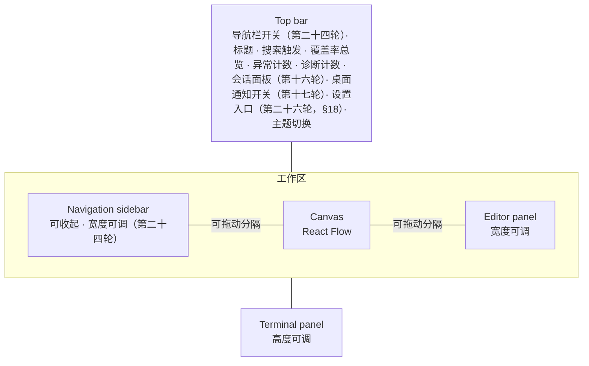
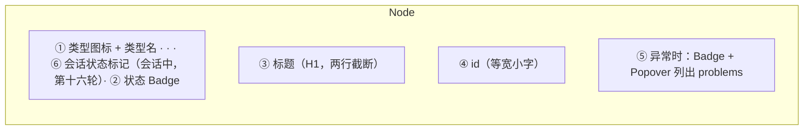
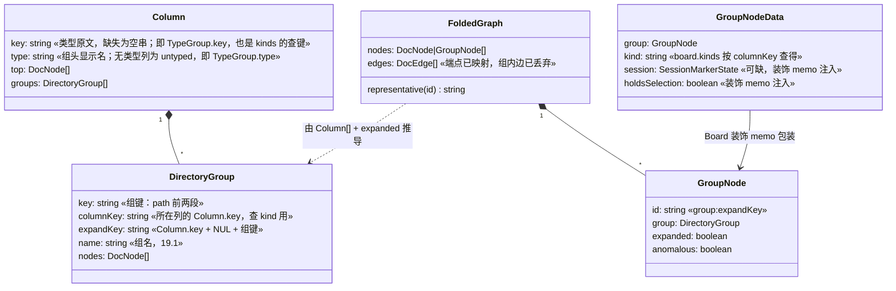

# Design: Docs 白板界面

> 白板界面的结构：设计令牌、布局、控件清单与图标语言。技术基座由
> [decision-00001-whiteboard-ui-stack](../decision/decision-00001-whiteboard-ui-stack.md)
> 定下（Tailwind 4 + shadcn/ui + Lucide）。

本文只管界面。数据模型、API、会话与 git 由
[design-00001-docs-whiteboard](design-00001-docs-whiteboard.md) 持有。两处触及
它：节点种类的下发方式（§4），以及画布布局——布局选型属 design-00001 §1，其
规则由 [decision-00002-whiteboard-layout](../decision/decision-00002-whiteboard-layout.md)
持有，本文 §2 只画出它的样子、§4 只定锚点与边的呈现。

**本文取代 design-00001 §7 末段的「前端 Graph View 职责补充」**（着色与搜索/
定位）——那一段与本文 §2、§4 是同一主题，两份活文档不能同时持有；其中的搜索/
定位已由 `spec-00001-FR-26`、`FR-27` 承接，不再是非功能项。本文进入 `active`
时，design-00001 该段替换为指向本文的一行指针，`spec-00001` §5 的 Technical
Design 表与 Links 同时补上本文。除 §8 裁定引入的 FR-26/FR-27 及其 AC 与 §7
非功能项外，在此之前不改动那两份 `active` 文档。

## 1. 设计令牌

单一来源是 `web/src/style.css`（Tailwind 4 的 CSS-first 配置；若按 Tailwind 约定
更名为 `index.css`，`main.tsx` 的导入同步更新）。`:root` 与 `.dark` 各一套变量，
shadcn/ui 的组件读的就是这套，因此改主题只改一处。

除 shadcn 的基础语义色（`--background`、`--foreground`、`--primary`、
`--destructive`、`--muted`、`--border`、`--ring`）外，白板另立两组领域令牌：

| 令牌组 | 成员 | 用途 |
| --- | --- | --- |
| `--status-*` | `draft` `active` `open` `resolved` `wontfix` `archived` | 文档状态，每个状态一组前景/背景对 |
| `--kind-*` | `living` `work` | 文档种类，用于节点的类型标记 |
| `--coverage-*` | `verified` `failing` `uncovered` | 需求条目的覆盖状态（§9），每态一组前景/背景对；不复用 `--status-*`——覆盖与文档状态是两套词汇 |
| `--group-node` | 单值 | 目录组节点的卡片背景与缩略块（第二十七轮，§19.5）；组没有 status，不借状态色 |

异常态不进 `--status-*`：它不是一个状态值，取 `--destructive`。`status.ts` 现有的
硬编码十六进制（6 个状态色 + `ANOMALY_COLOUR`）随之退场，`statusColour()` 改为
返回令牌引用（`var(--status-*)`）而非字面色值——它喂进 inline style，因此仍是
色值位置上的表达式，只是随主题变；`statusLabel()` 不变。

**主题三态的机制**（浅色 / 深色 / 跟随系统）：

- Tailwind 4 的 `dark:` 变体默认走 `prefers-color-scheme`，而本设计需要 class
  策略，因此显式声明 `@custom-variant dark (&:where(.dark, .dark *))`。
- localStorage 存三态之一；`light`/`dark` 直接决定 `.dark` 类的有无。
- `system` 态下监听 `matchMedia('(prefers-color-scheme: dark)')` 的变化事件增删
  `.dark`，页面加载时先同步一次。
- 主题偏好是纯呈现状态，不进 `docs/`，也不构成对「文件是唯一事实来源」的例外。

## 2. 布局

常驻区域（自上而下、自左而右）：



浮于其上的五者不占布局：**浮窗工具栏**贴选中节点悬浮于画布；**命令面板**是
覆盖全屏的对话框；**提示条**堆叠在画布一角；**缩略图**贴画布右下角（第二十四
轮，§17）；**设置面板**是覆盖全屏的对话框（第二十六轮，§18）。左侧的**导航栏**是工作区行内、画布与右槽之外的第三个区域（第二十四
轮，§17）：与右槽三态和终端面板互不占位、不参与右槽互斥，可收起。（澄清对话框第八轮废弃——澄清
改为发起会话，见 decision-00006。）

与当前实现的结构差异，以及每项的代价：

- **编辑器面板到右侧、终端面板留在底部**，两者各自可调、互不占位。依据是内容
  形状不同：文档是竖排长文，编辑与预览在窄而高的区域里更可读；终端输出是宽行
  （框线、表格、diff、长路径），在右侧面板里会折行到不可读，而底部放得下。
  （量级估算：1400px 视窗、12px 等宽字号下，右侧面板约 480px ≈ 55 列，底部
  约 180 列。默认宽度与字号落地时定，此处只作定性依据。）
  代价有两处：两种面板形态都要实现，而不是共用一个容器；**面板状态模型也要改**
  ——现实现的 `Panel` 是 `none | editor | terminal` 三选一，编辑器与终端不能同时
  在场，而本设计要求两者并存，须改为两个独立轴：**右槽**（无 / 编辑器 / 检视
  面板，三值——检视面板系第四轮引入，占用规则见 §9）与**终端**（开 / 关）。
  （本段初版写的是「两个独立开关」，§9 引入检视面板后右槽变为三值，已随之修订。）
  两者的尺寸都由 `react-resizable-panels` 持有。落地实测的结果与原设想不同：
  v4 **没有** `autoSaveId`，持久化走 `useDefaultLayout({ id, panelIds })`——它
  返回喂给 `Group` 的 `defaultLayout` 与 `onLayoutChanged`，默认落 localStorage。
- 动作被拒与失败的信息从画布下方的红条改为**提示条（toast）**：它是对某次动作
  的反馈，不该占据布局、压缩画布。
- 「找文档」从顶栏常驻输入框改为**命令面板**（⌘K / Ctrl-K），承载 spec-00001
  FR-26 与 FR-27 的检索与跳转。**代价是可发现性净损失**：搜索入口从常驻输入框
  退为一次点击或一个快捷键；补偿是顶栏保留触发按钮，让快捷键可被看见。

**画布内部**是一张类型分列的网格。**规则本身由
`decision-00002-whiteboard-layout` §2 持有**，此处不复述，只画出它的样子——
下面是本设计落地时本仓文档的一次快照（17 份、用到 9 个类型），不是活的清单：

```
        idea         prd          spec         rule       decision       design        plan        issue       record
row0   idea-00001  prd-00001   spec-00001  rule-00001  decision-00001  design-00001  plan-00001  issue-00001  record-00001
row1                                                   decision-00002  design-00002  plan-00002  issue-00002  record-00002
row2                                                                                 plan-00003  issue-00003
row3                                                                                             issue-00004
```

读法：横向是阶段，纵向是同一类型内的序号。图宽等于**实际用到的类型数**（此处 9）
而非配置里声明的 16——没有文档的类型不占列。（第二十七轮：列内在顶层文档之后
接目录组，每组折叠时占一行，§19.1。）

这套规则是同步纯函数，不需要布局引擎；它换掉的 ELK 与所接受的代价（无交叉
最小化、纵向无界、列序由 YAML 声明顺序承载）见 decision-00002 §4。

**布局与配置的到位次序**：列序来自 `GET /api/config`，而当前 `useBoard` 是
把它与 `GET /api/graph` 各自独立地取的（`web/src/useBoard.ts:63-66`），首屏
因此可能没有列序。本设计要求**两者都到位后才落位**，而不是先按无序布局画一遍
再重排——后者会让节点在首屏跳一次，直接违背 decision-00002「位置可预期」的立论。

## 3. 控件映射

| 界面位置 | 现在 | 改为 | 图标（Lucide） |
| --- | --- | --- | --- |
| 顶栏标题 | 纯文本 | 文本 + 图标 | `LayoutDashboard` |
| 找文档 | 裸 `<input>` | `Command` + `Dialog`（⌘K），顶栏留触发按钮 | `Search` |
| 异常计数 | 纯文本 | `Badge`；为 0 时保持现有的 `no issues` 文案，>0 时 destructive 变体。**治理轮（spec-00002）起 >0 时它同时是入口**：`Badge asChild` 包一个真 `Button`，点击开异常清单（下一行） | `TriangleAlert` |
| 异常清单 | 无 | 与命令面板同一承载形态的全屏 `Dialog`，Esc 与关闭控件各自可关；逐条列出「来源 · problem 文本」。**来源始终显示文件路径，旁边的 id 分三种情形**（design-00001 §7）：`nodeId !== path` 显示 `nodeId`；`nodeId === path` 且节点带 `duplicateOf` 显示 `duplicateOf`（撞 id 节点的键就是路径，那个撞的 id 正是异常内容，不显示则两条只剩一样的路径）；两者皆非则只有路径。边的异常归**声明方**，点击一条即关闭清单并在顶层白板定位并选中其 `nodeId` 节点（`spec-00002-FR-13`/`FR-15`）。计数为 0 时按上一行保持 `no issues` 文案且不可点击（`AC-13.2`） | `TriangleAlert` |
| 诊断计数 | §9 的 outline `Badge` | 同上改为 `Badge asChild` + `Button`，点击开诊断清单（下一行）。**为 0 时的「现状」是不渲染**（§9、`spec-00001-AC-40.5`），故零态没有可点的东西，`AC-14.2` 由此满足 | `FileWarning` |
| 诊断清单 | 无 | 同一形态的全屏 `Dialog`；逐条列出「来源文档 id · 类别 · **诊断详情**（截断）」，类别含治理轮新增的 `relation-field`。**第三列按类别取不同内容**：文法类诊断取**原文行**，`relation-field` 取**字段名与该类型**——它来自 front matter，没有正文行号也没有正文原文行可取（design-00001 §2），故该列写作「诊断详情」而不是「原文行」，行号列对它留空而不是显示占位。点击一条即关闭清单并定位选中该 `docId` 节点（`spec-00002-FR-14`/`FR-15`）。与异常清单**各自独立、内容不混**——一份文档既是异常节点又带诊断时，两份清单各列各的（`AC-14.3`） | `FileWarning` |
| 覆盖率总览 | 无 | 顶栏 `Button` 开**全局覆盖率视图**：与命令面板同一承载形态的全屏 `Dialog`（Esc 与关闭控件各自可关，**不占用右侧槽位**，编辑器/终端/子画布/会话运行中一律可开——`spec-00002-FR-10`、`AC-10.5`…`AC-10.8`）。按文档一行，每行「类型图标 · 文档 id · 标题 · 已验证/未通过/未覆盖三个计数」，计数复用 §9 的三个覆盖图标与令牌；单击行内展开，逐条列出条目 id 与覆盖状态，**同一时刻至多一行展开**（展开 B 即收起 A，再次点击收起，与 `FR-38` 同构），展开态**按文档 id 跨刷新保持**（并入 §10 的呈现状态族，`AC-11.5`）；无条目的文档展开为空态，仓库无可列文档时整个视图为空态。点击某个条目即**关闭视图**、在顶层白板定位并选中其所属文档节点，检视面板按 §9 的既有右槽规则出现（编辑器占槽时不出现，定位与选中照常，`AC-12.1`/`AC-12.2`）。**视图打开期间随刷新更新**（裁定，design-00001 §6）：同一条刷新通路一并重取 `GET /api/coverage`，行重新推导、计数当场更新（`AC-10.4`），一份已被删除的文档**整行消失**（就近关闭用在视图行上，并入 §10 的族），展开态按文档 id 保持（`AC-11.5`）；视图未打开时**不取**。点击落到一份磁盘上已不存在的文档时——即推送尚未到达视图、或点击与刷新同刻的**竞态窗口**——沿用既有的选中失败通路，以 `toast.error` 拒绝、当前选中不变（`AC-12.5`） | `Gauge` |
| 主题切换 | 无 | `DropdownMenu`（浅色/深色/跟随系统） | `Sun` `Moon` `Monitor` |
| 节点 | 手写 div | shadcn `Card` 承载 + `Badge` | 见 §4 |
| 浮窗工具栏 | 浮动 div + 原生控件 | `Card` 容器 + `Tooltip` 包裹的 `Button` | 见下 |
| 状态切换 | `<select>` | `DropdownMenu`，逐项列出合法目标状态（第二十二轮增共写运行期禁用，语义以 §15 为准） | `GitBranch` |
| 接收 | `<button>` | `Button`（default 变体）（第二十二轮增共写运行期禁用，语义以 §15 为准） | `Check` |
| 澄清 | 工具栏内联 textarea | `Button`，点击即发起澄清会话（终端内逐题提问；第八轮由 decision-00006 改写，原 `Dialog` + `Textarea` 废弃）；仅可澄清类型的节点呈现 | `MessageCircleQuestionMark` |
| 答疑 | 无 | `Button`（ghost 变体），点击打开问题输入（headless 只读答疑，`spec-00005`；第二十一轮改写，语义以 §14 为准——原「发起终端会话」废止） | `CircleHelp` |
| 审计 | 无 | `Button`（outline 变体），点击即发起审计会话（终端内对照 README 审查，`spec-00001-FR-50`，第十轮）；仅 `draft` 的可审计类型（spec/rule/design）节点呈现（`spec-00001-FR-51`）；因并发约束禁用时同澄清/答疑（见「发起入口禁用说明」行） | `ShieldCheck` |
| 终止会话 | 无 | 终端面板头部 `Button`（destructive 变体），仅**当前呈现的会话** running 时可用，作用于当前呈现的会话、逐会话判定（`spec-00001-FR-49`，issue-00010；第十六轮改多会话语义，`spec-00003-FR-5`） | `Square` |
| 发起入口禁用说明 | 无 | 推进/澄清/答疑/审计因并发约束禁用期间，悬停/聚焦呈现 `Tooltip`——**两种原因文案**：同文档互斥（该文档已有会话）或已达上限（`spec-00003-FR-2`/`FR-3`，第十六轮取代单一「session running」）；与「no next step」并存时后者优先（它不随会话结束消失，`spec-00001-AC-49.5`）。**标注的统一提交入口不在本行的枚举内**——它不随同文档互斥或总并发上限整体禁用，拒绝在提交时逐通路判定（第二十三轮，语义以 §16.5 为准） | — |
| resolved 门拒绝 | 无 | `toast.error` 呈现「N 个条目未验证」计数 + 缺口 id 列表（过长时截断并保留计数；`spec-00001-FR-52` 的逐条点名由 API 的 `gaps` 承载，toast 是它的呈现）。注意检视面板的覆盖取全部 record 口径，与门的证据集不同，不可互替（第十轮） | `TriangleAlert` |
| 会话面板入口 | 原「顶栏会话入口」（条件呈现的重开按钮） | 顶栏**常驻** `Button` + `Badge`：呈现「运行中数/上限」，有等待输入会话时另呈等待计数徽标（零态不渲染，沿诊断计数口径）；点击开会话面板（下一行）。原条件入口废止，终止可达性由本入口承接（`spec-00001-AC-49.8`、`spec-00003-FR-4`/`FR-6`，第十六轮） | `Terminal` |
| 会话面板 | 无 | 与命令面板同一承载形态的全屏 `Dialog`：逐会话一行「种类图标 · 目标文档 id · agent（配置多于一条时）· 状态 · 发起时间」，运行中在前、已结束（exited/failed/terminated 分别标明）在后；点击一行关闭面板、终端呈现该会话，目标在图上则定位并选中其节点，不在则仅呈现终端 + toast 提示、选中不变（`spec-00003-FR-4`）；无会话时空态文案，入口仍可开 | `Terminal` |
| 节点会话标记 | 无 | 目标文档节点 `Card` 上的 `Badge`：运行中与等待输入以**不同图标**区分（非颜色可辨）；激活（单击/Enter）即在终端呈现该会话，不触发节点选中语义；会话结束随刷新消失；只作用呈现层（`spec-00003-FR-10`） | `Terminal` `Keyboard` |
| 会话结束通知 | 无 | `Sonner` 提示条：每会话结束（自然退出/终止/启动失败）各一条，含种类、文档 id 与结束态，逐条堆叠不合并（`spec-00003-FR-7`） | `Terminal` |
| 桌面通知开关 | 无 | 顶栏 `Button` + **三态呈现**（关闭 / 未生效 / 生效，非颜色可辨）：开启时按 `spec-00004-FR-1` 走权限流程（已授予则静默生效、拒绝则回落关闭并 `toast` 提示到浏览器设置），关闭立即安静；开关布尔持久于浏览器本地，三态推导见 §13（第十七轮） | `Bell` `BellOff` |
| 新建 | 无 | 顶栏 `Button` + `Dialog`：类型只列流程配置 `entry` 声明者、slug 输入框；确认后编辑器以模板预填打开，保存即建档（`spec-00001-FR-53`，第十一轮）；`entry` 缺失或为空时按钮不呈现（第二十二轮增模式选择与材料区，语义以 §15 为准） | `FilePlus` |
| 会话历史 | 无 | 顶栏 `Button` 开历史列表（种类、文档 id、agent、起止、退出状态），点击一条查看转写全文（只读，`spec-00001-FR-54`，第十一轮） | `History` |
| agent 选择 | 无 | 配置多于一条 agent 时，发起会话的入口旁呈现 `DropdownMenu` 选择（缺省第一条）；仅一条时不呈现（`spec-00001-FR-55`，第十一轮；第二十三轮统一提交的确认对话框**逐通路各呈现一处**——question 通路只列已声明 headless 者、共写通路列全集，各自缺省各的第一条，语义以 §16.5 为准） | `Bot` |
| 推进 | `<select>` | `DropdownMenu`，逐项列出下一步类型；**无候选时按钮 disabled，并在 `Tooltip` 与菜单内呈现「no next step」**（spec-00001-AC-10.3） | `Plus` |
| 编辑 | `<button>` | `Button`（ghost 变体） | `Pencil` |
| 关系列表 | 无 | `Popover` + 按关系字段分组的列表，每项一行「字段名 · 方向 · 对端 id」，点击即定位并选中对端（`spec-00001-FR-30`）；无关系时呈现「no relations」 | `Waypoints` |
| 编辑/预览切换 | 两态按钮 | `Tabs`（Source / Preview）（第二十三轮扩为四态——编辑 / 预览 / 问题列表 / 标注列表，语义以 §14 与 §16 为准） | `Code` `Eye` |
| 保存 | `<button>` | `Button`，保存中为 disabled + spinner | `Save` `Loader` |
| 关闭面板 | `<button>` | `Button`（ghost, icon） | `X` |
| 动作被拒 / 冲突 | 面板内纯文本 / 画布下红条 | `Sonner` 提示条，错误态（`toast.error`）。第二十三轮增一种用法：统一提交的**整批拒绝（4xx）**取一条提示条，而**部分拦下（200）**取一条汇总提示条 + 逐条原因留在标注列表行内——逐条不弹，语义以 §16.5 为准 | `TriangleAlert` |
| 编辑器面板 | 底部固定 45vh | 右侧 `ResizablePanel`，宽度可调并持久化 | — |
| 终端面板 | 底部固定 45vh | 底部 `ResizablePanel` + `Card` 头 + 会话状态 `Badge`（running / awaiting（由载荷 status=running 且 awaiting=true 派生，非独立状态）/ exited / failed / terminated——词汇同 design-00001 §7 的会话载荷）；头部含当前会话的种类与目标文档 id，一次呈现一个会话、经会话面板切换（`spec-00003-FR-5`，第十六轮）；高度可调 | `Terminal` |
| 空画布 | 空白 | 空状态：图标 + 一句说明 | `FileQuestionMark` |
| 检视面板 | 无 | 右侧 `ResizablePanel`，选中 spec/rule 节点时可见，与编辑器互斥占用右槽（§9）；条目行含 id、正文、AC 计数与覆盖图标（`spec-00001-FR-31`…`FR-33`） | `PanelRight` `CircleCheck` `CircleX` `CircleDashed` |
| 子画布面包屑 | 无 | shadcn `Breadcrumb`，仅子画布中出现，「Board」项可点返回（`spec-00001-FR-35`/`FR-36`） | `ChevronRight` |

**异常节点的工具栏只保留「编辑」与「关系列表」两项**（spec-00001-AC-2.4，本轮
随 FR-30 修订）：前者用于修复 front matter，后者用于读出断链指向了谁——两者都不
改动任何文档。状态切换、评审、推进仍不渲染。上表描述的是正常节点的完整形态。

**上表标「治理轮」的各行、以及本节以下各段中不带前缀的 `AC-n.m`，一律指
`spec-00002`**——低号 AC 在 `spec-00001` 里另有其人（如 `AC-12.7` 是终端尺寸），
凡指后者处均写全前缀。

**治理轮（spec-00002）的三处下钻共用一个承载形态**：全屏 `Dialog`，与命令面板
同一个（`FR-10` 明写「与命令面板同一承载形态」，另两处 `FR-13`/`FR-14` 说「同一
形态」）。理由与代价都只有一句：三者都是**全局的、读完就走**的清单，右侧槽位已被
编辑器与检视面板占满，再挤第三种停靠就要第三条互斥规则；代价是同一时刻只能开一
份清单，且清单开着时看不见画布——可接受，因为点一条即关闭并跳到节点，本来就不是
并排比对的用法。**图标语言不新增词汇**：两个计数各自沿用它已有的图标
（`TriangleAlert` / `FileWarning`），点开的清单就是那个计数的展开，用同一个图标是
正确的指认；只有覆盖率总览需要一个新图标，取 `Gauge`——它在现有图标表里未被占用，
且与三个覆盖态图标（`CircleCheck`/`CircleX`/`CircleDashed`）不同形，不会在同一行
里读成第四个状态。不取 `ListChecks`/`ChartLine` 是因为它们已是 `plan`/`analysis`
的类型图标（§4）。

**用下拉菜单而不是 `<select>`**：状态切换与推进都是「执行一个动作」，不是「选定
一个值」——现有实现要把 `<select>` 的 value 强行复位成空串才能重复触发同一动作，
这是语义错配的症状。`DropdownMenu` 的每一项是一个动作项，语义对上了。

## 4. 节点

一个节点承载四件事，按信息层级排布（以 shadcn `Card` 组件作为实现载体；
第十六轮为会话中的节点加第六槽）：



⑥ 只在该文档有运行中会话时呈现，位于状态 Badge 之前（同一行、不同区），
图标与激活语义见 §3「节点会话标记」行与 §12；多会话口径与仅答疑时的
激活分支见 §14（第二十一轮）。

- **类型图标**：每个文档类型一个 Lucide 图标 —— `idea: Lightbulb`、
  `prd: Target`、`spec: FileText`、`rule: Scale`、`design: DraftingCompass`、
  `decision: Gavel`、`plan: ListChecks`、`task: SquareCheck`、`issue: Bug`、
  `record: ClipboardCheck`、`analysis: ChartLine`、`integration: Plug`、
  `reference: BookMarked`、`operation: Wrench`、`prompt: MessageSquare`、
  `report: FileChartColumn`。配置里出现而此处未列的类型回落到 `File`。
  （以上标识符已对 lucide 上游逐个核实；落地时按所装 `lucide-react` 版本复验。）
- **种类描边**：living 与 work 用 `--kind-*` 区分。**种类当前不经 API 下发**——
  `DocNode` 没有 `kind` 字段，它只存在于流程配置。两条路径二选一：给 `DocNode`
  增加 `kind`（则 design-00001 §7 的 `GET /api/graph` 契约需同步修订），或前端读
  `GET /api/config` 自行由 `type` 映射。**已裁定取后者**并落地：`useBoard` 拉
  `GET /api/config` 得到 `types`，节点按 `type` 查其 kind；`GET /api/graph` 的
  契约不变。
- **状态 Badge**：保持现有的「颜色 + 状态词」（`statusLabel()` 已渲染状态词），
  令牌化后颜色可随主题变，不靠颜色单独传达。
- **异常节点**：描边转 `--destructive`，节点面只留一个 `TriangleAlert` Badge，
  problems 列表进 `Popover`（不是 `Tooltip`：tooltip 内容对键盘与触摸用户不可达，
  而可访问性正是采用本基座的理由）。现在的实现把 problems 直接铺在节点上，长
  文本会撑破布局。
- **撞 id 的节点（治理轮，spec-00002-FR-8；本条内 `AC-n.m` 均指
  `spec-00002`）**：它是**异常节点的一个种类**，不是
  第四种呈现——描边、`TriangleAlert` Badge 与 problems `Popover` 全部照上一条，
  problems 里点名其余同 id 文件的路径。唯一的差别在第 ④ 行：节点键是**文件路径**
  而不是 id，故 ④ 行呈现**路径**，并在其后并列那个撞的 id（取 `duplicateOf`，
  design-00001 §2/§7），两者都要在，缺路径就分不清是哪一份、缺 id 就看不出撞的是
  什么（`AC-8.1`）。工具栏同异常节点，只留「编辑」与「关系列表」——编辑寻址的是
  该节点自己的路径，这就是修复通路（`FR-9` b、`AC-9.4`）。
  **命令面板的匹配面因此加一个字段**：`matchDocuments` 今天匹配 id 与标题，
  治理轮起再匹配 `duplicateOf`——键即路径，输入路径片段只命中该一份
  （`AC-8.5`）；输入那个撞的 id 则两份都命中，各自可分别定位（`AC-8.4`）。
- **选中态**：`--ring` 描边，与 React Flow 自身的选中样式统一。
- **组节点（第二十七轮，§19.2）**：目录组折叠时在列内占一个节点位的第二种
  节点形态——组名、计数、聚合的异常与会话标记；不进 `selected`、无工具栏，
  点击即展开或折叠。它不改本节文档节点的四槽层级。

**边有三个呈现态**，各有一个类名——`spec-00001-AC-28.x`/`AC-29.x` 的断言落在
类名上，不落在「更淡」这种无法观察的比较级上（承载 `spec-00001-FR-28`/`FR-29`，
取舍见 `decision-00003-whiteboard-edge-emphasis`）：

| 态 | 类名 | 何时 | 样式 |
| --- | --- | --- | --- |
| 弱化 | `edge--dim` | 未选中任何节点时的全部边 | `--muted-foreground`，`opacity: .28`，1px，**无标签**，位于节点之下 |
| 强调 | `edge--emphasis` | 与当前选中节点相连的边 | `--foreground`，`opacity: 1`，2px，**显示关系字段名**，`zIndex` 抬到节点之上 |
| 压弱 | `edge--suppressed` | 选中某节点时，与它无关的边 | 同弱化色，`opacity: .08`，仍无标签 |

节点同样有一个压弱态 `node--suppressed`（`opacity: .4`）：选中时与选中项无关的
节点用它。**这三个不透明度是起点，不是承诺**——落地后按真实图看一眼再定，改动
不需要回到本文档以外的任何地方。

`zIndex` 能把边抬到节点之上，已实测确认：`@xyflow/react/dist/style.css` 中
`.react-flow__edges svg` 是 `position: absolute`，故其 `z-index` 对节点层有效。

`ok: false` 的边在三态下都保持 destructive 虚线——异常不因为没被选中而消失；
异常与强调可以叠加（`spec-00001-AC-29.8`）。

边沿用 React Flow 的默认边型。另有三条规则：

- **箭头指向被引用的那份文档**。边的方向就是 front matter 的声明方向——`prd`
  写 `parent: idea`，箭头就落在 `idea` 一端。不做任何反推：`docs/README.md`
  规定每条边只在依赖方声明一次，画成别的方向就是在图上改写声明。已由产品负责人
  裁定采用此方向。
  **一条边在图上朝左还是朝右，取决于两端类型的列位，而不取决于关系字段名**：
  同一个字段两次出现可以指向相反的方向（`rule informs spec` 朝左，
  `design informs plan` 朝右）。因此不存在「某几个字段一律朝左」的规律，图上
  两个方向都会出现。**落地实测**（本仓 17 份文档、34 条边）：26 条朝左、8 条
  朝右、0 条同列。朝左占多数，但那是这批文档的类型分布所致，不是字段名的规律。
- **节点必须自带锚点**：四个方位（上/下/左/右）各一对 source/target，共 8 个。
  自定义节点接管渲染就接管了连接契约，缺锚点的节点会让 React Flow 丢弃它的
  每一条边——这正是 `issue-00002` 的根因。取 8 个而不是 4 个是为了不依赖
  `connectionMode="loose"` 的回退语义（Loose 只让 target 侧回退到 source 锚点，
  source 侧仍要求 `type="source"`），从而避免为此改动 `<ReactFlow>` 的全局 prop。
- **锚点不可见，但必须仍被布局与测量**。`display: none` 会让 React Flow 量不到
  锚点位置，等于重新制造 `issue-00002`；隐藏只能用不影响盒模型的方式
  （如 `opacity: 0`）。
- **手工连线必须显式关闭，且要关在锚点上**。React Flow 的 `nodesConnectable`
  默认为 `true`，所以锚点一旦落地，每个节点就多出四处可拖拽连线的交互——而白板
  的边只能来自 front matter。本条的写法被落地实测**推翻了两次**，两次都记在
  这里，因为它们是同一类错的两个层次：
  1. 只在 `<ReactFlow nodesConnectable={false}>` 上设不够——该 prop 只把
     `isConnectable` 传给**节点组件**，自定义节点不转发就等于没关。
  2. 每个 `<Handle>` 加 `isConnectable={false}` 仍然不够——`Handle` 的
     `isConnectableStart` / `isConnectableEnd` 是**各自独立**默认为 `true` 的，
     而 pointer-down 的守卫读的是 `isConnectableStart`。只设 `isConnectable`
     等于只摘掉了 CSS 类，拖拽通路照旧武装着。
  故三个标志全设。由 `spec-00001-AC-1.14` 守着，且该 AC 的断言必须落在
  `connectablestart` 上——只断言 `connectable` 类，等于断言那个不起作用的属性。
- **锚点按几何选**：两端不同列时走左右侧（起点出靠向对端的那一侧，终点从其对侧
  入）；同列时走上下（上方节点的下锚点 ↔ 下方节点的上锚点）；两端为同一节点时
  （文档引用了自己，`docRepository` 视其为正常边）走该节点的上下锚点成自环。
  同列的边是竖线；跨列的边只有在两端同行时才是横线，行不同即为斜线——本仓多数
  跨列边正是斜线。

## 5. 面板

`Tabs` 承载 Source / Preview 两个视图，与 spec-00001-FR-22 的互斥切换一致。
CodeMirror 在预览时仍只隐藏不卸载（FR-25 依赖它保住光标）。

- CodeMirror 主题跟随 `--background`/`--foreground`，与页面同一套令牌。
- xterm 的 `theme` 同样由令牌喂入，暗色切换时一并变。
- Preview 的 Markdown 排版用 Tailwind 的风格类手写一层（不引入
  `@tailwindcss/typography`，避免为一处排版再加一个插件），mermaid 图容器保持
  可横向滚动。

## 6. 可访问性

以下是 **Radix 承诺的行为**，不是本项目从零实现的：

- 对话框（命令面板）有焦点陷阱，Esc 关闭，关闭后焦点回到触发元素。
- 下拉菜单支持方向键、Home/End、首字母跳转；菜单项是 `menuitem` 角色。

以下是**本设计自己的约定**：

- 所有图标按钮带 `aria-label`（现有测试按可访问名查询控件，这一约定必须保持）。
- 焦点样式统一走 `--ring`，不依赖浏览器默认。
- 状态与异常不只用颜色传达，同时有文字或图标。
- **治理轮（spec-00002）新增的三份清单**（全局覆盖率视图、异常清单、诊断清单，
  `spec-00002` §7 第 1 条；本条内不带前缀的 `AC-n.m` 均指 `spec-00002`）：
  - 每一行都是**可聚焦、可激活的真控件**（`Button`，或 shadcn 列表项的
    `role="option"` 形态），不是加了 `onClick` 的 `div`——键盘 Tab/方向键到达、
    Enter 激活与鼠标点击同权，与 §9 「hover 与键盘 focus 走同一通路」的既有口径
    一致。开清单的那三个顶栏入口同理：异常与诊断两个计数从纯呈现的 `Badge` 变成
    包着真 `Button` 的 `Badge`，各带 `aria-label`（§3）。
  - 三个对话框的焦点陷阱、Esc 关闭与关闭后焦点归位由 Radix 承诺（本节上半段），
    `AC-10.7`/`AC-13.3` 落在这条既有行为上，不另实现。
  - **计数不只靠颜色**：覆盖率总览每行的三个计数各自配 §9 的图标
    （`CircleCheck`/`CircleX`/`CircleDashed`）与可访问名，令牌只管着色
    （沿用 `spec-00001-AC-32.6` 的口径）；两个顶栏计数各自带图标与数词
    （`N issues` / `N diagnostics`），零态是文案而不是一个变淡的数字。

落地时每一条都须有对应用例实测；**未实测的行为不得写进 spec 的 AC**——库承诺
与我们的验收是两回事。

## 7. 对现有测试的影响

覆盖率范围的处置见 decision-00001 §4，此处只讲设计后果。

现有测试按可访问名（role + name）查询的部分——`Accept` / `Clarify` / `Save` /
`Close` 按钮、工具栏的可访问名——预期继续成立。以下五类断言**必然需要改写，且
不构成可访问性回归**，实施者不应把它们当真实回归去追：

1. **`<select>` 专属 API**：`toolbar.test.tsx` 的 `getByLabelText(...).options`
   与 `userEvent.selectOptions(...)`，以及 `canvas.test.tsx` 中同类调用。
   `DropdownMenu` 上没有 `HTMLSelectElement.options`。
2. **`Preview` / `Edit` 两态按钮改 `Tabs`**：两个 tab 的可访问名为 `Source` 与
   `Preview`，role 从 `button` 变 `tab`；`preview.test.tsx` 中相关断言全部受影响。
3. **顶栏 `Find a document` 输入框的两处用例**（`canvas.test.tsx`）：该控件由
   命令面板取代，须按 FR-26/FR-27 的新 AC 重写。
4. **动作被拒的观察点**（`board.test.tsx` 对 `result.current.message` 的断言）：
   改走 `toast.error` 后，hook 的 message 通路随之改变。
5. **非零异常计数的文案**（`canvas.test.tsx` 的 `1 issues`）：Badge 化后可能变化。
   为零时的 `no issues` 按 §3 保持不变，那两处断言应当继续通过。

落地时另有四处改写超出上述五类，均有据可依，一并记明以免日后被误读为回归：
异常 problems 移入 `Popover` 后，节点面上查不到其文本（§4 所定）；面板状态从
三选一拆为两个独立开关（§2 所定）；编辑器自身的保存/冲突提示也改走提示条（§3
所定，§7 原先只点名了 `board.test` 的通路）；「再次点击 Clarify 收起」这一行为
随对话框化消失，未保留替代覆盖。

**第二轮（布局与边）另有三处必然失败，同样不是回归**（§2、§4 与
decision-00002 所致）：

6. **`board.test.tsx::places every node without overlapping`**：它的取样是
   `prd-00001-x` 与 `idea-00001-x`——两个**不同类型**，新布局下二者在同一行
   的两列，`expect(placed[0]!.y).not.toBe(placed[1]!.y)` 因此必失败。它同时是
   `record-00001` 中 `spec-00001-AC-1.2` 的唯一证据行，须一并换掉。
7. **`canvas.test.tsx::carries the relation as the edge label`**：整对象相等
   断言，`toFlowEdges()` 增加 `sourceHandle`/`targetHandle`/`markerEnd` 后必失败。
8. **两个函数的签名要加参数**：`layoutGraph(graph)` 与 `toFlowEdges(graph)` 现为
   单参（`web/src/layout.ts:19`、`web/src/canvasModel.ts:20`），前者需要列序、
   后者需要两端位置。受影响的调用点：`board.test.tsx:94,102,107`、
   `canvas.test.tsx:39,49,53,59,66`、`web/src/useBoard.ts:26`、
   `web/src/Board.tsx:49`。

**第三轮（边的强弱与关系列表）**又有两处必然失败，同样不是回归：

9. **`canvas.test.tsx::carries the relation as the edge label`**：它断言
   `label: 'parent'`，而 FR-28 规定弱化态不带标签。按 design §4 的三态改写观察点。
   （§7 第 7 项曾点名过同一条用例，但那是为了 `sourceHandle`/`markerEnd` 的整
   对象相等——那次已改为 `toMatchObject` 并通过，该项的理由到此为止。）
10. **`toFlowEdges()` 再加一个参数**（当前选中项），§7 第 8 项列出的调用点随之
    再动一次：`canvas.test.tsx:39,49,53,59,66`、`useBoard.ts:26`、`Board.tsx:50`。

**不受影响、不要去「修」它**：`canvas.test.tsx` 里断言
`aria-label === 'Edge from prd-00001-x to idea-00001-x'` 的那条——该属性由 React
Flow 从两端 id 生成，与标签无关，弱化态下照样成立。

以上三轮之外查询不到的控件、或断言不成立的行为，才按真实回归处理。

**jsdom 需要补的桩**（本段两次落地后的实际清单）：`web/test/setup.ts` 目前有
`matchMedia`、空实现的 `ResizeObserver`、`localStorage`、三个 pointer-capture
方法与 `scrollIntoView`、`Range.getClientRects`、三个 SVG 度量方法。画布要画出
边还缺两个：**会上报尺寸的 `ResizeObserver`**（React Flow 只在两端节点被测量后
才画边；entry 必须带 `borderBoxSize`，否则 `react-resizable-panels` 会读到
undefined）与 **`DOMMatrixReadOnly`**。下一段是首次落地时写下的判断，其中对现有
桩清单的描述已被上面这份取代：

Radix 的
`DropdownMenu` / `Dialog` / `Popover` 在 jsdom 下通常还需
`Element.prototype.hasPointerCapture`、`releasePointerCapture`、`scrollIntoView`
与 `PointerEvent`。现有 `matchMedia` 桩恒返回 `matches: false`，须改为可按用例
配置——理由是主题相关组件在 jsdom 下需要一个可控的系统偏好才能渲染两种形态，
不是为了给「跟随系统」写 GWT（§8 已裁定它不写）。

实施完成后须更新 `record-00001`：既有验收行中被改名的用例名要同步，且本次新增的
FR-26/FR-27 及其 AC 需要新的验收行。

## 8. 验收归属

新增的用户可见行为按以下方式归属，已由产品负责人裁定：

| 行为 | 归属 |
| --- | --- |
| 命令面板的检索与跳转 | `spec-00001-FR-26`、`FR-27` 及其 AC |
| 动作被拒与错误的提示条 | 不新增 FR——凡承诺拒绝或错误呈现的 FR（FR-5、FR-7…FR-9、FR-16、FR-18…FR-20）本已承诺该行为，改的只是呈现载体，其 AC 的观察点随之更新 |
| 主题三态、面板布局与尺寸记忆、保存中态、空状态、异常计数呈现 | `spec-00001` §7 非功能项，不写 GWT |
| 边的三个呈现态与选中时的节点压弱 | `spec-00001-FR-28`、`FR-29` 及其 AC；断言落在 §4 的类名上，不落在不透明度的具体数值上——那三个数是可调的起点 |
| 工具栏的关系列表 | `spec-00001-FR-30` 及其 AC |
| 检视面板的条目列表、覆盖状态与「无法归属」区 | `spec-00001-FR-31`…`FR-33` 及其 AC（右槽的编辑器优先规则由 AC-31.8/31.9 承载） |
| 面板条目与画布边的悬停联动 | `spec-00001-FR-34` 及其 AC；强调复用 §4 的 `edge--emphasis` 类，断言落在类名与标签内容上 |
| 子画布与面包屑返回 | `spec-00001-FR-35`、`FR-36` 及其 AC |
| 子画布详情面板与面板行内展开 | `spec-00001-FR-37`、`FR-38` 及其 AC |
| 行内 Markdown 渲染 | `spec-00001-FR-39` 及其 AC |
| 悬停标签密度阈值 | `spec-00001-FR-34` 修订（`AC-34.7`/`34.8`） |
| 工具栏避让右槽 | 实测验收，不写 GWT（§9 视口修正） |
| 解析诊断区与顶栏诊断计数 | `spec-00001-FR-40` 及其 AC |
| 终端尺寸随面板同步 | `spec-00001-FR-12` 修订（`AC-12.5`…`AC-12.7`） |
| 终止会话按钮（逐会话）、禁用原因 tooltip（两种原因）、会话面板入口 | `spec-00001-FR-49` 及其 AC；逐会话语义与两种原因由 `spec-00003-FR-2`/`FR-3`/`FR-5` 持有（第十六轮） |
| 会话面板的列出、点击呈现与定位（第十六轮） | `spec-00003-FR-4` 及其 AC |
| 终端切换与呈现状态保持（第十六轮） | `spec-00003-FR-5` 及其 AC |
| 等待输入徽标与计数（第十六轮） | `spec-00003-FR-6` 及其 AC |
| 会话结束与启动失败的提示条（第十六轮） | `spec-00003-FR-7` 及其 AC |
| 节点会话状态标记（第十六轮） | `spec-00003-FR-10` 及其 AC |
| 桌面通知开关、离场触发与点击回跳（第十七轮） | `spec-00004-FR-1`…`FR-6` 及其 AC |
| 推进指令的文法段与产出校验 | `spec-00001-FR-41` 及其 AC |
| 磁盘变更自动刷新与断连时的沉默 | `spec-00001-FR-42`、`FR-43` 及其 AC |
| 刷新后呈现状态按 id 保持与就近关闭 | `spec-00001-FR-44` 及其 AC |
| 面板宽度记忆、覆盖图标的具体样式 | §7 非功能项路线，不写 GWT |
| 全局覆盖率视图的打开、按文档列出与三态计数（治理轮） | `spec-00002-FR-10` 及其 AC |
| 视图内的行内展开与单开、展开态跨刷新保持（治理轮） | `spec-00002-FR-11` 及其 AC；保持的粒度是文档 id，与 §10 同一口径 |
| 点击条目关闭视图并定位选中、右槽让位编辑器（治理轮） | `spec-00002-FR-12` 及其 AC |
| 异常清单、诊断清单的打开与内容（治理轮） | `spec-00002-FR-13`、`FR-14` 及其 AC；两个计数的零态文案沿用现有断言 |
| 两份清单点击一条即定位选中（治理轮） | `spec-00002-FR-15` 及其 AC |
| 撞 id 节点的路径标签与命令面板按撞的 id 检索（治理轮） | `spec-00002-FR-8` 及其 AC；异常样式本身仍由 `spec-00001-FR-2` 持有，本文 §4 不新增呈现态 |
| 三份清单的键盘可达、计数不只靠颜色（治理轮） | `spec-00002` §7 非功能项，不写 GWT——与 §6 的既有约定同路线 |
| 目录组的归组与列内顺序、组节点的呈现与汇聚边、展开折叠与本地持久、选中落入即展开、导航栏镜像、刷新重建、缩略图块（第二十七轮） | `spec-00010-FR-4`…`FR-10` 及其 AC；组节点的令牌色值与缩进量为可调起点，不写 GWT |

不写 GWT 的项没有回归保护，这是明知的取舍。两处例外：空画布「无错误」由 AC-1.4
保证（§7 只涉及它长什么样），异常计数为零时的 `no issues` 文案有现存断言守着。

## 9. 检视面板与子画布（第四轮）

承载 `spec-00001-FR-31`…`FR-36`，取舍由
[decision-00004-whiteboard-requirement-panel](../decision/decision-00004-whiteboard-requirement-panel.md)
持有。数据侧（条目与验收行的解析、API 契约）归 design-00001，落地的 plan 一并
修订它；本节只管界面。

**停靠与互斥**：检视面板是右侧的 `ResizablePanel`，与编辑器互斥占用同一槽位，
规则是**编辑器优先**（`spec-00001-FR-31`，AC-31.8/31.9 守着）：面板随选中
spec/rule 节点出现，但编辑器打开期间不夺槽——编辑是显式动作，不该被一次点选
打断；编辑器关闭时，若选中仍是 spec/rule，面板随即呈现。两者的宽度各自持久化
（沿用 §2 的 `useDefaultLayout`，不同 `id`）。代价在 decision-00004 §4 明写：
无法边看条目边改正文；先付互斥的代价，真实使用证明需要并排再拆双槽。面板自身
滚动，30 条条目是设计目标规模（本仓 spec-00001 的实测值）。

**条目行的构造**（自上而下即视觉主次）：

1. 覆盖图标 + 条目 id（等宽字）+ AC 计数徽标；
2. 条目正文，两行截断，完整正文进 `Tooltip` 不可取（键盘/触摸不可达，§4 已有
   先例）——读全文走行内展开（`FR-38`）与子画布的详情面板（`FR-37`）。

覆盖三态的呈现，图标与令牌成对，不只靠颜色（`spec-00001-AC-32.6`）：

| 态 | 图标（Lucide） | 令牌 |
| --- | --- | --- |
| 已验证 | `CircleCheck` | `--coverage-verified` |
| 未通过 | `CircleX` | `--coverage-failing` |
| 未覆盖 | `CircleDashed` | `--coverage-uncovered` |

「解析诊断」区（`FR-33`/`FR-40`，第六轮由「无法归属」扩名）固定在条目列表之
后，每行「来源 id · 类别 · 原文行（截断）」，取 `--destructive` 前景——它是
数据断裂，不是覆盖状态。顶栏在 FR-2 异常 Badge 旁另立一个诊断计数 Badge
（`FileWarning` 图标，outline 变体以区分严重级），为零时不渲染
（`spec-00001-AC-40.5`）。

**悬停联动**（`FR-34`）：面板行的 hover 与键盘 focus 走同一通路（`FR-34` 对二者
同权），强调复用 §4 的 `edge--emphasis` 类、压弱复用 `edge--suppressed`——不新增
边呈现态，唯一的差别是标签内容换成被引用的 AC id 列表。测试断言因此落在既有
类名与标签文本上。

**文本呈现（第五轮）**：条目、AC 与验收行的文本在一切呈现处过**行内 Markdown**
渲染（`spec-00001-FR-39`）——复用 Preview 的 react-markdown 管线，`components`
只映射行内元素（code/strong/em）；块级元素映射为纯文本段；链接与图片降级为
纯文本（不产出可导航元素与外部请求，`AC-39.6`）；不启用 `rehype-raw`，FR-24
论证中 rehype-raw 的一半原样适用（mermaid 一半在行内呈现不涉及——块级已降级）。
截断用 `line-clamp` 作用在渲染结果上，原始标记因此不可见。

**详情面板与行内展开（第五轮）**：**卡片管辨认，详情管阅读**——与
decision-00004「画布紧凑、细节进面板」的分工同构。子画布中单击节点，右槽
（下钻时本就空闲）打开只读详情面板（`FR-37`）：AC 给完整 GWT，条目给全文加
AC **清单**（不是全文——子画布里 AC 自身是节点，单击即得全文；检视面板没有
AC 节点，故 `FR-38` 的展开态才给 AC 全文），验收行给测试/结果/Evidence 加跳回
record 的入口；宽度独立持久化（新增一个 `useDefaultLayout` id）。顶层检视面板
的条目行单击就地展开全文（`FR-38`，手风琴、单开，键盘 Enter 同权）——列表内
展开保留上下文，不需要新区域；hover 归联动、click 归阅读，两个手势不打架。
子画布打开期间的图刷新与文档被删的处置由 plan-00006 U2 裁定并实测覆盖。

**行内 id 跳转（第十五轮）**：承载 `spec-00001-FR-57`…`FR-59`。识别与渲染收
在 InlineMarkdown：为 `inlineOnly()` **新增**一个 `code` 元素映射（现状没有
该映射，行内代码落在 react-markdown 的缺省元素上，`web/test/inline.test.tsx`
对此有断言）——代码段内容恰为一个完整 id 且在可解析表内时渲染为按钮样态
（`button`，非 anchor，`AC-39.6` 的「不产出可导航链接元素」不破），否则回到
缺省的 `code` 元素。识别一处生效；**回调不是**——InlineMarkdown 现只收
`{ text }`，九个渲染点（Inspector 两处、SubNodes 三处、Details 四处）都要
接上新 prop，未传时行为与现状一致。可解析 id 表由服务端提供（载荷契约见
design-00001 §7）：**新做**的「id → 所属文档 id」一张表——`itemOwners` 的
构建逻辑可复用但它是 docRepository 的模块私有函数、今日不在任何载荷里，且
只含 ok 节点的条目/AC id，文档 id 与两条排除（撞 id、异常文档的条目）都要
在表的构建里补齐；前端不自行解析任何文档。激活回调走 Canvas 组件内既有的
`focus(id)`——与命令面板、关系列表、覆盖视图共用同一条跳转通路，退出子画布
与清详情面板是 `focus` 的既有行为，不重复实现——但本轮把「目标在图上」的
判定挪到任何视图清空**之前**（§10 就近关闭的通则；第十五轮域主裁定，
`AC-57.8`）：不合法只弹提示、视图不动，七个既有调用方一并受益。Details /
Inspector 沿 props 下传，SubNodes 是 React Flow 节点组件，回调经节点
`data`（或 context）到达，不是 prop 链。id 激活在 click 与 keydown（Enter）两条路径上都
`stopPropagation`——检视面板行的展开/收起（`FR-38`）与 Enter 处理都挂在行
容器上，不拦截则一次激活两个语义。可点击态带下划线加指针光标，不只靠颜色
（可访问性一节的既有原则）。

**悬停标签的密度阈值**（`FR-34` 修订，即 decision-00003 §5 预留的阈值）：被引
AC ≤3 条逐项并列，>3 条折叠为「首个 id +N」——标签管指路，清单去面板或详情
里读。plan-00005 实测记录的 900px 长条遮挡由此消除。

**两处视口修正**（plan-00005 实测观察项 3/4）：进入子画布时 fit 全部节点
（`AC-35.7`）；返回顶层后浮窗工具栏不得被检视面板裁边——工具栏与面板同时在场
时，NodeToolbar 的定位需避让右槽（实现手段自定，无 GWT，验收走实测）。

**子画布**（`FR-35`/`FR-36`）：同一个 React Flow 实例切换数据集，不是路由页——
顶层图的实例状态（缩放习惯、交互配置）原样保留。布局沿用 decision-00002 的
列网格思路，列即层级：条目 | AC | 验收行，行按条目编号升序，AC 与验收行各自
对齐到其条目行。节点形态：条目节点复用 `Card` 的缩小版（覆盖图标 + id + 正文
两行截断）；AC 节点更小（id + GWT 首行）；验收行节点含 record id、测试名与
结果 `Badge`。面包屑用 shadcn `Breadcrumb` 放在顶栏原标题位置，「Board」可点
（`FR-36`），当前文档 id 为不可点的尾项；顶层白板不渲染面包屑
（`spec-00001-AC-35.6`）。

## 10. 刷新与呈现状态（第七轮）

承载 `spec-00001-FR-42`…`FR-44` 的界面侧；链路与快照见 design-00001 §6，
缺陷出处见 `issue-00007`。

**一条通路**：刷新有三个触发来源——推送、白板自身动作、会话结束——三者共用
同一条「重取（graph + 当前 items）→ 按 id 重建呈现状态」的实现。呈现状态因此
不在任何一条通路上单独处理；`AC-44.3` 就是钉住这个等价性的那条。
**治理轮（spec-00002）把重取的第三项挂在同一条通路上**：全局覆盖率视图打开
期间一并重取 `GET /api/coverage`，未打开则不取（链路与理由见 design-00001 §6）。
它没有自己的刷新机制，也不因此多一条通路。

**断连是常态，不是错误**：不弹提示条、不遮挡画布、不禁用控件（`FR-43`）。
代价明写：用户无从知道自己看的图可能是旧的。给连接状态一个静默的顶栏指示器
是自然的下一步，本轮不做——它属状态指示，不属动作反馈，因此不会走 `Sonner`。

**就近关闭**：所指对象在刷新后的数据里消失时，只关掉依赖它的那一级——详情 →
关详情，下钻 → 退顶层，展开 → 收起，选中 → 取消。多级同时失效则各自生效
（删掉正在下钻的文档会同时退顶层与取消选中，二者都是「就近」的结果，不是
连锁清空）。**治理轮补一级**：全局覆盖率视图中一份文档的行随其消失而消失，
该行的展开态一并消失——**视图本身不关**，因为它是全局视图、不依附于任何一份
文档（这正是「就近」的意思：关到那一级为止）。

**保持的粒度是 id，不是索引**：条目行的展开、详情的目标、下钻的文档、
**全局覆盖率视图的展开行**（治理轮）全部按 id 比对——按位置保持会在文档新增
或重排后指向别的东西；**目录组的展开态**按「列 × 组键」比对且跨页面重载保持
（第二十七轮，§19.3）。`CONTEXT.md` 的「呈现状态」条目已同步列入这一项。
**第十六轮增两项**（与 `CONTEXT.md`「呈现状态」的枚举一致）：当前呈现的
会话；各会话终端滚动位置——均按会话保持（`spec-00003-FR-5`；呈现的会话
消失时按就近关闭只关终端呈现）。**第二十一轮再增两项**（枚举同步已随
spec-00005 接收进 `CONTEXT.md`）：编辑器的问题列表视图态；其定位线程——
按文档与线程 id 保持，所指线程消失时按就近关闭只清定位、列表态不退
（§14）；重取清单同轮加第四项——列表打开期间一并重取
`GET /api/asks/:id`，未打开不取（与覆盖率视图同口径，链路见
design-00001 §10.3）。另注：同批多会话收尾的刷新合并为一次是
**服务端行为**、不属呈现状态（`spec-00003-FR-8`，见 design-00001 §5），
记在此只为说明合并不影响本节的保持语义。**第二十二轮再增一项**：重取
清单加**第五项**——共写目标文档的编辑器打开期间，同一次刷新一并重取
`GET /api/docs/:id` 与当前 `baseHash` 比对（§15 缓冲重载的判据来源；
未在共写中不取，与覆盖率/问题列表同口径）；就近关闭补一级——共写目标
文档在刷新后的数据里消失时，只关其编辑器（只读态随之无对象），**终端
与会话不动**：会话仍在注册表中，终止入口在终端面板头部与会话面板行
照常可达（§15）。**第二十三轮再增两项**：编辑器的标注列表视图态；其
定位标注——按文档与标注 id 保持，所指标注消失时按就近关闭只清定位、
列表态不退（与问题列表两项同构）；重取清单同轮加**第六项**——
`GET /api/annotations/:id`，其取数条件是**该文档的编辑器打开期间**而非
「列表打开期间」（文内痕迹在编辑与预览两态都要呈现，是对前五项口径的
有意偏离）；**第四项的取数条件同轮扩**为问题列表**或标注列表**打开期间
（标注列表的 question 项状态由 asks 合成——design-00001 §12.1，否则
停在标注列表时线程状态过期）。理由与 `CONTEXT.md` 的回写措辞见 §16.8。
**第二十六轮再增一项**：设置面板的开合（§18.1）——只活在当前页面、不跨
重载、刷新不动它（对话框覆盖全屏，刷新与它无交集）；重取清单**不加项**：
面板的数据源在打开时取、不随刷新重取（§18.1）。

## 11. 治理轮的两处裁定余项（已裁，非未决）

- **全局覆盖率视图先用纯滚动，不虚拟化（治理轮裁定）。** 检视面板的设计目标
  规模是 30 条条目（§9，本仓 spec-00001 的实测值），而全局视图列的是**全仓
  每一份 spec/rule**，展开一行后条目再叠一层。`spec-00002` §6 已把筛选、排序
  与分组排除在外；裁定：本轮纯滚动（同刻只展开一行本身就是密度上限），虚拟化
  等真实仓库出现可感知卡顿再议——届时它是纯呈现层改动，不动契约。
- **异常清单与诊断清单之间不加互相切换的入口（治理轮裁定）。** 三份清单共用
  全屏对话框，同一时刻只能开一份（§3 已记为接受的代价）。裁定：本轮不加
  「切到另一份」的控件——没有使用证据，`spec-00002-FR-14` 也只要求两份内容
  不混；等真用起来再定。

**已有归宿的实现项**：`Gauge` 与其余 Lucide 标识符按 §4 的既有约定，落地时
按所装 `lucide-react` 版本逐个复验。

## 12. 并行会话与会话面板（第十六轮）

承载 `spec-00003` 的界面侧；服务端的注册表、槽位、等待判定与收尾串行见
design-00001 §5，API 见 design-00001 §7。控件逐项已并入 §3 的表；本节只
持有三条结构性决定：

- **每会话一个常驻 xterm 实例**，切换即挂载/卸载 DOM 容器，不销毁实例——
  这是「切回后完整输出与滚动位置保持」（`spec-00003-AC-5.1`）的最省实现：
  重放 1 MB 缓冲能恢复输出但恢复不了滚动位置。代价是内存按并行数线性
  增长，上界 = `max_sessions`（缺省 3）个实例各持 1 MB 缓冲，可接受。
  尺寸帧只从**已挂载**的实例上报（`fit` 只对可见容器有意义），未呈现的
  会话自然无帧——与 design-00001 §7 的 WS 语义互为两端（`AC-5.7`）。
- **会话面板取全屏 `Dialog`**（与命令面板、三份治理轮清单同一承载形态）：
  它同样是「全局的、读完就走」的清单——点一行即关闭并落到终端与节点，
  不是并排监控台；常驻监控由入口 `Badge` 的「运行中数/上限 + 等待计数」
  承担，面板只在需要切换或查看时打开。面板行是真控件、键盘可达——§6 对
  治理轮三份清单行的口径**扩展适用于本面板**（第四份同形清单，同一
  义务）。
- **节点标记不是第四种覆盖图标**：它落在节点 `Card` 头部第⑥槽（§4）、用
  `Terminal`（运行中）/ `Keyboard`（等待输入）两个图标——不取
  `MessageSquareDot`，它与 `prompt` 类型图标 `MessageSquare`（§4）只差
  一点，同板呈现时非颜色可辨性存疑；两个图标 §4 类型表未占用，落地时按
  所装 lucide-react 版本复验，与覆盖三态图标不同区不同形；激活标记
  `stopPropagation`，不触发节点单击的选中语义（`spec-00003-FR-10` 与
  行内 id 跳转的 FR-57 同构约定）。

## 13. 桌面通知（第十七轮）

承载 `spec-00004` 的界面侧；取舍全部在案于 `decision-00010`。零服务端
改动：事件源就是 §12 会话面板同一份会话载荷。触发点两处：结束沿 useBoard
既有的结束差分（`announce`，以 `seen` 映射 id → status）；**awaiting
差分为本轮新增**——`announce` 的同一处差分扩展记录每会话的 awaiting
布尔。等待通知的判重**以离场区间为界**（issue-00020 据实改写，初版的
「等待回合计数」信了服务端标志的逐次翻转，而 CLI 空闲重绘使标志打摆）：
页面持两个逐会话标记——「已通知」（该会话本次离场区间的等待通知已发，
转折与补发都不再发）与「其后回来过」（用户回到页面时给全部已通知会话
盖上）；只有**新的置位 ∧ 回来过**才清掉「已通知」再发一条。服务端
标志的抖动不进通知层，徽标照旧随标志（`spec-00003-FR-6` 不动。第十八轮
追注：FR-6 已改双通路 + 锁存（decision-00011），发信号的 CLI 在真等待
期间标志不再抖动；本节判重不依赖抖动、语义不变，只是被兜的翻摆变少）。

- **离场判定**：`document.hidden || !document.hasFocus()`——可见性盖住
  标签页后台，焦点盖住「窗口可见但在别的窗口干活」（spec-00004 §1 把
  口径交给本节持有）。监听 `visibilitychange` + `focus`/`blur`；转入
  离场的瞬间对当前已 awaiting 且未带「已通知」标记的会话补发
  （`spec-00004-FR-2`）；重复的离场读数（已离场又收到 blur）不重跑补发。
- **通知本体**：`new Notification(title, { tag, body })`——**tag 每条
  唯一**（`会话 id:序号`），「同一会话后到替换先到」（`spec-00004-FR-6`）
  由页面自己承载：每会话记住在场的那一条，发下一条前 `close()` 它（句柄
  在 close 与 click 时按同一性守卫释放——真浏览器的 close 异步上报，被
  替换者可能晚于替换者报到）。不依赖平台的 tag 替换语义，`renotify`
  取消——macOS Chrome 对被点掉的 tag 会吞掉后续同 tag 通知
  （issue-00019 据实校正；本条初版写作「tag 取会话 id、天然承载替换」，
  即该缺陷的来源）。title/body 只由种类、文档 id、状态拼出，不经手正文。
  `Bell`/`BellOff` 落地时按所装 lucide-react 版本复验（§11/§12 的既有
  约定）。
- **权限路径**（`spec-00004-FR-1`/`AC-1.2`）：权限请求只发生在开关的
  点击处理器里（用户手势要求恰好同源满足）。请求被**拒绝**时布尔写回
  false——开关回落为**关闭态**，并以 `toast` 提示到浏览器设置手动开启
  （载体同 §3 动作被拒行）；权限已是 denied 时点击**不再请求**（浏览器
  不允许程序化重试，decision-00010 §4），布尔保持 false、同一条 toast
  提示。
- **点击回跳**：`notification.onclick` → `window.focus()`（尽力而为，
  能否前置属浏览器/系统策略）+ 走 §12 会话面板行点击的同一条
  `showSession` 通路（含目标不在图上的就近处置与会话已不在的提示）。
  页面关闭后遗留通知的 onclick 随页面消亡——spec-00004 §6 的既定边界，
  本设计不为其造 SW 通路。
- **开关三态**（呈现随 `spec-00004` 的三个验收态，缺一即混淆）：本地
  布尔（与 §2 面板尺寸的持久化同一存放层）与浏览器权限两个输入推导——
  布尔 false → **关闭态**（用户自己关的或从未开启，`AC-1.3`/`AC-1.5`）；
  布尔 true ∧ 权限非 granted → **未生效态**（权限被收回，`AC-4.3`——
  告诉用户是权限死了，不是他关的）；布尔 true ∧ granted → **生效态**。
  权限被收回时布尔不动，未生效态自然浮现（`spec-00004-FR-4` 的静默
  降级，无需额外状态）。

## 14. 答疑线程（第二十一轮）

承载 `spec-00005` 的界面侧；取舍全部在案于 `decision-00012`。服务端的
headless 通路、存储与注册表第二形态见 design-00001 §10。终端答疑退役：
本节的控件不回填 §3 的表（退役与新增交错，集中一处可读）；被本节改写
语义的 §3/§12 行**逐一点名**——「答疑」（发起形态）、「编辑/预览切换」
（两态扩三态）、「终止会话」（面板行增入口）、「会话面板」（行点击分
kind）、「节点会话标记」（多会话口径与激活分支）、「agent 选择」（可选
集收窄）——各行以本节为准。

- **双入口，一个输入**：浮窗工具栏的答疑项**保留位置、换行为**——点击
  不再发起终端会话，改为打开**问题输入**（`Popover` 承载：多行输入 +
  agent 选择 + 提交；agent 选择仅列已声明 headless 的条目，可选集单条
  时不呈现选择器）；编辑器头部新增 Ask 按钮（**新增控件**：`Button`
  ghost 变体 + `CircleHelp`——与浮窗答疑入口同形同图标，同一动作同一
  形），开同一个输入；输入组件按文档 id 键控——换选节点或换文档即清
  草稿，写给 A 的问题不可能提交到 B 上（T4 评审补记）。空问题禁用
  提交（服务端 422 兜底）；提交等 POST 成功才收起清空，被拒（409/422/
  网络）保留草稿、原因以提示条呈现（T4 评审据实收紧，原「提交即收起」
  的收起时点）；不打开终端面板（`spec-00005-FR-3`）。Ask 入口只受
  **总并发上限**禁用（带原因，同其他入口的口径）、不受文档占用禁用
  （`spec-00005-FR-6`；上限也数答疑，`spec-00003-FR-3`——T4 评审
  补记）。异常文档：
  浮窗无该项（既有口径），其编辑器不呈现 Ask 按钮
  （`spec-00005-AC-7.3`）；全部 agent 未声明 headless 时两处入口都不
  呈现（`AC-7.4`）。
- **编辑器第三视图态（spec-00005-FR-9）**：编辑器头部的 Source/Preview
  切换扩为三态——编辑、预览、**问题列表**。视图态切换不动编辑缓冲
  （同既有编辑/预览切换，`AC-9.2` 的缓冲保留由此免费获得）；§2 的右槽
  模型（无/编辑器/检视面板）**不变**——列表随编辑器占槽，
  `spec-00001-FR-31` 原样适用。列表数据 = `GET /api/asks/:id` 与
  `/api/sessions` 运行态合成：逐线程一行（问题首行截断 + 状态徽标：
  进行中 spinner / 已回答 / 失败 / 终止），点开展开该线程全部问答——
  回答按 Markdown 渲染（复用预览的渲染管道，capture 层已保证无控制
  序列，design-00001 §10.1）；展开的线程带追问输入（进行中禁用，
  `AC-7.1` 的界面半边），失败/终止的问带重发按钮——**只在线程末条**上
  （服务端的 resend 就地改写的是末条，摆在更早的条目上会静默改发别的
  问题，T4 据实收窄）；失败问在展开的问答旁呈现其失败原因（存储的
  `reason`，design-00001 §10.2——收拢行只有一行截断，原因随展开
  呈现）；线程带「接续已失效」
  标注时（CLI 拒绝接续，design-00001 §10.2 的域主裁定）追问输入禁用并
  提示另开新问，重发按钮保留（以原接续标识再试，成功即清标注）。
  **视图态与定位线程
  上提到 board 级呈现状态、Editor 受控**（现 `mode` 是 Editor 局部
  state，面板行与通知的导航要从外部设置它）；两者计入呈现状态
  （`CONTEXT.md` 已随 spec-00005 接收扩义，§10 的保持清单随本节扩
  两项），刷新按 id 保持、就近关闭口径照 §10；列表打开期间刷新一并
  重取 `GET /api/asks/:id`（§10 重取清单的第四项，链路见
  design-00001 §10.3）。
- **导航（spec-00005-FR-9）**：§12 面板行与 §13 通知点击的
  `showSession` 通路按 kind 分叉——kind=ask 时不呈现终端，改为：目标
  文档在图上 → 打开其编辑器、切问题列表态、定位并展开该线程；不在
  图上 → toast 提示、当前视图不变（列表寄居编辑器，无节点即无编辑器，
  `AC-9.4`）；会话已不在本次运行列表 → toast 提示、视图不变
  （`AC-9.5`）。
- **节点标记（spec-00005-FR-9 对 `spec-00003-FR-10` 的改写）**：
  `runningOn` 从「doc → 单会话」改为「doc → 会话列表」——**这张映射
  同时是入口锁的推导源，必须一起改**：非 ask 入口的禁用只数该文档的
  非 ask 会话；ask 入口不因任何会话禁用（逐线程串行由服务端 409 与
  展开行的禁用承载）。标记呈现：该文档有 ≥1 运行中会话即一枚（不逐
  会话计数）；图标沿用 `Terminal`/`Keyboard`（存在终端形态会话时，
  等待语义照旧），仅 ask 运行时取 `CircleHelp`——与答疑入口同形
  （同一能力同一图标；不另取问号族新图标：§3 的澄清行已用
  `MessageCircleQuestionMark`，再引一枚问号图标可辨性存疑），落地按
  所装 lucide-react 版本复验（§11/§12 的既有约定）。激活：存在终端
  形态会话 → 呈现其终端
  （`spec-00003-FR-2` 对非 ask 仍互斥，至多一个，无歧义）；仅 ask →
  打开编辑器问题列表态（`AC-9.6`/`AC-9.7`）。`stopPropagation` 照旧。
- **会话面板（§12 扩展）**：行字段照旧（kind=ask 自明形态）；**每个
  运行中会话的行增设终止按钮**——统一提供而非答疑特判（终端形态会话
  的终端面板头部终止入口不动，`spec-00005-FR-7`），图标与变体沿用
  终端面板头部终止入口（同一动作同一形），点击走既有
  `DELETE /api/sessions/:id`、二次确认口径同终端头部入口——后者本无
  二次确认，同口径即皆无（T4 据实注）。ask 行点击
  按上条导航分叉。**每会话一个常驻 xterm 实例的规则（§12）对 ask 会话
  不建实例**；终端的回落/首会话自动呈现只取终端形态会话
  （`spec-00005-AC-3.4`/`AC-3.5`）。

## 15. 共写工作区（第二十二轮）

承载 `spec-00006` 的界面侧；取舍全部在案于 `decision-00015`。服务端的
受理、任务指令、收束过滤与状态锁见 design-00001 §11。共写是第四种交互式
终端形态：§12 的每会话常驻 xterm、节点标记（`Terminal`/`Keyboard`）、
§13 的通知全部照常适用，本节持有共写新增的控件与若干结构性决定。被本节
改写或扩展语义的 §3/§12 行逐一点名——「新建」（增模式选择与材料区）、
「状态切换」与「接收」（共写运行期禁用，第三种禁用原因）、「发起入口
禁用说明」（枚举增共写入口）、「会话面板」（种类图标增 cowrite 一枚）、
「agent 选择」（新建对话框的共写模式也呈现它）、「保存」（新增只读
禁用态）、「编辑/预览切换」（只读态只作用于 Source 视图）——各行以
本节为准。

- **浮窗共写入口**：`Button`（ghost 变体），图标取 `NotebookPen`
  （§4 类型表与 §3 控件表均未占用；按 §12 的同板可辨标准与同一浮窗内的
  编辑 `Pencil` 对照过——笔记本本体在工具栏尺寸下与裸铅笔可辨，且二者
  永远同区并列、有 tooltip 文字兜底；落地按所装 lucide-react 版本复验，
  实测混淆再换非笔形替代）。**不按 status 条件化**——非法状态目标照常
  呈现该入口，点击照常打开发起输入；**发起提交**后以服务端 422 的原因
  toast 拒绝、草稿保留（`spec-00006-FR-9`，沿 `spec-00001-FR-9` 澄清的
  先例与 §14 答疑输入的收起时点收紧）；异常节点浮窗无该项
  （`spec-00001-AC-2.4` 的两项白名单不扩）。并发禁用与原因 tooltip 沿
  「发起入口禁用说明」行的两种原因口径，该行的枚举增共写。
- **发起输入**（`Popover`，形态同 §14 答疑输入，纪律逐条继承并注明
  例外）：**两个多行输入**——粘贴文本一个；仓内文档 id、仓库外绝对
  路径、URL 共用一个，一行一项——加 agent 选择（配置多于一条时，§3
  既有口径）与发起按钮。继承的纪律：草稿按文档 id 键控（换文档即清）、
  提交等 POST 成功才收起清空、被拒（409/422/网络）保留草稿并以提示条
  呈现原因；**例外**：材料全空**可提交**（`spec-00006-AC-3.3`——共写
  的输入不是问题文本，空材料是常态，与答疑的空问题禁用相反）。
  **归类判据写死**：一行以 `/` 起且非 `//` = 仓外绝对路径；含 `://` =
  URL；匹配 `<type>-<五位数>-<slug>` 形态 = 仓内文档 id。三者皆不中的
  行、或形态合法但仓内无此 id 的行，**阻止提交并就地标出该行**——不
  静默丢弃、不塞进粘贴文本段（后者会把拼错的 id 变成一段没人读的
  散文）。
- **新建对话框扩展**（§3「新建」行改写）：类型与 slug 之外增**模式**
  两选——空白（既有行为）/ 共写（增材料区与 agent 选择，输入形态与
  纪律同上条）；共写模式确认走 `POST /api/sessions/cowrite` 的
  create 形（design-00001 §11.2——先占槽再建档，全有或全无），成功即
  呈现新档的工作区；拒绝以 toast 呈现、对话框保留输入。`entry` 缺失或为空时按钮不呈现的既有规则不变——
  共写模式同样只列 `entry` 类型。
- **工作区 = 编辑器右槽 + 终端底部**，两者本就并存（§2 的两轴模型，
  无新布局）：发起共写（含新建接续）成功即打开目标文档编辑器、视图态
  置为 Source（覆盖 §14 的按文档保持值——上次停在问题列表的文档也
  从文档本体开始，`spec-00006-AC-4.1`；此后视图切换照常保持），并呈现
  该会话终端。**呈现切换是对 §12/§14「仅首会话自动呈现」的有意例外**
  ——`AC-4.1` 要求同屏，故共写发起成功即把当前呈现的会话切到它；其余
  种类的发起行为不变。检视面板让位沿编辑器优先的既有规则
  （`spec-00001-FR-31`）——共写 spec/rule 期间检视面板不可见，会话
  结束且编辑器关闭后照常。目标文档中途消失的就近关闭见 §10（只关
  编辑器，终端与会话不动）。
- **缓冲重载与只读态**（`spec-00006-FR-4`，`spec-00001-FR-42` 的共写
  例外）：目标文档有运行中共写会话时，刷新到达且重取的文档 hash 变化
  （重取清单第五项，§10）→ **缓冲干净时**重载为盘上最新内容；**缓冲
  脏时不重载**——保留用户缓冲，以提示条告知盘上已变，此后保存走
  `spec-00001-FR-5` 的既有 409 冲突通路（此时冲突**应当**触发，是对
  用户未保存改动的保护，不是缺陷）。会话 running 且 `awaiting !== true`
  期间编辑器置只读（CodeMirror readOnly + 保存按钮禁用 + 只读原因
  可见）——**只读只作用于 Source 视图的编辑与保存**：预览与问题列表
  视图态、Ask 入口与追问不受共写影响（`spec-00005-FR-6` 原样适用）；
  只读态的到来**不清空脏缓冲**，脏缓冲在只读期保持、解除后可继续。
  `awaiting` 期间解除只读，用户改动保存照常——重载到达后缓冲基于盘上
  最新版，冲突**在常态下**不触发（`spec-00006-AC-5.1`）；重载尚未到达
  的去抖窗口（~100ms）内保存仍走既有 409 冲突通路，同为保护。会话
  结束即恢复常规行为（重载例外与只读态一并解除，
  `spec-00006-AC-4.4`）。awaiting 翻转经既有事件通路到达
  （`spec-00003-FR-6` 的载荷字段，无新事件）。**已知代价**（等待判定
  是弱语义，decision-00011）：awaiting 误置真时编辑器会在 agent 回合
  中解锁——脏缓冲的不重载与 409 冲突通路把损失兜在「保存被拒」而非
  「改动被吞」。
- **手改注记是服务端行为**（design-00001 §11.4 的 PTY 前缀注入），
  前端无事可做——保存走既有 PUT，注记随用户下一轮输入自动生效。
- **状态锁呈现**（`spec-00006-FR-10`）：目标文档有运行中共写会话时，
  浮窗的状态切换与接收禁用，`Tooltip` 给出**第三种禁用原因文案**
  （目标文档共写中——「发起入口禁用说明」行原有两种原因是发起侧的，
  本条作用于两个非发起控件，形态沿用、文案新增）；服务端以 409
  `doc-busy` 兜底（design-00001 §11.4，词汇按 §7 的 409/422 分界）。
- **图标语言**：`NotebookPen` 承载共写的**入口与会话面板行的种类
  图标**（同一能力同一形，§14 答疑用 `CircleHelp` 的同一约定）；节点
  标记与通知沿用终端形态的既有图标——共写不是第四种覆盖态也不是第二种
  标记。

## 16. 文内标注（第二十三轮）

承载 `spec-00007` 的界面侧；服务端的标注存储、选区锚的数据形态与重定位
算法、统一提交 API 与共写的程序化发起见 design-00001（同轮修订）。标注
**不新立会话种类**：question 走 §14 的答疑、issue 走 §15 的共写，两条
通路的既有控件、终端与通知一概原样适用，本节只持有标注自身的加注、
清单、提交与定位。本节控件不回填 §3 的表（同 §14 的既有做法：退役与
新增交错，集中一处可读）；被本节改写或扩展语义的既有行**逐一点名**——
§3「编辑/预览切换」（三态扩四态）、§3「agent 选择」（统一提交的确认
对话框逐通路各呈现一处）、§3「动作被拒 / 冲突」（部分拦下取汇总提示
条）、§3「发起入口禁用说明」（统一提交入口**不进**该行的禁用体系，
`spec-00007` §1 为 `spec-00003-FR-2`/`FR-3` 登记的排除）、§10（呈现
状态与重取清单各增项）——各行以本节为准。

### 16.1 呈现归属：标注列表是编辑器的第四视图态（裁定）

**裁定：与问题列表并列，不合并**——编辑器头部的 `Tabs` 由三态（编辑 /
预览 / 问题列表，§14）扩为四态，第四项是标注列表。这是 `spec-00007-FR-9`
与 `CONTEXT.md`「标注列表」词条明写委给本文的一项，随本轮接收由域主
确认。三条理由，按份量排：

1. **合并会使 `spec-00005-FR-9` 的导航自指。** `spec-00007-FR-9` 要求
   question 项点击「导航到问题列表并定位该线程」，`spec-00007` §1 并把
   「标注列表 question 项点击」登记为 `spec-00005-FR-9` 导航来源枚举的
   第三条。两张清单若是同一张，这条导航就成了从自己跳到自己，交接清单
   里的那一行随之失去所指。并列使该通路成立，且与会话面板行点击、桌面
   通知点击两条既有来源同构（§14 的「导航」条）。
2. **同一条线程会在两张清单里各出现一次，合并即须造去重规则。** 标注
   提交发起的答疑线程照常进问题列表（`spec-00007-FR-6`），而它的标注项
   在标注列表里另有一行——两行的字段与手势都不同：线程行给追问与重发
   （§14），标注行给原文引用、改删与重新选区。合并要么呈现两遍，要么
   立一条「哪一行代表它」的去重规则，而那条规则没有第二处用途。
3. **两者的状态模型不同构。** 问题列表逐线程一态（进行中 / 已回答 /
   失败 / 终止）；标注列表的项要同时承载**未提交**（可改、可删、可重新
   选区，孤儿是它的失效标记而非独立状态）与**批状态**（issue 的共写中 /
   已完成），且 issue 是**多条一批**——一个会话对应多行。合并后的每一行
   都要能读出这两套词汇。

代价明写：编辑器头部由三个 tab 变四个，密度上升（四项均带图标与文字，
窄面板下文字可省、`aria-label` 不可省）；且一次提交的后果要在两张清单
里分别读（question 的回答在问题列表，issue 的修订在终端与共写会话）。
接受它的理由正是第 3 条的反面——把两套词汇塞进一行的代价**每次阅读**
都要付，切换的代价只在跨清单追踪时付。呈现状态枚举随本裁定入列，措辞
清单见 §16.8。

### 16.2 加注：选区右键菜单、类型守门与标注输入

- **只在有非空可映射选区时接管右键。** 编辑与预览两个视图态的正文容器
  各包一层 shadcn `ContextMenu`（Radix），其 `contextmenu` 处理器**只在
  当前选区非空、且（预览侧）两端可映射到源文本时**接管；否则不
  `preventDefault`，浏览器原生菜单照常弹出。`spec-00007-AC-1.5`（无选区
  时不呈现添加标注入口）由此满足，且不夺走复制/粘贴这些本来就有的能力
  ——开一个只有一项且那一项不可用的菜单，比不开更糟。**据此，`AC-1.5`
  的断言形态是「唤起后没有应用菜单出现」**，不是「菜单出现但其中查不到
  添加项」：满足方式是不接管 contextmenu，落测按前者写；按后者写会钉住
  一个本设计不产出的 DOM。
- **类型是两个并列菜单项，不是子菜单、不是先开对话框再选类型**：
  「添加 question 标注」与「添加 issue 标注」，各带其通路的图标
  （`CircleHelp` / `NotebookPen`，见 §16.7）。少一跳，且菜单本身就是
  可选集的呈现处——守门的结果一眼可见。
- **可选集的唯一来源是 `submitPreview`**（`GET /api/annotations/:id` 与
  列表同一次下发的 `issueEligible` / `questionEligible`，design-00001
  §12.3）。**前端不按 `status` 自推资格**——§2 的既有分工是裁决只有
  一个点，而 `issueEligible` 要算的是种类二分加 `rule-00001-BR-29`/`BR-3`
  两条路径，在前端重算一遍必然与服务端漂移。异常文档同理由服务端侧
  给出（两个字段皆假，`spec-00007-FR-4`）。守门呈现分两种，各自沿既有
  先例，不新立体系——**双轨（一禁用一不呈现）为域主裁定，2026-09-01**：
  `spec-00007-FR-4`/`FR-10` 的「可选集」读作**可选中集合**，禁用项不在
  其内，故禁用与不呈现都是合式的「不在可选集」，取哪一种按下面两条各自
  的理由分。**据此，`AC-4.1`/`AC-4.5` 的验收断言形态是「issue 不可选，
  且呈其资格原因」**，不是「DOM 中查不到 issue 项」；`AC-10.5` 那一侧
  照旧断言 question 项不存在。（`spec-00007` 的措辞校正属其修订轮，本文
  不改它。）
  - **`issueEligible` 为假**（work item 的 `resolved`/`wontfix`、两种类
    的 `archived`）→ issue 项**呈现但禁用**，禁用原因就地作 `muted` 小字
    （「该文档当前状态不能发起共写」），沿 §3「发起入口禁用说明」行的
    既有口径（存在、禁用、带原因）。理由：这是**这一份文档此刻**的状态
    所致，用户改得动（转回 `draft` 即可），把原因说出来才有出路；藏起来
    只留下「为什么少了一项」的困惑。
  - **`questionEligible` 为假**（无 agent 声明 headless 形态）→ question
    项**不呈现**，沿 §14 已裁定的同一条件同一处置（`spec-00005-AC-7.4`：
    两处答疑入口都不呈现）。理由：这是**流程配置**层面的能力缺席，与
    具体文档无关，不是用户在此处能处理的事。
  - 两项皆假时（异常文档正是此支，`spec-00007-FR-4` 明写不提供任何标注
    入口）**整个添加标注区不呈现**；此时若无别的菜单项，右键不接管
    （回到上面第一条）。
- **标注输入**（`Popover`，形态与纪律同 §14 的答疑输入、§15 的共写发起
  输入）：锚定在选区矩形上弹出，含**多行 `Textarea`** + 一个两态
  `ToggleGroup`（question / issue，预置为菜单里点的那一项，可就地改，
  受同一条守门——被守掉的一态禁用或不呈现，同上）+ 确认。空标注文本
  禁用确认（`spec-00007-AC-1.4`，服务端 422 兜底，同 §14 空问题的
  口径）。**草稿依附这一次选区**：`Popover` 关闭即弃，不按文档 id 跨
  选区保留（与 §14/§15 的按文档键控**有意不同**——那两处的输入是
  文档级的，这里的输入没有选区就没有意义）；唯一的例外沿 §14 收紧过的
  时点：确认被拒（422/网络）时保留输入、原因以提示条呈现。
- **编辑视图态的选区**直接取 CodeMirror 的 `state.selection.main`，缓冲
  含 front matter，不作偏移补正；对**未保存缓冲**的选区照常可加注
  （`spec-00007-AC-1.3`），其区间进 §16.6 的区间集随缓冲变更映射。
  预览视图态的选区走 §16.3 的映射。
- **不可加注区双侧对称：front matter 与代码块内一律不接管**（**域主
  裁定，2026-09-01**）。预览侧的口径由 §16.3 给出（`code`/`pre` 子树
  不带字符级映射、front matter 根本不在渲染里）；**编辑侧本条把同一条
  规则落到缓冲上**——选区两端任一落入下述区间时，右键**不呈现加注入口**
  （同本节第一条：无可加注项则不接管 contextmenu，原生菜单照常）：
  - **front matter 区间** = `[0, 前缀长度)`，前缀长度取 §16.3 那一处
    计算（`stripFrontMatter` 一并返回），**不在编辑侧另求一次**；
  - **代码区间** = 围栏代码块与行内代码。判定取 **CodeMirror 的 Lezer
    语法树**（`syntaxTree(view.state)`，选区两端的节点向上查 `FencedCode`
    / `CodeBlock` / `CodeText` / `InlineCode` 祖先），**不取服务端载荷**
    ——裁定理由有二：① 判定的对象是**缓冲**而非磁盘，用户刚敲进去的
    围栏必须当场算数，服务端只看得见盘上那一版；② 语法树本来就在
    （`@codemirror/lang-markdown` 已装，`syntaxTree` 是既有能力），不新增
    契约、不新增重取项、不新增一个会与盘上版本漂移的来源。

  代价明写：同一条规则在两侧**各自实现**（预览侧靠映射的有无，编辑侧靠
  语法树），故落地时须有一对用例——同一段 front matter 文本与同一个围栏
  块，在编辑与预览两侧都不可加注——把两个实现钉在同一条规则上。重新
  选区走同一条判定：重选模式下落在这些区间的选区同样不触发确认
  `Popover`（§16.4）。
- **共写只读期照常可加注、可改删、可重新选区**（`spec-00006-FR-4` 的
  只读**只作用于 Source 视图的编辑与保存**，§15）：右键加注不改缓冲、
  不写文档，标注存储是板外的另一侧，与只读态无关——同 §14 Ask 入口与
  追问不受共写影响的同一条口径。CodeMirror 的 `readOnly` 不禁止选区与
  contextmenu，实现上无需另开口子。重选模式在只读期同样可用（它只读
  选区）；但只读期无法保存，而**提交**须先保存（`spec-00007-FR-5`），
  故此期间攒下的标注要等等待期或会话结束后才提交得掉——出路与
  `spec-00007-FR-5` 写明的一致，界面侧不另加拦截。

### 16.3 预览渲染文本到源文本的映射

现状：`Preview.tsx` 是 react-markdown + `remark-gfm`，渲染
`stripFrontMatter(markdown)`，只有一处 `code` 组件映射把 mermaid 交给
`Mermaid`（§5）。它今天不带任何位置信息。加三样东西即够：

- **一个 rehype 插件 `rehypeSourcePos`。** remark 的 mdast 逐节点带
  `position`，`mdast-util-to-hast` 把它带进 hast；插件遍历 hast，把
  `node.position.start.offset` / `end.offset` 写成
  `data-src-start` / `data-src-end` 两个属性（react-markdown 把 hast 的
  `data-*` 属性原样传成 DOM 属性——**落地时须实测确认**这一条对所装版本
  成立，沿 §2/§4 两次被实测推翻的先例，未实测的行为不当作前提）。
  **text 节点另包一层 `<span data-src-*>`**——元素级偏移只到块与行内
  标记的边界，定位不到文本内部的字符，而选区落的正是文本内部。代价是
  每个文本节点多一个行内 `span`：不影响排版（`display: inline`），也
  不影响 §9 已有的行内 Markdown 管线（那是 `InlineMarkdown`，另一条，
  不改）。
- **`code` / `pre` 子树内的 text 节点不包 span（裁定）。** `Preview.tsx`
  的 mermaid 分支取 `String(children)` 拿源码，children 一旦被包成元素，
  它就变成 `[object Object]`，mermaid 当场画不出来——这是包裹的**必然
  后果**，不是可以事后调的样式。故两类代码子树一并豁免：mermaid 块与
  普通代码块。代价是代码块内不能加标注，这与本节末的「不可映射区」是
  同一条口径（那里本已把 mermaid 记为不可映射，本条把它扩到全部代码
  子树并给出机械理由）。块级的 `<pre>` 仍带 `data-src-*`，只是其内没有
  字符级映射，故选区落其中即不接管右键。
- **逐节点的 1:1 判据。** 只有 `end.offset - start.offset ===
  value.length` 时，源偏移才等于「span 起点 + 该 span 内的字符下标」；
  不等的（转义 `\*`、实体 `&amp;`、制表符展开）标
  `data-src-exact="false"`，落在其内的选区**整段取该 span 的区间**——
  宁可把选区放宽到整个文本节点，不可给出错位一两个字符的切片（锚是
  内容锚，错位的切片会静默锚到别处）。
- **front matter 的偏移换算是双向的，前缀长度只算一处。** 存在**两个
  坐标系**：服务端与编辑侧一律用整文件坐标（design-00001 §12.2 明写
  锚的坐标系是整文件的**规范化文本**（行尾 `\r\n`/裸 `\r` 统一为
  `\n`，design-00001 §12.2——落地实测：CodeMirror 接文档时**自行**
  归一行尾，`state.doc.toString()` 永不含 `\r`，缓冲坐标因此天然就是
  规范化坐标，无需前端二次规范化；该不变量已由断言测试钉住，一旦
  配 `lineSeparator` 或向区间集喂入非缓冲文本即会逐行错位——评审轮
  据实校正；CodeMirror 的缓冲也含 front matter），而预览
  的 rehype 插件产出的是**剥掉 front matter 后的正文内**偏移，因为渲染
  的就是 `stripFrontMatter(...)` 的结果。故：
  - **预览选区 → 整文件**（加法）：`整文件偏移 = 正文内偏移 + 前缀长度`；
  - **整文件区间 → 预览 DOM**（减法）：`正文内偏移 = 整文件偏移 -
    前缀长度`，落在 front matter 内（差为负）的区间在预览侧无对应位置，
    按不可映射处置（不画痕迹、定位入口禁用）。

  前缀长度由 `stripFrontMatter` 一并返回（或以原串与剥后串的长度差求得），
  **一处计算、两向共用**，不许两侧各求一次。漏掉任一向就是整份文档的
  系统性错位，且在没有 front matter 的文件上测不出来——落地时须有一条
  带 front matter 的用例同时钉住两个方向。

**选区 → 源区间**：取 `window.getSelection().getRangeAt(0)`，两端各向上
找最近的 `[data-src-start]` 祖先；起点 = 该 span 的 `start` +
`range.startOffset`（`exact` 为假时取 span 的 `start`），终点同理取
`end` 侧。两端落在不同 span 时取**闭包** `[起点 span 的起点侧, 终点
span 的终点侧)`——跨块选区因此把其间的 Markdown 标记字符（`##`、列表
符号、表格竖线）一并含进选区文本。这是诚实的：锚要对源文本成立，而那些
字符在源文本里确实位于选区两端之间。

**不可映射区**（三处）：`code`/`pre` 子树（上条裁定，含 mermaid 与普通
代码块）、front matter 区间（换算为负）、以及任何找不到 `[data-src-start]`
祖先的位置。选区落其中时不接管 contextmenu（§16.2 第一条）；反向落在
其中的区间不画痕迹、其定位入口禁用（§16.6）。本轮**不**给 mermaid 块补
块级映射——SVG 内的选区语义不清，一个「整块」的锚也不是用户选的那句；
记为已知边界。

**映射的产物只用于切片**：正向给出整文件源文本上的一段 `[start, end)`，
用来切出选区文本与其上下文喂给锚（`spec-00007-FR-1`/`FR-2`）；**偏移量
本身不入存储**——锚是内容锚，位置由服务端的重定位算法在提交与呈现时
各自求得（design-00001 §12.2）。前端不实现重定位（§16.6）；反向换算只
服务于痕迹与定位，同样不落存储。

### 16.4 标注列表

列表随编辑器占右槽（`spec-00001-FR-31` 原样适用，同 §14 问题列表），
面板自身滚动，视图态切换**不动编辑缓冲**（`spec-00007-AC-9.7`，沿 §14
「视图态切换不动编辑缓冲」的同一口径，缓冲保留由此免费获得）。

**数据合成的三个来源，各有各的单一来源**（design-00001 §12.1 明写服务端
不做 join）：条目本身与逐条现算的 `locate` 取 `GET /api/annotations/:id`；
**question 项的状态**由前端取 `GET /api/asks/:id` 中该 `threadId` 的
**末条 exchange 的 `outcome`** 现算（`running | answered | failed |
terminated` 一一对应进行中 / 已回答 / 失败 / 终止），与 §14 问题列表、
会话面板答疑行的反查同一条既有通路；**issue 项的状态**取同一份标注载荷
里 `batches[]` 中该 `batchId` 那一行的 `status`（批粒度，标注上不存副本）。
**不经 `/api/sessions` 合成**——批状态的翻转由服务端在收尾回调里回填到
`batches[]`（design-00001 §12.6），再走一次会话列表反查只会多一个会
漂移的来源。`spec-00007-AC-9.11`/`AC-9.14`（重发走问题列表的既有能力、
标注项跟随）由「末条 exchange 现算」自动成立，不需要任何回写通路。

**排序：按创建序混排，未提交不置顶**（与 design-00001 §12.1 的存储形态
一致——`annotations` 是一个数组、`state` 是其上的一个字段）。理由：标注
是**读文档时**留下的，其顺序对应文档里的先后与思路的先后；按状态分区会
把同一次阅读留下的几条拆到两处，而「哪些还没提交」由徽标一眼可读，不需
要靠位置说第二遍。

**逐项字段布局**（一行三段，自左而右；不设行内展开——一行已放得下全部
字段，没有第二层内容，故 §9/§14 的手风琴单开在此不适用）：

1. **类型图标 + 状态徽标**：question 取 `CircleHelp`、issue 取
   `NotebookPen`（同一能力同一形，§14/§15 的既有约定，§16.7）；徽标逐态
   ——未提交 / 进行中（spinner）/ 已回答 / 共写中（spinner）/ 已完成 /
   失败 / 终止，变体沿 `web/src/AskList.tsx` 的 `OUTCOME_VARIANT` 口径
   （问题列表的既有映射，复用而不另立一套色词汇）。
2. **标注文本**（首行截断）与其下的**原文引用**（`--muted-foreground`、
   左侧一道竖线的引用样，两行截断）。原文引用**始终在**——它独立于锚
   有效性，是 `spec-00007-FR-2` 的兜底。
3. **动作区**（右对齐的 ghost icon `Button`，各带 `aria-label`）：定位
   （`Crosshair`，全部项都有，锚不可定位时禁用并以 `Tooltip` 说明原因）；
   仅未提交项另有编辑（`Pencil`）、重新选区（`Replace`）、删除
   （`Trash2`）三枚。

**行主体单击按状态逐态分派**（两套手势不打架，同 §9「hover 归联动、
click 归阅读」的分工思路）。逐态写全，不留「其余情形」这种会被实现者
各自填空的口子：

| 行的状态 | 单击行主体 |
| --- | --- |
| 未提交、锚可定位 | 定位到文内（等同动作区的定位按钮） |
| 未提交、孤儿 | **无动作**——无处可去；出路是动作区的重新选区，它已提为 `default` 变体 |
| question：进行中 / 已回答 / 失败 / 终止 | 导航到问题列表并定位该线程（不限线程状态，§16.6） |
| issue：共写中 | 终端面板呈现该会话（§16.6） |
| issue：已完成 | 锚可定位则定位到文内；不可定位（「原文已变更」）则**无动作**——收束 commit 引用已就地可读，不需要跳到别处 |
| issue：终止 / 失败 | 该批已解引用回未提交（`spec-00007-FR-10`），按上面「未提交」两行处置 |

「无动作」是**真的什么都不做**：不弹提示条、不闪烁——用户点的是一行
本来就没有去处的记录，替它编一个反馈只是噪音；不可点的信号由定位按钮的
禁用态与 `Tooltip` 承担。键盘 Enter 与鼠标单击同权，行是真控件（§6 对
清单行的既有义务扩展适用于本列表）。

**空态**（`spec-00007-AC-9.9`）：`Highlighter` 图标 + 一句「还没有标注
——在编辑或预览里选中一段文本，右键添加」；添加与提交入口的既有守门
照常（无未提交标注时提交入口禁用，见 §16.5）。

**编辑**：行就地换成与加注时同形的输入（`Textarea` + 两态
`ToggleGroup`），类型改为 issue 受同一条守门（`spec-00007-FR-3`）；确认
写回、取消复原。

**重新选区**（`spec-00007-FR-3`，孤儿的出路）：点击即进入**重选模式**
——该行高亮并就地提示「在编辑或预览中选中新的一段文本」，编辑器切到
该文档上次的编辑/预览态（无记录时取编辑）；此后**第一次完成的非空可
映射选区**弹出一个锚在选区上的 `Popover`「用作该标注的新选区 / 取消」，
确认即替换选区锚与原文引用、清除失效标记、退出重选模式并切回标注列表
（`spec-00007-AC-3.4`）。Esc、切换文档或关闭编辑器均退出重选模式。
**重选模式不进呈现状态**——它是一次进行中的手势，刷新即退出；跨刷新
保留会让用户在别处莫名其妙地被要求选一段文本。

**孤儿呈现**（未提交项的失效标记）：`Unlink` 图标 + `--destructive`
前景的一行「原文已找不到」（`missing` 与 `ambiguous` 两个原因值各配
一句文案：找不到原文 / 原文在文中多处相同，design-00001 §12.2），并把
**原文引用从两行截断放开为完整呈现**——此时它是唯一线索；定位按钮禁用
（`Tooltip` 说明），重新选区按钮提为 `default` 变体（出路在此）。孤儿
不是独立状态，徽标仍是未提交（`spec-00007-FR-9`）。

**失效呈现的触发信号是 `locate`，不是 `orphan`**（两个信号分工写死，
免得实现者二选一）：载荷里逐条**现算**的 `locate`（对当前磁盘正文，
design-00001 §12.2）是呈现的**唯一判据**——失败即画失效标记、禁用定位；
存储上的 `orphan` 字段只是**上一次提交把它拦下过**的记录，用来解释那次
提交为何少了一条（与 `blocked` 同类），**不驱动呈现**。两者会分开正是
本条存在的理由：用户重新选区或手工把那句话改回来之后，`locate` 当场
恢复成功，而 `orphan` 要等下一次提交才清——只看 `orphan` 会让一条已经
好了的标注一直挂着红字。

**「原文已变更」提示**（已提交项的定位退化，`spec-00007-FR-12`）：**同
一枚 `Unlink` 图标，但取 `--muted-foreground`**，一行小字「原文已变更」，
原文引用照常两行截断可见，定位按钮禁用并说明。**不改状态徽标、不着
destructive 色、不弹提示条**——这是文档往前走之后的自然结果，不是错误；
可辨识（有图标有文字，非颜色单独传达）而不打扰，正是
`spec-00007-FR-12`「不算标注失效、处理不中断」的呈现面。两处共用一枚
图标、以色与位置区分严重级，沿 §3「图标语言不新增词汇」的既有约束。

### 16.5 统一提交

- **入口恰一处：标注列表头部**的一行（「N 条未提交」+ 提交 `Button`，
  `Send`——§14 答疑输入的提交按钮已用它，同一动作同一形）。**不在编辑器
  头部另设常驻入口**：提交是全量动作（`spec-00007` §6 排除部分提交），
  按下之前必须看得见要提交的是什么；把它摆在看不见清单的地方，就是在
  鼓励盲按。
- **禁用面只有一条**：无未提交标注时禁用（`spec-00007-FR-5` 明写「入口
  不可用」，`AC-5.3`）。**缓冲有未保存改动时不禁用**——`AC-5.4` 的可
  观察通路是「执行统一提交 → 整体被拒并提示先保存」，禁用会让那次执行
  无从发生；改为点击时以 `toast.error` 拒绝并提示先保存。服务端**不复验
  这一条**——未保存缓冲只活在浏览器里，没有第二个观察点，故提交请求把它
  作为 `unsavedChanges` **由前端声明**、服务端按该声明拒绝（422
  `unsaved-buffer`，design-00001 §12.3 明写无从核验及其代价）；界面侧
  因此是**这一道的唯一判定处**，不能以为后面还有网兜着。同文档互斥与
  总并发上限**一律不使入口整体禁用**（`spec-00007`
  §1 为 `spec-00003-FR-2`/`FR-3` 登记的排除，同 `spec-00005-FR-6` 为
  答疑登记排除的先例）——其拒绝按 `spec-00007-FR-10` 在提交时逐通路
  判定。提交在途期间入口进 pending（spinner + 禁用），是
  `spec-00007-AC-10.4` 在途拒绝的第一道，服务端仍为准。
- **动作明示走一个确认 `Dialog`**（点击入口先开它，不直接提交），**三行
  逐字取自 `submitPreview`**（与列表同一次下发，design-00001 §12.3；前端
  不数自己手上的条目、也不按 `status` 自推流转）：`questions` → 「将发起
  N 条答疑」、`issues` > 0 → 「将发起 1 个共写会话」、`willTransitionTo`
  非空 → 「目标文档将由 `active` 转 `draft`」（`spec-00007-FR-5`、
  `AC-5.7`）。三行按这三个字段条件呈现（`issues` 为 0 则后两行皆无；
  `willTransitionTo` 为 `null`——已在 `draft`/`open`——则无流转行）。
  取它而不在前端现数的理由与守门同一条：明示的内容必须与服务端真正会做
  的事同源，两处各算一遍就是两个会漂移的实现。另含**逐通路的 agent
  选择**（§3「agent 选择」行的扩展：
  question 通路只列已声明 headless 者、共写通路列全部 agent，各自多于
  一条时才呈现，缺省各取各可选集的第一条——`spec-00007-FR-5` 的逐通路
  口径）；确认 + 取消。取 `Dialog` 而不是 `Popover` 或直接提交的理由：
  这是本白板里唯一一个动作**同时**开会话、改文档状态并产生 commit，且
  不可撤销；逐行明示需要的空间也只有对话框放得下。
- **两类结局分两种呈现，按 HTTP 分界读**（design-00001 §12.3 钉死的那条：
  **4xx = 整批没有发生任何事；200 = 批已执行，逐条结局在载荷里**）：
  - **4xx**（`409 submit-in-flight` / `409 doc-missing` / `422
    doc-anomalous` / `422 unsaved-buffer` / `422 empty-submit` /
    `422 unknown-agent` / `422 agent-not-headless`——七种，与
    design-00001 §12.3 的 submit 契约逐字对齐）→ 一条
    `toast.error` 说明原因，**列表一行不动**，确认对话框关闭。
    `doc-missing`（文档已在盘上删除或改 id，`spec-00007-AC-10.6`）走的
    正是这一支：整批拒绝、标注存储保留，界面上除提示条外没有别的变化
    ——不去猜「是不是该把这些标注也清掉」。
  - **200**（含零拦下与部分拦下）→ 结果落两处，各按其寿命摆放。一条
    **汇总提示条**（「已提交 N 条，拦下 M 条」；零拦下时为普通 `toast`，
    有拦下时 `toast.error`）——不逐条弹（一批可以有十几条；§12 会话结束
    逐条不合并是因为那是逐会话的独立事件，这里是一次动作的一个结果）。
    **逐条原因留在列表里**：被拦下的条目留在未提交区，其行内呈现原因
    ——提示条会消失，而拦下的条目要处理，原因必须跟着条目走。
- **`blocked[].reason` 七种，逐种一句文案**（枚举以 design-00001 §12.3
  为准，前端不造第八种；`message` 字段若有则优先呈现，本表是其回落）：

  | reason | 行内文案 | 呈现形态 |
  | --- | --- | --- |
  | `orphan-missing` | 找不到原文 | §16.4 的失效标记（`Unlink` + destructive） |
  | `orphan-ambiguous` | 原文在文中多处相同 | 同上 |
  | `gate-ineligible` | 该文档当前状态不能发起共写 | 一行 `muted` 原因文案 |
  | `doc-busy` | 该文档已有会话在跑 | 同上 |
  | `cap-reached` | 已达会话并发上限 | 同上 |
  | `start-failed` | agent 启动失败 | 同上 |
  | `no-headless-agent` | 没有 agent 声明 headless 形态 | 同上 |

  后五种是**可等可重**的拦下（会话结束、名额空出、配置补齐后再提交即可，
  `spec-00007-AC-10.2`），故一律取 `muted` 而非 destructive——它们不是
  这条标注坏了，是此刻不巧；前两种才是这条标注自己需要处理。原因文案在
  该条被修改或再次提交时清除（服务端清 `blocked` 字段，界面跟随）。
- **提交成功后的呈现**：编辑器**保持标注列表视图态**——`spec-00007` §1
  明写 `spec-00006-FR-4`「发起成功时以 Source 视图打开目标文档」的一次
  覆盖对标注来源不适用；而 §15 的另一半（终端切到该共写会话）**照常
  适用**，同屏语义不减。这正是标注来源与手工共写的那处差别的呈现面。

### 16.6 定位、高亮与文内痕迹

**一份区间集，两侧共用，坐标系是整文件的规范化文本（§16.3 的同一次规范化）。** 区间来自服务端逐条现算的
`locate`（对**磁盘正文的规范化文本**、整文件坐标，随 `GET /api/annotations/:id`
下发，判定细则在 design-00001 §12.2）；**前端不实现重定位**，不复制那套
「恰一处命中」的判据。区间持在 CodeMirror 的 `RangeSet` 里
（`Decoration.mark`），随缓冲变更自动映射（`RangeSet.map` 是既有能力，
不是新算法）——脏缓冲因此自然对齐。预览侧渲染的是同一个缓冲串（§5：
预览时 CodeMirror 只隐藏不卸载，一直在场），故预览也吃这份**已映射**的
区间——**但要过一次坐标换算**：预览的 DOM 是剥掉 front matter 之后的正文，
区间进预览前一律减去前缀长度（§16.3 的反向换算，那里已写明前缀长度一处
计算、两向共用），换算后为负的区间落在 front matter 内、在预览侧无对应
位置，不画痕迹、定位入口禁用。这个换算点是两侧唯一的差别，漏掉它两侧就
会各画各的。刚创建、尚未落盘的标注（`spec-00007-AC-1.3`）由创建动作把
选区区间直接放进该区间集——那个区间前端本来就有（§16.2/§16.3 的映射
产物，已是整文件坐标），下一次刷新拿到服务端结果即以服务端为准。

**刷新送来的新区间怎么并进去**（与 §15 缓冲重载**同构**的一条裁定；不写
明就会出现「磁盘坐标直接覆盖已向前映射的区间集」这种静默错位）：

- **缓冲无未保存改动时**：以刷新载荷的 `locate` **重建**整个区间集——
  盘上与缓冲一致，服务端的现算结果就是最准的那一份。
- **缓冲有未保存改动时不重建**：沿用本地 `RangeSet` 经变更向前映射的
  区间，载荷的 `locate` 只用来更新**状态与失效呈现**（列表侧的文案），
  不动痕迹的位置。理由与 §15 脏缓冲不重载完全一致——盘上的坐标对用户
  眼前这份缓冲不成立，按它画就是把痕迹画到别的句子上。
- **静默，不提示**（择一裁定）：§15 的脏缓冲不重载要提示，是因为那关系到
  用户接下来的保存会不会撞冲突；痕迹只是阅读辅助，位置暂时以本地映射为准
  没有任何后果，为它弹一条提示条是纯噪音。缓冲下次干净时（保存或重载后）
  按上面第一条重建，自动回到服务端为准。

- **文内痕迹**（`spec-00007-AC-9.13`，**仅未提交且锚可定位**者）：编辑
  侧是 `Decoration.mark` 加一个 `annotation-mark` 类；预览侧由 §16.3 的
  同一个 rehype 插件按区间切分文本节点、把命中段包成
  `<mark class="annotation-mark" data-annotation-ids="…">`。样式取
  `--muted` 底 + 2px 下划线，**不用 `--destructive` 也不用 `--ring`**
  （那两个已是异常与选中的词汇）；**不按类型分色**——不新立第三套色
  词汇，类型由 `aria-label`/`title` 的文字说出。区间重叠时预览侧按边界
  切分、重叠段带多个 id，编辑侧的 decoration 天然可叠。
- **定位不限未提交**（`AC-9.6`/`AC-9.12` 说的是「一条锚可定位的标注」，
  与提交与否无关；而痕迹只为未提交项产出，故**定位不能只靠痕迹那枚
  mark**）。做法：定位动作按需为**目标那一条**产出一枚**临时 mark**，
  两侧各自实现——
  - 编辑侧：`view.dispatch({ selection, effects: EditorView.scrollIntoView(…) })`
    把选区落到该区间上，并加一个 `annotation-mark--located` 的
    `Decoration.mark`；
  - 预览侧：把区间经 §16.3 的反向换算落到 DOM，滚动到该位置，并就地包
    一枚 `<mark class="annotation-mark--located">`（未提交项本已有痕迹
    mark 时，只在那一枚上加类，不重复包）。

  **清除时机**（临时的意思要写死）：下一次定位、**正文内**的一次
  按下（列表内其它行的点击按 §16.4 的分派表各行其是，`none` 行不清
  ——两条相抵时取更具体的 §16.4，实现轮据实校正）、
  切换视图态或文档、以及编辑侧的下一次文档变更，四者任一即清；不设定时
  淡出——自动消失会让用户在读长段落时突然失去刚找到的位置。样式取
  `--ring` 描边（选中的既有词汇，此处正是「这就是你找的那一条」）。定位
  发生在**当前视图态**上，不替用户切换编辑/预览（他选的那一侧就是他要
  看的那一侧）；从标注列表态发起定位时切到该文档上次的编辑/预览态（无
  记录时取编辑）。锚不可定位的项、以及换算后落在 front matter 内而预览
  侧无位置的项，定位入口一律禁用并以 `Tooltip` 说明（§16.4）。
- **question 项的导航**（`spec-00007-FR-9`，复用 `spec-00005-FR-9` 通路）：
  切到该文档的问题列表视图态、定位并展开该线程，**不限线程状态**
  （§14「导航」条的同一实现，只是发起点从会话面板行换成标注行）。这是
  同一文档内的视图态切换，故 §14 那条的「目标不在图上」分支在此不适用；
  仍保留一条就近处置——线程已不在 `GET /api/asks/:id` 中时 `toast` 提示、
  视图不变（同 `spec-00005-AC-9.5` 的口径）。切走之后**定位标注不清**
  （两个定位项互不相扰），切回标注列表仍定位在那一条。
- **共写中的 issue 项**：走 §12 的 `showSession` 通路在终端面板呈现该
  会话（kind=cowrite 本就是终端形态，无 §14 的 ask 分叉）；编辑器保持
  标注列表态（不覆盖为 Source，同 §16.5 末条）。
- **已完成的 issue 项**：行内呈该次收束 commit 的引用——等宽的短 hash，
  取自批行的 `commit` 字段（`CommitResult.commit` 的短 hash，design-00001
  §12.6；`AC-9.4`）；该字段为 `null` 时以 `muted` 文案「无变更」代替
  （`AC-9.5`，`spec-00006-FR-8` 的无 commit 分支）。**呈现收敛到载荷里
  有的东西**：只有短 hash 与这个空态，`Tooltip` 说的是「本批修订的收束
  commit」这类固定说明，**不呈现 commit message 或改动清单**——载荷里
  没有它们，为一行引用去 design-00001 侧补数据不值当。**hash 不可点**：
  白板没有 diff 或 commit 浏览视图，造一个不在本轮范围内；修改内容看
  会话转写（§3「会话历史」行）。
- **终止 / 失败回到未提交的批**（`spec-00007-FR-10`）：徽标回到未提交，
  其下留一行 `muted` 的「上一次共写已终止 / 已失败」直到**再次提交**
  （新批覆盖）——拒绝不吞标注，但也不假装什么都没发生过。初稿写的
  「被修改」也清做不到：服务端 `close()` 交回未提交时删掉标注上的
  `batchId`，该行只能由前端从 `batches[].annotationIds` 反查得来，
  与单条修改无关联（实现轮据实校正；如要修改即清须服务端另存
  lastBatch 引用，本轮不加）。

### 16.7 图标

沿 §4/§3 的既有约定逐枚核对不冲突，落地时按所装 `lucide-react` 版本
复验（§11/§12 的既有约定）。**先复用后新增**：question 与 issue 两类
标注项一律取其通路的图标——`CircleHelp`（答疑，§14）与 `NotebookPen`
（共写，§15），同一能力同一形；提交按钮取 `Send`（§14 答疑输入的提交
已用它，§3 表未收录，本节据实点名）；编辑取 `Pencil`（§3 既有）。四枚
新增：

| 用途 | 图标 | 非冲突核对 |
| --- | --- | --- |
| 标注能力本身（右键菜单区、第四视图态 tab、列表空态） | `Highlighter` | §4 类型表与 §3 控件表均未占用；与同一 tab 条上的 `Code`/`Eye`/`List`（§14）不同形 |
| 锚定位失败（孤儿的失效标记、已提交项的「原文已变更」） | `Unlink` | 未占用；与 `TriangleAlert`（异常）刻意不同形——锚失效不是文档异常，两者同板出现时不可混读 |
| 定位到文内选区 | `Crosshair` | 未占用；与 `Waypoints`（关系列表）、`Search`（命令面板）不同区不同形 |
| 重新选区 | `Replace` | 未占用；只出现在未提交行的动作区，与同区的 `Pencil`/`Trash2` 并列且各有 tooltip |

删除取 `Trash2`（§3/§4 均未占用；白板此前没有删除类控件，本节是第一处）。

### 16.8 呈现状态、重取与就近关闭（§10 的第二十三轮增项）

- **呈现状态增两项**（并入 §10 的族，按 id 保持）：**编辑器的标注列表
  视图态**；**其定位标注**——按文档 id 与标注 id 保持，与问题列表的
  视图态/定位线程两项同构、互不相扰。重选模式**不在**其中（§16.4）。
- **就近关闭**：定位标注在刷新后的存储里已不存在（被删除、或文档改 id
  使其不再呈现）时，**只清定位、列表态不退**——照 §14 定位线程的同一
  口径。文档本身消失时按 §10 既有的编辑器一级处置（§15 的共写例外照旧
  只关编辑器）。
- **重取清单加第六项，但条件与前五项不同**：`GET /api/annotations/:id`
  在**该文档的编辑器打开期间**一并重取，而不是「标注列表打开期间」——
  因为文内痕迹要在编辑与预览两个视图态里呈现（`spec-00007-AC-9.13`），
  只在列表态取会让痕迹在另外两态里过期。这是对覆盖率视图 / 问题列表 /
  共写 hash 三项「打开才取」口径的**有意偏离**，理由如上；编辑器未打开
  时照旧不取。
- **重取第四项的条件同轮扩**：`GET /api/asks/:id` 的取数条件由「问题
  列表打开期间」扩为「问题列表**或标注列表**打开期间」——标注列表的
  question 项状态与回答由 asks 合成（design-00001 §12.1/§12.6 登记的
  跨文档依赖），不扩则停在标注列表时线程状态过期。
- **接收本轮时回写 `CONTEXT.md`「呈现状态」词条**（`spec-00007` §1 登记
  的待定项，本清单是其完整口径，本轮不就地改 `CONTEXT.md`）：
  - 枚举句末的「编辑器的问题列表视图态及其定位线程」之后，接
    **「、编辑器的标注列表视图态及其定位标注」**——即该句变为
    「……当前呈现的会话与各会话的终端滚动位置、编辑器的问题列表视图态
    及其定位线程、编辑器的标注列表视图态及其定位标注。刷新后按 id
    保持。」
  - 「标注列表」词条的末句「与问题列表（答疑）是两样东西，合并还是
    并列呈现属 design」据实改为**「与问题列表（答疑）是两样东西，并列
    呈现为编辑器的第四视图态（design-00002 §16.1 裁定）」**——裁定既下，
    那半句的待定口径不能留在词条里。
  - 「问题列表」词条的「作为其编辑器的**第三视图态（与编辑、预览并列）**」
    在四态之后已不完整，据实改为**「作为其编辑器的一个视图态（与编辑、
    预览、标注列表并列）」**——去掉序数而不是把三改成四：序数排到第四
    就还会排到第五，而「与谁并列」才是这句真正要说的事。

## 17. 导航栏与缩略图（第二十四轮）

承载 `spec-00008` 的界面侧；取舍全部在案于 `decision-00016`。零服务端改动：
导航栏的归组、排序与行内容全部从 `GET /api/graph` 与 `GET /api/config` 的既有
载荷推导。本节只管界面；归组与排序**规则**归 `decision-00002` §2，此处只复用。

### 17.1 停靠与持久化

- **工作区行内的第三个区域，不进右槽**：导航栏是工作区最左的
  `ResizablePanel`。实现上在 §2 既有的水平 `ResizablePanelGroup`（右槽三态）
  **外再包一层**水平组 `sidebar | board`（内侧面板不叫 `work`——那是
  `whiteboard-rows` 里既有的行面板 id，而新组恰嵌在它里面），既有三个右槽布局
  （`whiteboard-columns` / `whiteboard-inspector-columns` /
  `whiteboard-detail-columns`）的 `panelIds` 与持久化键一个不动——导航栏的宽度
  由自己的 `useDefaultLayout({ id: 'whiteboard-sidebar-columns', panelIds:
  ['sidebar', 'board'] })` 持有，与 §9「各占一槽者各记各的宽」同口径。外层
  `defaultSize` 取 `sidebar` 18 / `board` 82，`sidebar` 的 `minSize` 12；内层
  `canvas` 面板的 `defaultSize`（62 / 100）不动——它的百分比基准从此是 `board`
  而不是整个工作区，画布因此在缺省态比现在窄约 18%，`decision-00016` §4 已
  接受。
- **收起 = 卸载**：与终端面板同形——收起时面板与分隔条都不渲染，画布占满
  左侧；不用 `react-resizable-panels` 的 collapsed 语义，避免「0 宽但仍在」的
  中间态进测试。
- **开合态**持久于 `localStorage`（键 `whiteboard-sidebar`，值 `open` /
  `closed`；**无键即展开**），与 `notify.ts` 走同一本地层、同样的两函数形态，
  但缺省相反（通知开关无键读作 off）；**各组展开态**同一路径（键
  `whiteboard-sidebar-expanded`，值为已展开组键的 JSON 数组；**无键即全折叠**
  ——首屏只有类型组目录，域主第二次裁定；初版记的是折叠组、缺省全展开，其键
  `whiteboard-sidebar-collapsed` 不读、不迁移、不清理——上线数小时内的改口，
  装机面只有域主本人）。
  两者都是呈现状态（§10 的族增两项，`CONTEXT.md` 随 spec 接收同步），**但跨
  页面重载保持**——这一点与主题、通知开关同、与其余呈现状态不同，理由是它们
  是用户对界面的**偏好**而非对某份文档的**位置**。宽度不进这一族：它走既有
  面板尺寸记忆的口径（§8）。（第二十七轮：目录组的展开态是第三项跨重载保持的
  呈现状态，但它由 `useBoard` 持有、画布与导航栏共享，不在本节的两键里，§19.3。）
- **顶栏开关**：顶栏最左、标题图标之前，一个图标 `Button`（`PanelLeftClose`
  展开时 / `PanelLeft` 收起时），`aria-label` 为 `Hide navigation` /
  `Show navigation`。
- **收起或展开不动视口**：画布宽度随之改变，但 issue-00006 的重居中只挂在
  选中动作后（`pendingFocus`），本处不触发——与打开终端面板同口径，代价在
  `decision-00016` §4 明写。

### 17.2 内容构造

- **纯函数归组**：`layout.ts` 把「按列键分桶、桶按键排序、桶内按 id 与路径
  排序」抽成一个导出的 `orderedColumns(graph, typeOrder): DocNode[][]`，
  `layoutGraph` 与新模块 `sidebarModel.ts` 的 `typeGroups` 都只是它的映射——
  组序与画布列序、组内序与画布行序由同一段代码保证，不是两处各写一份规则再
  靶测一致（落地据实校正：初稿写的是导出 `columnKey` 与 `byIdThenPath` 这一对
  函数，那会让归组循环在两处各写一遍；`plan-00024` 实现期裁定）。
  `TypeGroup` 为 `{ key, type, nodes }`：`key` 是声明的 `type` 原文（缺失为空
  串），展开态按它记；`type` 是组头文案，缺失者呈现 `untyped`（配置未声明的
  类型呈现其原名）。（第二十七轮：`orderedColumns` 改返回 `Column`，`TypeGroup`
  增 `top` 与 `directories`，组内先顶层文档、再目录组，§19.4。）
- **组头**：一个 `Button`，含 §4 的类型图标（`typeIcon`）、类型名、计数
  `Badge`、折叠指示的 `ChevronRight`（展开时旋转 90°）；`aria-expanded`
  如实。
- **行**：一个 `Button`，两行：第一行**状态点**（`statusColour(node)` 喂
  背景色的圆点，`aria-hidden`）+ **id**（等宽小字）+ **状态词**（`statusLabel`，
  靠右、`text-muted-foreground`）；第二行**标题**（单行 `truncate`）。状态词
  是「不只靠颜色」的那一半（§6）。异常节点：状态点取 `--destructive`，状态词
  位呈现 `TriangleAlert` 图标 + `front matter problem`（`statusLabel` 的既有
  返回）。`statusColour` 对「`ok` 为真而 `status` 缺失」的兜底分支在此不可达：
  服务端把非字符串或不合法的 `status` 记为 problem（`docRepository.ts`
  `validate`），`ok` 为真即 `status` 在。撞 id 节点：id 位呈现 `node.id`（此时
  即路径）并列 `duplicateOf`——与 §4 节点 ④ 行一致。
- **树形缩进模型（issue-00026 据实校正，2026-09-03）**：导航栏是一棵树，三种
  行按同一规则排：每行 `padding-left = level × --tree-indent`（`index.css` 令牌，
  起点 16px，可调不钉）；每行行首**两个固定 16px 的列**：第一列是**箭头槽**——
  可折叠行（类型组头、目录组头）放 `ChevronRight`，文档行**留空**；第二列是
  **图标列**——组头放类型图标或 `Folder`，文档行放状态点。两列都占住，同级的
  文字起点才永远相同（组头与文档行同列对齐），子级文字的起点恰是父级文字起点加
  一级缩进——这与 VS Code 里文件名与同级文件夹名对齐是同一个道理：叶子也有
  图标列。类型组头 level 0，顶层文档行与目录组头 level 1，目录组成员行 level 2，
  行带 `data-level`。文档行的第二行标题与 id 同在两列之后的内容列里，不与状态点
  齐头。（落地首稿把状态点放进箭头槽、省掉图标列，文档行文字因此比父组头文字
  左 8px——层级仍读不出，据实校正为两列。）计数徽章一律 `ml-auto` 贴同一右边线，行尾不放箭头。
  这是 VS Code 资源管理器 / Finder 列表 / Figma 图层面板共有的树语法：箭头永远
  在行首固定列、叶子行保留空槽。修前三种行各写死一个 padding（`pl-4`/`pl-6`），
  子级落在父级箭头列而非文字列，层级读不出来。
- **区域语义**：整条导航栏是 `<nav aria-label="Documents">`；组头与行都是真
  控件（§6 的既有约定），Tab 可达、Enter 激活。
- **空图**：没有组就没有内容，不另写空态文案——画布中央的「no documents
  under docs/ yet」已在说这件事。

### 17.3 与选中的联动

- **行点击 → `focus(id)`**：`Board.tsx` 既有的 `focus` 是命令面板、三份
  清单与行内 id 跳转共用的那条通路（`spec-00001-FR-27`）：先查图上有没有
  （没有即提示条拒绝、什么都不动——`spec-00008-FR-8` 就落在这一步）、退出
  子画布与详情、居中、选中。导航栏不新增一行跳转逻辑。
- **选中 → 高亮与滚入视野**：行以 `board.selected` 判高亮，选中行
  `aria-current="true"` 并取 `bg-accent`；一个 `useEffect` 盯 `selected`：
  变化时若所在组折叠则先展开（写回展开态），再对该行 `scrollIntoView({
  block: 'nearest' })`。取消选中即无 `aria-current`。展开只挂在**选中变化**
  上：用户随后手动折叠含选中行的组，组保持折叠（`spec-00008-FR-4`）。（第二十七
  轮：目录组的展开由 `useBoard` 的同形效果负责，本效果只管类型组，§19.3。）导航栏收起时组件不挂载、效果不跑；重新展开即重新挂载，同一
  效果在挂载时按当前 `selected` 补做一次——这就是「重新展开时补做高亮与滚入
  视野」的实现。
- **子画布期间**：导航栏照常呈现与可点（点行即退出子画布，`spec-00008-FR-2`）；
  高亮的仍是顶层选中（下钻的文档正是选中的那份，§9）。

### 17.4 缩略图

- `ReactFlow` 子元素加 `<MiniMap pannable zoomable nodeClassName={…} />`，
  贴右下角（`Controls` 在左下，不撞）。子画布与顶层是同一个 `ReactFlow`
  实例换 `nodes`，缩略图随之切换，不另加条件。
- **节点须声明尺寸**（落地实测，`plan-00024` 实现期裁定）：缩略块的大小取自
  节点对象自带的 `width`/`height`，而本板是不接 `onNodesChange` 的受控图，
  React Flow 量出的 `measured` 尺寸不会写回节点——不声明尺寸，缩略图一个块
  也画不出来。`toFlowNodes` 因此给每个文档节点声明 `NODE_WIDTH × NODE_HEIGHT`
  （卡片本就是布局为它保留的那个尺寸），与 `subCanvas` 为条目节点声明尺寸
  同一做法。
- **着色走类名不走内联色**：`nodeClassName` 返回 `minimap-status-<status>`
  （异常节点 `minimap-anomaly`，子画布节点无状态则不加类；第二十七轮：组节点
  `minimap-group`，有异常成员时 `minimap-anomaly`，§19.5），`index.css` 以
  `.react-flow__minimap-node.minimap-status-draft { fill: var(--status-draft) }`
  等逐状态映射（双类选择器，压过库的单类规则，不靠导入顺序）；容器背景与
  遮罩走 `index.css` 既有的 `.react-flow { --xy-* }` 覆写块，加两行
  `--xy-minimap-background-color: var(--background)` 与
  `--xy-minimap-mask-background-color`（取 `--muted` 的半透明），不另立令牌。
  这样深色主题切换时缩略图随 §1 的令牌一起变，不用向组件传颜色字面量。
- 拖动平移与滚轮缩放是库承诺，不写 AC（§6 末段的口径）。

### 17.5 可访问性

- 顶栏开关、组头、行三类控件均为真 `Button`，各带可访问名（组头与行的可访问
  名即其可见文本）；选中行由 `aria-current` 而非仅背景色标识；组头
  `aria-expanded` 如实。
- 缩略图的 `<svg>` 由库固定为 `role="img"` 加可访问名（`ariaLabel` prop，
  缺省 `Mini map`），组件不接受 `aria-hidden`；保留库缺省的名字即可——它是
  视觉辅助，信息在画布与导航栏里都有。

### 17.6 对既有测试的影响与验收归属

- 挂载结构多了一层 `ResizablePanelGroup`，`panels.test.tsx`、
  `viewport.test.tsx`、`focus.test.tsx` 若按面板层级或 `panelIds` 断言需对齐；
  `setup.ts` 已桩 `scrollIntoView` 与 `ResizeObserver`，缩略图与滚入视野无需
  新桩。
- 新增用例落 `web/test/sidebar.test.tsx`，缩略图用例并入 `canvas.test.tsx`。
- 本节全部用户可见行为的验收归 `spec-00008`（FR-1 … FR-8 及其 AC）；跳转本身
  仍由 `spec-00001-FR-27`/`FR-36` 持有，缩略图的拖动与缩放为库承诺、导航栏
  宽度记忆为非功能项，两者不写 GWT（§6 末段与 §8 的既有口径）。

## 18. 设置面板（第二十六轮）

承载 `spec-00009-FR-7` / `FR-8` 的界面侧；取舍全部在案于 `decision-00017`，
数据与合并规则归 design-00001 §13，本节只管呈现与编辑。

### 18.1 入口与容器

- **顶栏入口**：主题切换之前一个图标 `Button`（Lucide `Settings`），
  `aria-label` 为 `Agent settings`。
- **容器是 `Dialog`**（与命令面板同族，覆盖全屏、`Esc` 关闭），不进右槽：
  设置不是对某份文档的操作，与文档面板互斥没有意义；也不做常驻面板——用完
  即走。开合是呈现状态（§10 的族增一项，`CONTEXT.md` 已随 spec 接收同步），
  **不跨重载保持**：它是一次性的操作入口，与主题、通知开关那类记住的选择
  不同。
- 数据源 `GET /api/settings/agents`：**每次打开**取一次（手改文件后重开即见
  其错误，`spec-00009-AC-4.4`）；打开期间不轮询；保存成功后用响应回填，不
  重取。

### 18.2 列表

列出的是**两层条目的并集**（`project` ∪ `local.entries`，从
`GET /api/settings/agents` 的 `project` 与 `local` 合成），不只是有效列表——被
禁用的条目（项目的或追加的）**也列出**、可在此启用或删除
（`spec-00009-AC-7.4`、FR-7 的「禁用与启用」「删除本地条目」）。顺序：先按
有效列表顺序（缺省项因此在首位），被禁用者排在末尾并降对比度。每条一张
卡片：

- 首行：名字（等宽）· 来源 `Badge`（`项目` / `本地` / `项目+本地覆盖`，
  `variant` 依次 `secondary` / `default` / `outline`）· 缺省 `Badge`（仅缺省项）·
  `headless` `Badge`（仅声明者）· 禁用 `Badge`（仅禁用者）。
- 次行：`command` + `args` 的一行摘要（等宽、`truncate`），`{model}` 已按
  `model` 填好呈现（读者看到的就是将要运行的命令）。
- 三行：`model` 的值（无则不呈现该行）；`env` 的键列表，每键后跟**遮罩的值**
  与 18.3 的显示按钮——FR-7 要求面板**列出** `model` 与 `env`，
  `spec-00009-AC-7.7` 的「打开面板即见遮罩」在卡片这一层成立，不必展开。
- 追加条目（来源为本地）卡片底部一条 `text-muted-foreground` 说明：「此 CLI
  未经写域校验，越界写入不由白板拦截，后果由你自负」——出处是 design-00001
  §11.5 的接入验证纪律，但**文档编号与章节号只进代码注释，不进用户可见文案**
  （issue-00025：初稿把引注写进了引号内，实现照抄后漏到了界面上）。不可关闭、
  不占提示条——它是一行说明文字，不是通知。
- 顶部两个动作：**新增本地条目**、**保存**（有未保存改动时才可用）；底部
  `agentSettings.error` 有值时一条 `destructive` 色的说明行（本地层不合式的
  原因与 `at`），`notices` 逐条 `muted` 说明行（无所指的覆盖/禁用/缺省）。

### 18.3 编辑表单

点一行展开（`aria-expanded`）为表单，字段与只读性：

| 字段 | 控件 | 项目条目 | 追加条目 |
| --- | --- | --- | --- |
| `command` | `Input` | 可覆盖 | 必填 |
| `model` | `Input`（自由文本） | 可覆盖 | 可填 |
| `args` | 每元素一个 `Input` 的列表，增删按钮 | 可覆盖 | 可填 |
| `cwd` | 只读文本 | 项目值 | `docs` |
| `env` | 键值对列表，值列见下 | 可覆盖 | 可填 |
| `headless` | 三个子字段：`first` / `resume` 各为元素列表，`capture` 为下拉（选项来自 `GET /api/settings/agents` 的 `captures`，今天只有 `claude-json`）；另有「无 headless」开关——项目条目打开即写 `headless: null` 覆盖（design-00001 §13.1），**关掉即撤销该键的本地覆盖**（项目声明回来；覆盖对象因此为空则整条删掉；项目条目本无 headless 且无覆盖时开关呈 ON、关掉是空操作——要给它本地加 headless 直接填 first / resume / capture）；追加条目打开即不写该键，关掉写回表单内容（没有项目值可回） | 可覆盖 | 可填 |
| 禁用 | `Switch` | 可 | 可 |
| 设为缺省 | 单选（列表级） | 可 | 可 |

- 组件：表中的 `Input`、`Switch`、`Select` 三个 shadcn 组件今天的 `ui/`
  目录里**没有**（现有：badge、breadcrumb、button、card、command、dialog、
  dropdown-menu、popover、resizable、tabs、tooltip），按 decision-00001 的方式
  加入；不手写替代品。
- 项目条目的每个可覆盖字段旁有「撤销覆盖」小按钮，**仅当该字段有本地覆盖时
  呈现**；点击后字段回到项目值、来源徽标随之变化（`spec-00009-AC-7.2`）。
  覆盖是键级整体替换（design-00001 §13.1）：`args` 或 `env` 改任何一项即整个
  键成为本地值，表单上以该字段的「已覆盖」标识说明。
- **`env` 值缺省遮罩**（域主 2026-09-02 裁定）：只读态显示 `••••••` 与一个
  `Eye` 图标按钮，`aria-label` 为 `Show value`；点击后该值显示明文并换为
  `EyeOff`（`Hide value`），逐值独立、不联动（`spec-00009-AC-7.8`）；进入编辑
  态（聚焦该值的 `Input`）时不遮罩——遮罩的是**浏览**，不是**输入**。
- 表单不做实时校验：合并规则只有一份、在服务端（design-00001 §13.2），前端
  不复制一份来预判。保存时 422 的 `{error, at}` 落到对应字段下方为
  `destructive` 文案并滚入视野；`at` 无法映射到字段时落在顶部说明行。
- 删除追加条目：卡片上的 `destructive` 图标按钮，一步删除、无二次确认——
  保存前都在表单里，关掉对话框即放弃。
- 已选 agent 名的校正（18.4）覆盖**每一处**持有选择的控件：`AskEntry`、
  `MaterialsInput`、以及标注列表统一提交的 question / issue 两个选择
  （`AnnotationList.tsx`）——实施期据实补，初稿只点了前两处。

### 18.4 保存与就地更新

- 保存 = 把表单序列化为本地层全量 `PUT /api/settings/agents`。成功：用响应
  的 `effective` 回填列表，并喂给 `useBoard`——它今天不持有配置对象，持有的是
  从配置推出的 `agents: string[]` 与 `askAgents: string[]`
  （`useBoard.ts:954-963`，后者按 `headless !== undefined` 过滤），保存成功后
  这两个数组从响应重新推导；`/api/config` 的 `agents` 项本轮起 `headless` 是
  **布尔**（design-00001 §7），过滤条件随之改为真值判断，否则每条都会被当作
  可答疑。§14 的答疑入口、§15 的共写发起、§16 的统一提交与 `AskEntry` 的
  选择器都读这两个数组，因此**同页即刻**呈现新列表、无需重取 `GET /api/config`
  （`spec-00009-FR-8`）；选择器恰一条时不呈现的判定不变（`agents.length > 1`）。
  **已选中的 agent 名要随之校正**：`AskEntry` 与 `MaterialsInput` 各自持有
  `agent` 状态、缺省 `chosen = agent ?? agents[0]`，若用户先选了 `codex-local`
  再在面板删掉它，下一次请求会带着已死的名字被 422——保存成功后 `useBoard`
  把不在新列表里的已选名重置为未选（回到「第一条」缺省）。`api.ts` 的
  `ConfigPayload` 今天复用服务端的 `AgentConfig[]` 作 `agents` 类型，收窄后
  另立前端类型。
  其他标签页不更新（design-00001 §13.3：不广播），这是 `spec-00009-FR-8`
  明写的边界。
- 失败：422 见 18.3；500（写盘失败）为顶部 `destructive` 说明行「未能写入
  `.whiteboard/agents.json`」+ 原因，表单内容保留供重试（`spec-00009-AC-6.5`）。
- 保存后对话框**不自动关闭**：用户可能连改几条。

### 18.5 可访问性

- 卡片头是 `Button`（`aria-expanded`），字段皆为带 `<label>` 的真控件；来源、
  缺省、禁用三个徽标都是文字，不只靠色（§6）。
- 遮罩按钮与撤销覆盖按钮是图标按钮，`aria-label` 如上；遮罩状态以
  `aria-pressed` 反映。

## 19. 目录组（第二十七轮）

承载 `spec-00010-FR-4` … `FR-10` 的界面侧；取舍全部在案于 `decision-00018`。
**零服务端改动**：归组、折叠与导航栏镜像全部从 `GET /api/graph` 节点既有的
`path` 字段推导；配置排除在服务端（design-00001 §14），页面不知道它存在。
本节的设计原则只有一条：**折叠是对图的一次纯变换**，变换之后的图只喂画布的
三个消费者，其余一切继续读原图。



### 19.1 归组模型（纯函数，`layout.ts`）

- **组键**：`groupKey(node)`——`node.path` 按 `/` 切段，段数 ≥ 3 时取前两段
  `<文件夹>/<子目录>`，否则 `undefined`（顶层文档，含直接位于 `docs/` 下者，
  `spec-00010-AC-4.6`）。更深层级自然归入前两段（`AC-4.2`）。
- **列内构造**：`orderedColumns` 的返回从 `DocNode[][]` 改为 `Column[]`。
  **`Column.key` 就是今天 `TypeGroup.key` 的语义**——声明的 `type` 原文、缺失为
  空串——它是导航栏类型组展开态（`whiteboard-sidebar-expanded`）的持久键，改
  语义会让用户既有的展开态静默失效；今天 `columnKey` 那个带序号前缀的排序键
  留作函数内局部变量，不外露。`top` 按既有 `byIdThenPath`；`groups` 按组键
  `localeCompare`（与 `byIdThenPath` 同一排序口径，spec 的「字典序」即此）；
  组内按 `byIdThenPath`。一个目录里不同 `type` 的文档按列各成一组（`AC-4.3`）
  ——归组在列内做，所以这一条不需要任何代码。**只含一份文档的子目录也成组、
  可见文档为零的目录不成组**（`AC-4.7`/`AC-4.8`）：后者是「组由节点归出来」的
  直接结果，前者是不加阈值。
- **组名**：组键第一段与列的 `Column.key`（类型原文）相同时取第二段，否则取
  两段（`decision-00018` §2 第 11 条，域主裁定；`AC-5.13`/`AC-5.14`）。无声明
  类型的列其 `key` 为空串、与任何目录名都不相等，故永远呈现两段；一个恰叫
  `untyped` 的目录落在无类型列时同样呈现两段——比对的是 `key`（空串），不是组头
  显示名 `type`（「untyped」）。
- **展开键**：`Column.key`（缺失为空串）+ NUL + 组键（与 `toFlowEdges` 合并键
  同一做法），即 spec 的「列 × 组键」。**一律用 `key` 不用 `type`**：`type` 是
  显示名，无类型列上是 `untyped`，拿它拼键会把持久键写成 `untyped␀…`，与
  §17 的类型组持久键（用 `key`）分道。以这个键而不以组键本身，是因为同一目录的
  文档可能分在两列（上一条）。
- **`layoutGraph(columns, expanded)`**（`columns` 即上款 `orderedColumns` 的
  产物，§19.3 只算一次）：行序为 `top` → 各组的**组
  节点行** → 展开的组紧随其组节点的成员行。组节点的 `Placed.id` 为
  `group:<展开键>`。不撞文档节点键的理由：文档节点键或合 `ID_PATTERN`
  （`^[a-z]+-\d{5}-…$`，无冒号），或是 `docs/` 相对路径；只有 front matter 写
  `id: group:…` 这种畸形 id 才有理论碰撞——它不合 `ID_PATTERN`、节点键回落为
  路径，碰撞实际不发生。行距不变（`NODE_HEIGHT + ROW_GAP`），组节点占恰一行，
  所以展开一个组把下方行整体下移 `nodes.length` 行（`AC-6.1`），跨列位置不受
  影响。

### 19.2 折叠变换与画布（`canvasModel.ts`）

**消费边界（先立）**：`foldGraph` 的输出**只**喂 `Board.tsx` 的三个 memo——
`toFlowNodes`、`toFlowEdges`、`suppressedNodes`。顶栏异常与诊断计数、异常
清单与诊断清单、命令面板、全局覆盖率视图、`focus` 的存在性守卫、关系列表、
空板态判定（`board.graph.nodes.length === 0`）一律继续读 `board.graph`
（`AC-5.2`、`AC-7.1`、`AC-1.10` 的空态提示由此成立）；导航栏读 `Column`，其
类型组计数是全体节点（`AC-8.1`）。落地时任何把 `board.graph` 换成折叠图的改动
都要回到这一句。

- **`foldGraph(graph, columns, expanded): FoldedGraph`**——一次纯变换：
  - `nodes`：顶层文档 + 展开组的成员（原 `DocNode`）+ 每个组的**组节点**
    （`GroupNode`：`id`、`group`、`expanded`、`anomalous`——全部可从图与展开态
    算出，所以 `foldGraph` 的签名只有这三样输入）；折叠组的成员**不在其中**
    （`AC-5.1`）。会话与选中态**不在这里**：`foldGraph` 拿不到 `runningOn` 与
    `selected`，它们由下一款的装饰 memo 注入。
  - `representative(id)`：文档 id → 它在画布上的代表——自己（可见）或所属
    折叠组的 `group:` id。
  - `edges`：每条 `DocEdge` 的两端各经 `representative` 映射；映射后两端相同的
    边（组内互指）丢弃（`AC-5.4`）；其余原样保留 `relation`/`ok`/
    `declaredTargets`。**不在这里合并**——合并留给既有的 `toFlowEdges`：它的
    合并键是「from + 分隔符 + to」，作用在映射后的端点上，于是「同一对、同方向
    合一条、标签并列全部字段名、反向不合并」（`spec-00001-FR-28` 口径）对组
    节点自动成立（`AC-5.3`、`AC-5.7`…`AC-5.9`），边合并这一处一行新代码都
    没有。一个明写的副作用：`spec-00001-FR-34` 的悬停证据标签按文档 id 查
    `evidence`，端点换成 `group:` id 后查不到——**汇聚边不承载 FR-34 的 AC
    标签**，展开后恢复；折叠组内的 record 不是悬停条目的近邻，接受。
- **`toFlowNodes` 与装饰 memo 都按节点形态分派**：今天 `toFlowNodes` 写死
  `type: 'doc'`、`data: { node }`、`selected: node.id === selected`；`Board.tsx`
  随后还有一个装饰 memo，对每个结果 `data as DocNodeData` 读 `data.node.type`
  查 `board.kinds`、按 `data.node.id` 查 `runningOn` 注入会话——组节点的 `data`
  里没有 `node`，这个 memo 不分派就会在第一个组节点上抛。故两处同改：文档节点
  照旧；组节点 `toFlowNodes` 出 `type: 'docGroup'`、`data: { group }`，React
  Flow 的 `selected` 标志**不给组节点**（组不进 `selected`）；装饰 memo 对
  `docGroup` 注入 `kind`（`board.kinds[groupNode.group.columnKey]`——
  `columnKey` 即所在列的 `Column.key`，为此进 `DirectoryGroup`）、`session`
  （把 `groupNode.group.nodes` 每份在 `runningOn` 里的会话合并后按下文聚合）、
  `holdsSelection`（`representative(selected) === groupNode.id`），得到类图的
  `GroupNodeData`。
  节点类型名取 `docGroup` 而不是 `group`：`group` 是 React Flow 的内置类型名，
  库的 `style.css` 为 `.react-flow__node-group` 预置了背景、边框与 `.selected`
  阴影，撞名会白拿一套容器样式。
- **`columns` 只算一次**：`orderedColumns` 的结果与 `placed` 出自 `useBoard`
  同一个 memo（§19.3），`Board` 的 `foldGraph` 与 `Sidebar` 的 `typeGroups` 都读
  它，不再各自从 `Object.keys(board.kinds)` 重算——两处各算一遍，列序或展开键
  拼法有一丝分歧，`group:<展开键>` 就在 `placed` 里查不到、组节点整体落到
  (0,0)。
- **选中的代表**：`toFlowEdges`/`suppressedNodes` 收到的 `selected` 先过
  `representative`——选中文档所在的组折叠时，其代表是组节点：与组节点相连的边
  取强调、组节点不被压弱（`AC-6.6`、`AC-5.10`）；无选中时一切弱化（`AC-5.11`）。
  `suppressedNodes` 本就按「选中及与之有边相连者」算 keep 集，喂折叠后的图即得
  组节点的压弱（`AC-5.10` 的 `ccbill`）。
- **点击分流**：`Board.tsx` 的 `onNodeClick` 今天对任何节点调 `select(node.id)`。
  改为先按 `node.type` 分流——`docGroup` 调 `toggleGroup(展开键)`、`doc` 照旧
  `select`——组节点因此**从不进入** `select`/`pendingFocus`（`AC-5.6`）。卡片内
  的两个标记按钮各自 `stopPropagation`（与 `NodeCard` 会话标记按钮同一约定），
  免得一次点击既触发标记又触发切换。
- **组节点卡片 `GroupNodeCard`**（节点类型 `docGroup`）：外壳是 `div`（与
  `NodeCard` 同构，**不是** `Button`——`<button>` 内不得再嵌 `<button>`），三个
  同层控件：
  1. **组名行 `Button`**：`Folder` 图标 + 组名 + 计数 `Badge`，`aria-expanded`
     如实、可访问名「<组名>, <n> document(s)」（按数量取单复数，与 `NodeCard`
     同），点击即 `toggleGroup`。**它与会话标记都 `stopPropagation` 后各自调
     `onToggle`**（落地据实校正）：让组名行冒泡到 `onNodeClick` 也能切换，但那样
     它自己没有处理器、一处多余的 `stopPropagation` 就会静默弄死它；卡片空白处
     的点击仍经 `onNodeClick` 分流到 `toggleGroup`——一次点击永远只切换一次。图标取
     `Folder` 只是形状，词汇仍是「目录组」——`CONTEXT.md` 的 _Avoid_ 管的是
     术语，不管图形。
  2. **异常标记 `Badge`**（成员任一 `!ok`）：`TriangleAlert`，取 `--destructive`，
     可访问名「<n> document(s) with problems」（按数量取单复数）。**不带 `Popover`、不可激活**：
     `spec-00010-FR-5` 只要求标记，哪一份坏了在展开后的真节点上看（异常清单也
     逐份列着）；给组节点加一个列成员路径的弹层是 spec 之外的交互，本轮不加。
  3. **会话标记 `Button`**（成员任一有会话）：把 `NodeCard` 内联的标记 JSX
     抽成 `SessionMarker`，两处共用；聚合函数 `groupMarker(sessions)` 与它同住
     `SessionMarker.tsx`、由装饰 memo 调用；可访问名「<态> session in <组名>」，
     镜像 `NodeCard` 的「<态> session of <id>」。组上的态按 `spec-00010-FR-5` 聚合，**两态**：
     任一成员的任一会话等待输入 → 等待态（`Keyboard`）；否则运行态。运行态的
     图标沿 `spec-00005-FR-9` 单文档的既有读法：组内有终端形态会话取
     `TerminalIcon`，仅答疑取 `CircleHelp`——这是运行态的图标规则，不是第三态
     （`AC-5.5`/`AC-5.12`）。**这与 `NodeCard` `markerOf` 的选法不同，故意如此**：
     `markerOf` 先挑一个会话（终端优先）再看它是否等待，组上是先看任一成员是否
     等待——FR-5 要的是「有人在等」一眼可见，单文档的挑选序不适用。**激活只
     `toggleGroup`**（`AC-6.7`），不打开终端、不呈现问题列表——会话从展开后真
     节点的标记进入，`spec-00003-FR-10` 的呈现分支不在组上重演。
  卡片尺寸声明为 `NODE_WIDTH × NODE_HEIGHT`（缩略图与布局都要它，§17.4 同一
  理由）；8 个锚点抽成 `NodeHandles.tsx` 与 `NodeCard` 共用（落地据实校正：照抄
  是三十行重复加两段 issue 注记；§4 的锚点规则不变，`NodeCard` 的 DOM 不变）。
  卡片的 `data-testid` 取 `group-<columnKey>-<groupKey>` 而非展开键——展开键含
  NUL，不能进 DOM 属性或 CSS 属性选择器。
  **描边**取所在列 `kind` 的 `--kind-*`（成员同列即同 kind），**含异常成员时
  描边不转 `--destructive`**——组不是一份坏文档，坏的是其中某几份，异常标记已
  在说这件事。**选中态**：`holdsSelection` 时取 `--ring` 描边并加
  `aria-current="true"`——与文档节点的选中态同一呈现，不另立「强调」。压弱态
  复用 `node--suppressed`。卡片背景取 `--group-node`，文字取 `--foreground`
  （该色定为 `--muted` 偏深一档，前景不必成对）。
- **折叠含选中文档的组**：`selected` 不变。浮窗工具栏消失的真机制：`Board.tsx`
  渲染 `<NodeToolbar nodeId={selected.id}>`，`selected` 取自未折叠的
  `board.graph`，条件仍成立；但 React Flow 的 `NodeToolbar` 从内部 `nodeLookup`
  取节点，节点不在 `nodes` 里即 `return null`。这是**库行为**——`AC-6.6` 的
  用例要断言工具栏 DOM 不在，不能断言 `selected` 为空。右槽由 `selected`
  驱动，不受影响。

### 19.3 展开态——一份、共享、本地持久（`directoryGroups.ts`）

- **状态住在 `useBoard`，不在 `Board` 或 `Sidebar`**：`placed` 今天是
  `useBoard` 的 `useState`、只在图加载路径里 `setPlaced(layoutGraph(…))` 一次。
  切换一个目录组必须重算整幅布局，所以 `expandedGroups: string[]` 与
  `toggleGroup(key)` 下沉进 `useBoard`，`placed` 与 `columns` 改为同一个
  `useMemo`：`columns = orderedColumns(graph, typeOrder.current)`，
  `placed = layoutGraph(columns, expandedGroups)`——顺带去掉那一处命令式赋值。
  `typeOrder` 是 `useRef`，**不进依赖数组**；正确性靠既有时序——config 先
  `await` 落地、再首次 `setGraph`，`spec-00001-AC-1.12` 钉的正是它。`placed`
  仍从 `useBoard` 暴露，既有消费者（画布 memo、`centre`、缩略图）不动，
  `columns` 新暴露给 `Board` 与 `Sidebar`（§19.2）。§17 的类型组展开态是导航栏
  私有的，仍留在 `Sidebar`。
- **持久化**：`localStorage` 键 `whiteboard-directory-groups-expanded`，值为
  展开键的 JSON 数组，**无键即全折叠**（`AC-6.5`）——与 `sidebar.ts` 两函数
  同形，也继承了它裸 `JSON.parse` 的既有弱点（存储被外部写坏即抛错；既有缺陷，
  本轮不修、不扩大）。呈现状态族（§10）增此一项，`CONTEXT.md` 已随 spec 接收
  同步；跨页面重载保持的理由与导航栏两项相同：用户对界面的偏好。键含列与组键，
  目录改名或文档换列即旧键失效、该组从缺省折叠起（`spec-00010-FR-9`，
  `AC-9.6`/`AC-9.9`）；过期键**留在存储里不清理**——无害，且清理要在每次刷新
  对比一遍。
- **选中变化 → 展开**：`useBoard` 一个 `useEffect` 盯 `selected`：变化时若其组
  折叠则加入展开键。所有改变选中的通路（命令面板、三份清单、关系列表、导航栏、
  会话面板、行内 id 跳转、详情面板的 record 跳转）都汇到 `focus`/`select`，效果
  挂在 `selected` 上即覆盖全部（`AC-7.1`…`AC-7.6`），不逐通路加代码；面包屑
  返回不改变 `selected`，自然不触发（`spec-00010-FR-7`）。只随**变化**发生：
  依赖数组只有 `selected`，与 §17.3 的类型组同一写法，手动折叠不反弹
  （`AC-6.6`、`AC-8.5`）。
- **居中要等布局**：今天 `focus(id)` 同步调 `centre(id)`，而 `centre` 在
  `board.placed` 里找该 id——组还折叠时找不到，`setCenter` 不会执行；补做居中的
  `pendingFocus` 效果只在画布宽度变化时跑、跑完即清（issue-00006 的右槽补偿）。
  本轮把 `centre` 从 `focus` 的同步调用挪进那个效果，`pendingFocus` 增一个
  `centred` 位，效果分两支：**第一支**「`board.placed` 中出现了
  `pendingFocus.id` 且未 `centred`」→ 居中、置 `centred`、**不清**
  `pendingFocus`——覆盖折叠组展开后的第一次落位（`AC-7.1`）；顶层文档在同一帧
  `placed` 已含该 id，这一支立刻跑，与今天观感一致。**第二支**「画布宽度变了
  **且已 `centred`**」→ 居中、清 `pendingFocus`——原样保留 issue-00006 的补偿；
  加 `centred` 设防是为了堵一个窗口：宽度变化若先于布局落位到达，第二支不能
  在 `placed` 还没有该 id 时先跑、把 `pendingFocus` 清掉，否则一次都不居中。只有第二支清，
  否则顶层文档第一支跑完就清、右槽打开引起的宽度变化再也补不到，issue-00006
  回归。**`centred` 的初值按来源定**（落地据实校正）：`focus`（命令面板、清单、
  导航栏、关系列表、行内 id 等跳转）置 `centred: false`——跳转欠一次落位后的
  居中；`select`（画布点选）置 `centred: true`——点选不欠居中，只武装宽度补偿。
  不分来源则第一支会让每次画布点选都居中，`viewport.test.tsx`「选中不改变画布
  宽度时视口不动」即破。`focus.test.tsx` 以「展开组后居中一次 + 宽度变化后再居中一次」两条断言
  钉住。用户手动展开或折叠不动视口（`decision-00016` §4 口径，spec §6 明写）。
- **刷新重建（`spec-00010-FR-9`）——零新代码**：目录组不是持有的状态，是每次
  渲染从 `graph.nodes` 的 `path` 推导的纯结果，刷新即重建：新组键自然出现、不在
  `expandedGroups` 里故折叠、落在组键序位（`AC-9.1`）；成员归零的组键自然不再
  产出（`AC-9.2`/`AC-9.7`）；文档移动即换组、计数随之（`AC-9.4`/`AC-9.8`）；
  `expandedGroups` 是一个键的集合、与图无关，不相干的刷新不改变它（`AC-9.3`）；
  选中文档消失时沿 `spec-00001-FR-44` 的就近关闭清空（`AC-9.5`/`AC-9.7`）。
  `refresh.test.tsx` 的 `AC-9.x` 用例钉的是这些推导，不是新逻辑。

### 19.4 导航栏（`sidebarModel.ts`、`Sidebar.tsx`）

- `typeGroups` 直接映射 §19.1 的 `Column`：`TypeGroup` 增 `top` 与
  `directories`，`nodes` 保留为全体（组头计数含组内文档，`AC-8.1`；`Sidebar`
  既有的「按 `selected` 找所在类型组并展开」效果因此对目录组内的行同样命中，
  `AC-8.4` 的类型组一并展开不加代码）。
- **渲染**：类型组展开后先 `top` 的行，再每个目录组一个**目录组头**
  （`Button`，level 1：行首槽位放 `ChevronRight` → `Folder` 图标 → 组名 → 计数
  `Badge` 贴右，`aria-expanded`——与类型组头同一语法，箭头不放行尾），展开时
  其下列成员行（level 2，行内容同 §17.2）。缩进与槽位规则见 §17.2「树形缩进
  模型」（issue-00026 据实校正：初稿写「缩进一级 / 再缩进一级」而未定基准，落地
  成 `pl-4`/`pl-6` 与行尾箭头，层级平掉）。目录组头点击调
  `onToggleGroup(展开键)`——与画布组节点的组名行是同一个函数。
- **选中联动**：§17.3 的效果只管类型组；目录组的展开由 §19.3 在 `useBoard` 里
  做，`Sidebar` 收到新的 `expandedGroups` 后照常渲染，`selectedRow` 的
  `scrollIntoView` 依赖数组加 `expandedGroups`（`AC-8.4`）。

### 19.5 缩略图

- `minimapClass`：`type === 'docGroup'` 的节点返回 `minimap-anomaly`（有异常
  成员）或 `minimap-group`（`AC-10.1`/`AC-10.3`）；展开态下组节点仍是一块、取
  `minimap-group`，成员各按状态（`AC-10.2`）。
- **新令牌 `--group-node`**（§1 表增一行）：组节点的卡片背景与缩略块取它——
  组没有 `status`，借状态色会让缩略图读成「一份 draft」。浅色取 `--muted` 偏深
  一档、深色对称，落地按真实缩略图看一眼再定（§4 不透明度的同一口径）。
  `index.css` 增 `.react-flow__minimap-node.minimap-group { fill: var(--group-node) }`。

### 19.6 可访问性与测试

- 组节点的两个控件（组名行、会话标记）与导航栏目录组头都是真 `Button`、彼此
  同层不嵌套：Tab 可达、Enter/Space 激活，组名行与目录组头 `aria-expanded`
  如实；异常标记是带可访问名的 `Badge`；两个标记都带图标不只靠颜色；持有选中
  的组节点除 `--ring` 外加 `aria-current="true"`（spec §7）。
- 用例落点：新增 `web/test/layout.test.ts`（19.1 全部纯函数，`AC-4.x`；今天
  `orderedColumns`/`layoutGraph` 的用例在 `board.test.tsx`，随本轮迁入）、新增
  `foldGraph.test.ts`（边的映射与丢弃、`representative`、`holdsSelection`）、
  `canvas.test.tsx`（`AC-5.x`、`AC-6.x`、`AC-7.x`、`AC-10.x`——`AC-5.6` 断言
  点击组节点后 `selected` 不变、`AC-6.6` 断言工具栏 DOM 不在、`AC-7.1` 断言
  `setCenter` 恰被调用一次、坐标是**展开后**布局给该成员的位置——折叠时该位置
  不存在，故证明了先后；不探 DOM，React Flow 提交节点比 `placed` 慢一拍）、`sidebar.test.tsx`（`AC-8.x`）、
  `refresh.test.tsx`（`AC-9.x`）。`toFlowEdges` 不加新用例——它没改。
- 既有测试影响：按 `orderedColumns` 返回 `DocNode[][]` 断言的用例改读
  `Column.top`；`toFlowNodes` 的节点计数用例需给出 `expanded` 或用无子目录的
  夹具（无子目录时行为与今天完全相同，`AC-4.5`）；`useBoard` 的 `placed` 从
  `useState` 改 `useMemo`，按 `setPlaced` 时序断言的用例（若有）改为按渲染结果
  断言；`focus.test.tsx` 的居中断言从「同步调用」改为「效果内调用」。

## 20. Open Questions

- 本文档当前无未决项（第十五轮审计的两问已由域主裁定，见 spec-00001 §8；
  就近关闭的裁定已回写 §9；第十六轮的取舍全部由 decision-00009 在案；
  第十七轮的取舍全部由 decision-00010 在案；第二十一轮的取舍全部由
  decision-00012 在案；第二十二轮的取舍全部由 decision-00015 在案；
  第二十四轮的取舍全部由 decision-00016 在案；
  第二十六轮的取舍全部由 decision-00017 在案，`env` 值的遮罩由域主
  2026-09-02 裁定、条文在 §18.3；第二十七轮的取舍全部由 decision-00018 在案，
  组名与选中态呈现两项由域主 2026-09-03 裁定、条文在 §19.1/§19.2；
  第二十三轮的取舍由本文 §16 就地裁定——其中标注列表的**呈现归属**
  （§16.1）是 `spec-00007-FR-9` 明写委给本文的一项，随本轮接收由域主
  确认，不作为未决项挂起）。
- **第二十三轮审计的两项曾待裁，现已在案**（记明以免「无未决项」读成
  把未决藏进裁定语气里）：**守门呈现的双轨**（状态守门=呈现但禁用+
  原因、无 headless=不呈现；「可选集」读作可选中集合）与**不可加注区
  双侧对称**（front matter 与代码块/mermaid 源码块内不可加注，编辑侧
  同预览侧）——两项均由域主于 **2026-09-01** 裁定，条文落在 §16.2，
  各处并注明了裁定日期。`spec-00007` 一侧的措辞校正（`FR-4`/`FR-10`
  的可选集读法、`FR-1` 的「可映射正文选区」半句）属其修订轮，不在本文。
