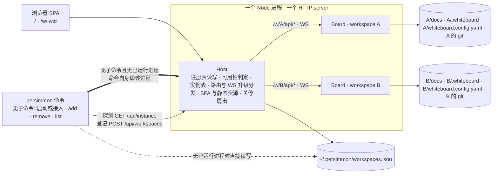
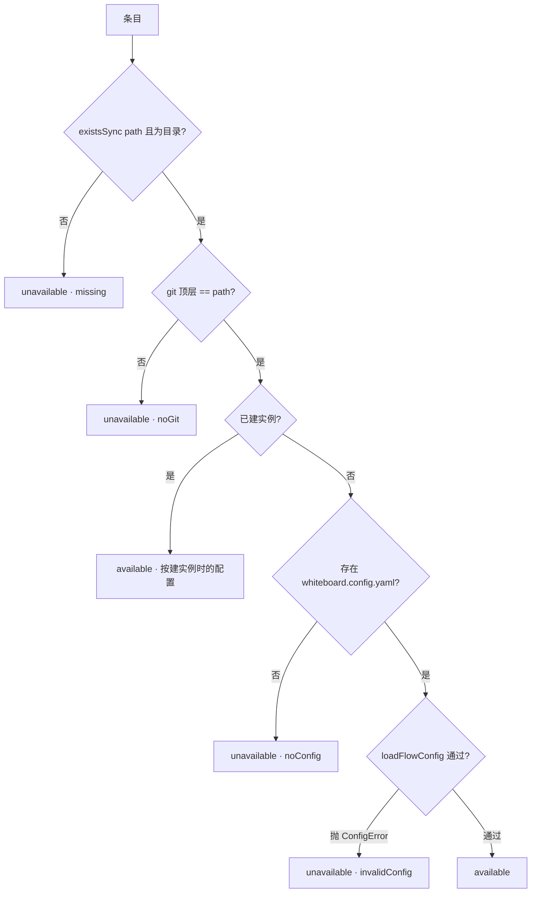
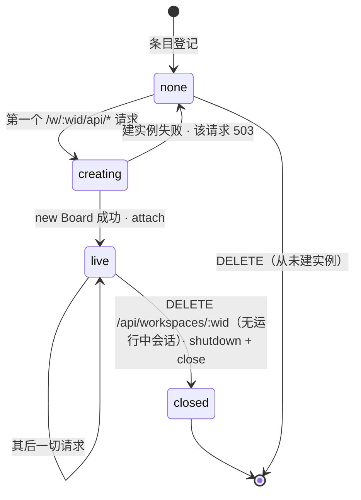
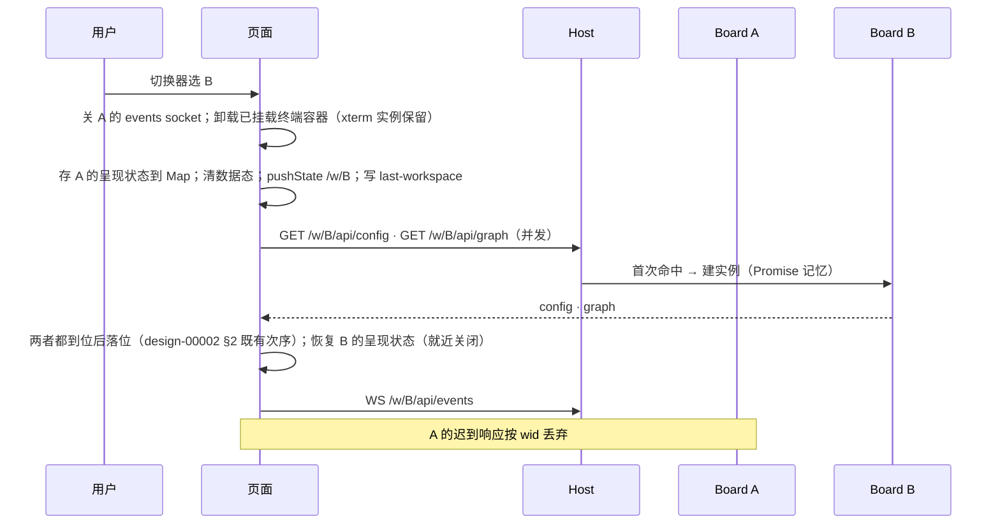
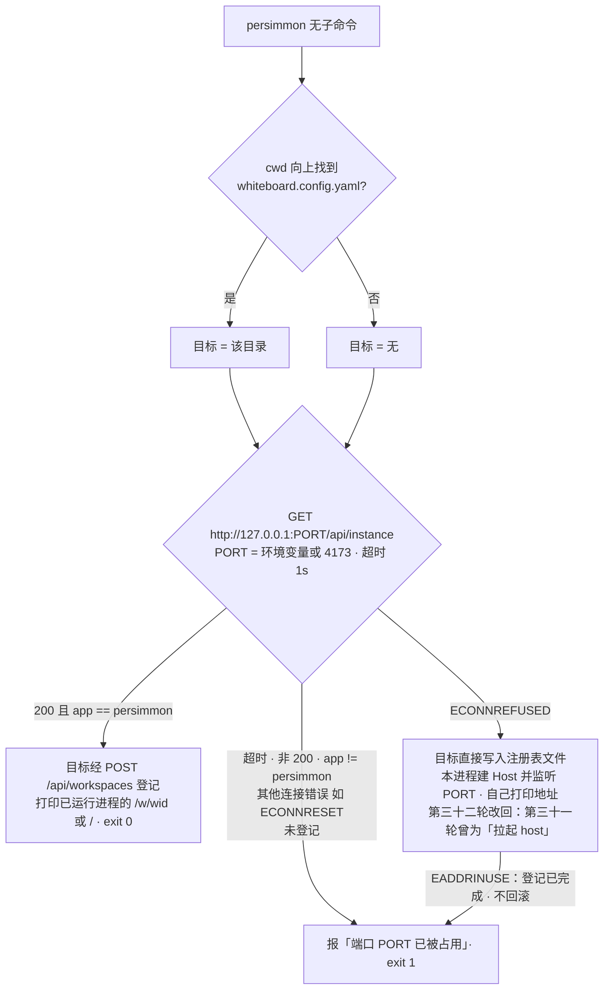
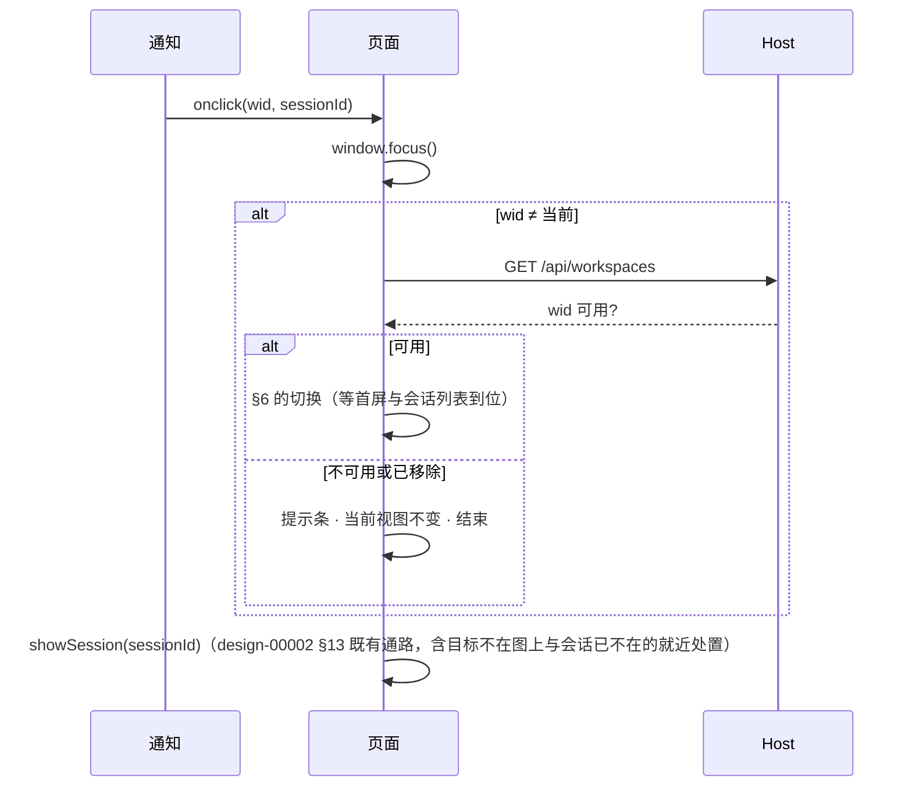

# Design: 多 workspace——一个进程按 workspace 分实例

> 在今天的 `Board`（一个仓库一组服务）之外加一层 **Host**：持有 workspace
> 注册表、按 workspace id 惰性建 `Board` 实例、把 `/w/<wid>/api/...` 的 HTTP 与
> WS 请求分发到实例、服务 SPA；`persimmon` 命令负责登记、探测已运行进程与
> 启动。`Board` 只在三处开缝：监听拆成挂载与关闭、WS 升级交由 Host 递入、
> 会话状态变化多一个回调；其余逐仓库语义原样。

## 1. 形态



- **`Board` 仍是「一个 workspace 的全部服务」**：`DocService`、`SessionManager`、
  `AskStore`、`Annotations`、`DocsWatcher`、`EffectiveAgents` 仍由它以 `repoRoot`
  构造（design-00001 §2）；路由表（`server.ts` 的 `/api/...` 全部）一行不动。
  多 workspace 不是把这些服务改成多租户，而是**多建几份**。
- **`Board` 的三处开缝**（design-00001 §7 与 §5 随其修订轮改写；这里是全部
  改动清单，没有第四处）：
  1. `listen(port)` 拆成 `attach()`（返回 `{app, handleUpgrade(kind, req,
     socket, head)}`——`kind ∈ terminal|events`，把升级递给对应的
     `WebSocketServer`）与 `close()`（关两个 `WebSocketServer` 与 `DocsWatcher`）。
     今天 `listen` 自建 HTTP server、自持升级路由表、随 server 的 `close` 关
     watcher（`server.ts:534-589`）——一个进程只有一个 HTTP server 时它不能再
     自建。`shutdown()` 不变，仍只收束会话（`server.ts:599`，幂等）。
  2. `BoardOptions` 增可选 `onSessionsChanged`：在 `watcher.signal()` 因会话
     状态而被调用的**三处**同时调用——等待标志翻转（`server.ts:105`）、会话
     收尾（`server.ts:120`）、`finishSession` 的收束（`server.ts:180`）。Host 用它喂 `/api/workspaces/events`
     （§5），**不**经 `watcher.subscribe`——那会把 Host 算成一个浏览器
     （`watcher.ts:23-28` 的 follower 语义，`spec-00001-AC-42.8` 计数）。
  3. 静态资源：Host 服务 SPA（§6）。`Board` 自己那条 `express.static` 不改，
     但在前缀下**不可达**——Host 只把余路径以 `/api/` 起头的请求递给实例
     （§5），其余落回 SPA fallback。
- **Host** 只做六件事：读写注册表（§2）、判定可用性（§3）、惰性建实例并持有
  实例表（§4）、分发 HTTP 与 WS（§5）、服务 SPA（§6）、关停扇出（§7）。它不
  解析任何文档、不发起任何会话。
- **`persimmon` 命令**（第三十一轮补入参与者，`decision-00020`；第三十二轮据
  该决定的回退改写）：它是**本 npm 包的 bin**。探测已运行进程、经其 API 或
  直接读写注册表登记；**无已运行进程时它自己在同一进程内建 Host 并监听**——
  那一次调用就是「已运行进程」，不再有「拉起另一个产物」这一层。有已运行进程
  时它打印地址后退出，不常驻。（第三十一轮此处写的是「无进程时拉起 host 包的
  服务，它不是已运行进程，形状由 `design-00004` 持有」，那是两产物形态。）
- **浏览器 SPA** 一份，URL 路径 `/w/<wid>` 指明当前 workspace（§6）。

## 2. 注册表文件契约

`~/.persimmon/workspaces.json`（目录名同包名与命令名，`idea-00004` 已定方向
第 3 条；用户目录取 `os.homedir()`。第三十一轮曾据当时的改名校正为「目录名跟的
只是命令名」，第三十二轮包名改回 `@ryan-alexander-zhang/persimmon`、bin 名同为
`persimmon`，两者复归一致）。Host 以**构造参数**
`registryPath` 接收文件路径——测试指到临时目录，与 `spawn`、`awaitThresholdMs`
等既有测试缝同一形态（design-00001 §5）；不引入环境变量。`persimmon` 命令
自己也从用户目录推同一个路径，其测试改 `HOME` 来指向临时目录——今天
`bin/persimmon.js` 的测试就是这么做的，不另立机制（第三十一轮补）。

**这份契约只有一份实现**（第三十二轮，`decision-00020` §2 第 5 条）：读写注册表
的是 `src/workspaceRegistry.ts`，判可用性的是 `src/workspaceAvailability.ts`；
Host 与命令的无进程路径调用的是同一个模块——命令就是本包的 bin，与 Host 同一
进程、同一份代码。第三十一轮的两产物形态曾让这份契约有 Go 与 TS 两份实现、
并把防漂移的责任交给文档与两侧测试，本轮随该形态一并撤销：**不得再出现第二份
注册表实现**（`decision-00020` §2 第 9 条）。

```json
{
  "version": 1,
  "workspaces": [
    { "id": "persimmon", "name": "persimmon", "path": "/Users/me/GitHubProjects/persimmon" },
    { "id": "persimmon-2", "name": "persimmon-2", "path": "/Users/me/tmp/persimmon" }
  ]
}
```

- `version` 固定 `1`；`workspaces` 为列表，顺序即切换器顺序（追加在尾）。
- `id`：URL 与 API 中的键，须匹配 `[a-z0-9-]+`。**由目录名派生**：小写、非
  `[a-z0-9-]` 折成 `-`、去首尾 `-`、连续 `-` 合一；结果为空（目录名无 ASCII
  字母数字，如 `演示`）时取 `workspace`；与既有 `id` 冲突时追加 `-2`、`-3`……
  一经分配不再改变——目录改名后 `id` 不跟着改。可读的 URL（`/w/persimmon`）
  值得这点去重逻辑。
- `name`：切换器与通知标题里的显示名。**缺省取 `id`**（而不是目录名——两个
  同名目录会得到 `demo` 与 `demo-2`，通知标题因此天然可辨）；`persimmon add
  --name` 或手改文件可换，用户自己写成重名是用户的选择。
- `path`：项目根目录的绝对路径，**经 `realpath` 解析符号链接后落盘**——
  macOS 的 `/tmp` 是 `/private/tmp` 的链接，不解析则同一目录被登记两次、建
  两个实例、两个 watcher 写同一个 `.whiteboard/`。同一 `path` 至多一条：添加
  已登记路径时返回既有条目（幂等——`persimmon new` 的登记步骤依赖这一点；
  第三十一轮：依赖方变了，不只是改名——原先依赖它的是模板 `post_create` 调
  `persimmon add` 这条跨仓库通路，现在是命令自己走的那条注册表路径，
  `decision-00020` §2 第 7 条 ②）。
- **文件不存在 = 空注册表**。文件存在但不可解析、`version` 不是 `1`、任一
  条目缺 `id`/`name`/`path`、`id` 重复或不匹配 `[a-z0-9-]+`、`path` 非绝对、
  文件不可读、`~/.persimmon` 是文件而非目录——**整份不合式**，唯一的读入口
  抛错，进程与命令的子命令都拒绝并指明文件路径与问题（`spec-00011-FR-18`）。
  不合式时**不改写**文件：那是用户手写的，白板不替他决定丢哪一条。
- 写入：`mkdirSync(recursive)` + `<path>.tmp` + `renameSync`，失败时尽力删掉
  暂存文件并把错误交给调用方——沿 `agentSettings.ts` 的口径（design-00001
  §13.3）；`POST /api/workspaces` 写盘失败答 `500 {error}`，同 agents 保存。
- **每次读都重读文件**（沿 `EffectiveAgents` 「每次调用重算」的口径，
  design-00001 §13.2）：手改文件后下一次列出即可见。文件小（几十条以内）。
- **并发写**：同一进程内的写经 Host 串行；命令在有已运行进程时经它登记
  （§8），不直接写文件——两个写者因此只在「无进程在跑时两次命令并发」出现，
  取后写者，接受：`persimmon new` 是串行的人类动作（第三十一轮：登记方由模板
  侧改为命令自己，串行这一点不变）。

## 3. 可用性判定

一条注册表条目在每次列出时判定一次，结果不缓存；判定是分支不是状态机：



- 四种不可用各带 `reason` 与一句 `error`（**英文**，与 `ConfigError` 及全部既有
  用户可见字串同语——四种原因会并列在同一个切换器里，不能两种语言各半；本节
  初版以中文给出这三句，是文档语言带进契约的笔误，T4 落地时据实校正）：
  `missing` →「workspace directory does not exist: `<path>`」；`noConfig` →
  「directory has no whiteboard.config.yaml: `<path>`」；`noGit` →
  「directory is not a git repository: `<path>`」（判定取 `git rev-parse
  --show-toplevel` 的结果**等于** `path`——不是仓库、或只是别的仓库的子目录
  都算否。比 ARCHITECTURE.md §2「工作树必须是 git 仓库」严一格，理由在代码：
  `gitLayer.ts` 以 `git status --porcelain` 的顶层相对路径过滤 `docs/` 前缀
  （`gitLayer.ts:90-93`、`:205-211`），而 `docsPath()` 给的是 `repoRoot` 相对
  路径（`docService.ts:1148-1150`）——`repoRoot` 低于顶层时什么都提交不上、
  且不报错。把这个静默失败提前成一个有名字的不可用原因）；`invalidConfig` → 即 `ConfigError.message`——与今天 `bin/whiteboard.js:41`
  打印的同一句。`noConfig` 以 `existsSync` 先判，**不**让 `loadFlowConfig` 的
  「no flow config at …」承担——否则与 `invalidConfig` 混为一类。
- 已建实例的条目**只免去配置两项的重验**（`noConfig`、`invalidConfig`）：它读的
  是建实例那一刻的配置，配置改动经重启进程生效，与今天一致（`spec-00010` §6
  「`exclude` 改动经重启生效」的既有口径推广到整份配置）。`missing` 与 `noGit`
  对已建实例照样每次判——目录被删或 `.git` 被删是能让实例整体失效的事，一次
  `stat` 与一次 `git 顶层`判定的代价可付——但 `/api/workspaces` 随会话状态变化
  重取（§5），所以顶层判定**不得**是每条一次的同步子进程：取 `.git` 的存在性
  与 `git 顶层`结果的进程内缓存（按 `path`，随条目生命周期失效），把子进程留给
  首次判定。判为不可用的已建实例**保留**
  （其运行中会话可能还在收尾），对它的读写按各自的失败路径报错；它不可切换、
  不可点通知落到（§9），无运行中会话时可移除（§4 的 `shutdown` + `close`）。
- `loadFlowConfig` 是同步读一个小 YAML；`/api/workspaces` 每次都跑一遍，其
  触发率见 §5——只在注册表写入与会话状态变化时，不在每次 `docs/` 写入时。

## 4. 实例生命周期



- **惰性**：Host 启动时不建实例；**只有**余路径以 `/api/` 起头的
  `/w/<wid>/api/*` 请求触发建实例——Host 的 `/w/:wid` 处理器先看余路径，不是
  `/api/` 的一律 `next()` 进 SPA fallback，不查注册表、不建实例
  （`/w/A/favicon.ico` 不该建一整套服务；Express 的裸挂载做不到这一点，
  实测 `/w/A/favicon.ico` 会进子应用）。
  `config` 此刻加载；失败即该请求 `503 {error, reason}`，不建实例。理由：
  登记了十个项目的人一次只看一两个，每个实例一个 chokidar 监听与一棵解析树。
- **建立中**：实例表是 `Map<wid, Promise<Board>>`——首屏的 `/config` 与
  `/graph` 同时到达（design-00002 §2），两个请求同时未命中不得建两个
  `Board`（各跑一次 `asks.reconcile()` 与标注 `reconcile()` 写盘，再丢一个
  带活 watcher 的）。
- **常驻**：实例一旦建立，进程存续期间不销毁——它可能有运行中会话。移除
  workspace 在有运行中会话时被拒（`spec-00011-FR-5`）；无会话时 Host 先
  `shutdown()`（此时无会话，立即返回）再 `close()`（关 watcher 与两个
  `WebSocketServer`——`shutdown()` 不关它们，`server.ts:599`），从实例表摘除。
  移除后再添加同一目录会得到同一 `id`（slug 去重只看现存条目）与一个新实例。
- **`Board` 不知道自己叫什么**：`id` 与 `name` 是 Host 的事。

## 5. API 契约

既有全部路由挂在 `/w/:wid` 下，Express 的挂载会剥掉挂载前缀、保留其后的
`/api/...`，所以字面形态是**两段**：

```
# 既有（design-00001 §7 全部），逐 workspace
GET/POST/PUT/PATCH/DELETE /w/:wid/api/<既有路径去掉 /api>   → 语义与状态码同 design-00001 §7
                                                          # 例：/w/persimmon/api/graph、/w/persimmon/api/docs/:id
                                                          # :wid 不匹配 [a-z0-9-]+ 或不在注册表 → 404 {error}（JSON——api.ts 的 request 对一切响应 response.json()）
                                                          # 条目不可用 → 503 {error, reason: missing|noConfig|noGit|invalidConfig}（error 即 §3 的那句）
WS   /w/:wid/api/terminal?sessionId=<id>                  → 同 design-00001 §7；Host 的 upgrade 处理器按前缀取实例、调 board.handleUpgrade('terminal', …)
WS   /w/:wid/api/events                                   → 同 design-00001 §7：该 workspace 的无载荷刷新信号；不合前缀的升级 socket.destroy()（既有口径，test/server.test.ts「refuses an upgrade on any other path」推广到 Host）

# 新增，Host 级
GET  /api/instance                                        → {app: "persimmon", version, pid}   # 启动握手（§8）
GET  /api/workspaces                                      → {workspaces: [{id, name, path, availability: available|missing|noConfig|noGit|invalidConfig, error?, sessions: [{id, kind, sourceId, status, awaiting}]}]}
                                                          # 每次重读注册表并逐条判定（§2、§3）；sessions 只对 live 实例给出（该实例 SessionManager.list() 的子集），其余 []。切换器计数与桌面通知（§9）都从这一份推导
POST /api/workspaces               {path, name?}          → 201 {workspace} | 200 {workspace}（同路径已登记，幂等）| 422 {error}（路径不存在 / 非目录 / 无流程配置；配置非法与非 git 仓库**不拒绝登记**——那是可用性）| 500 {error}（写盘失败）
DELETE /api/workspaces/:wid                               → 200 | 404 {error} 不在注册表 | 409 {error} 有运行中会话
POST /api/pick-directory                                  → 200 {path} 用户选定 | 200 {path: null} 用户取消 | 403 {error} 非本机来源 | 409 {error} 已有一个对话框开着 | 503 {error} 此处开不了目录选择对话框
                                                          # 第三十轮，spec-00011-FR-22/FR-23/FR-24。服务端弹原生目录选择对话框——浏览器拿不到绝对路径
                                                          # 取消是 200 {path: null} 而不是 204：`api.ts` 的 request 对一切响应无条件 response.json()（本节上文即此口径），
                                                          # 204 没有正文，会让取消抛 SyntaxError 而不是静默复位——§5 其余端点也无一用 204
                                                          # macOS: osascript -e 'POSIX path of (choose folder)'，脚本前置 `tell app "System Events" to activate`，
                                                          # 否则对话框常开在最前窗口之后：按钮此时是 disabled 的，看不见窗口就读作卡死
                                                          # 实测（本机 macOS）：选定 → stdout 为带尾斜杠的路径、退出 0，根目录返回 `/`；
                                                          # 取消 → 退出 1 且 stderr 含 `-128`（`execution error: User canceled. (-128)`）。故判定取消的是
                                                          # **退出非零且 stderr 含 -128**——按数字而不按英文原文，非英文 locale 下的文案未实测；
                                                          # 其余一切非零（非 macOS、无图形会话、osascript 不在）一律 503，不押在任何未实测的错误文本上
                                                          # 并发由**服务端**持有：Host 至多持一个在飞子进程，第二次请求 409 且不动已开着的那个（spec-00011-AC-22.4/AC-22.5）——
                                                          # 按钮 disabled 只管得住一个页面，两个标签页会各开一个而 Host 只认得后一个
                                                          # 客户端中断（页面刷新、关标签页）时 req 的 'close' 到达：杀掉子进程，否则对话框留在屏幕上没有主人
                                                          # **Origin 校验**：本端点不带正文，属 CORS 的「简单请求」——用户正在访问的任何站点都能向
                                                          # 127.0.0.1 发一个表单 POST 把原生对话框弹到用户屏幕上（读不到回应，但弹窗本身就是骚扰）。
                                                          # 绑回环挡不住它：浏览器本就在用户机器上。规则须写准，否则 403 掉的是用户自己：
                                                          #   · 无 Origin 头 → 放行。命令行客户端（persimmon 命令、curl）不带它，而本条防的是浏览器发起的跨站请求；
                                                          #     本机进程本就能直接调用，拦它一无所得
                                                          #   · 有 Origin 且其 hostname 是回环名（localhost / 127.0.0.1 / [::1]）→ 放行，**不比端口**
                                                          #   · 其余 → 403
                                                          # 不比端口有两个不得不然的理由：打印地址的那一侧（第三十一轮起是 bin/host.js，原为 bin/persimmon.js）给的是 http://localhost:PORT 而 listen 绑的是
                                                          # 127.0.0.1，拿绑定地址去比字符串会把每一次「浏览」都 403 掉；且 `npm run dev` 的 vite 代理未设
                                                          # changeOrigin（vite.config.ts），到达 Host 的 Origin 是 http://localhost:5173，与 Host 自身端口
                                                          # 永不相等。放宽到「任意回环端口」不丢防护：能在回环上架站的人本就能直接调这个端点
                                                          # 这是本仓库第一处 origin 处置——其余端点无需它：POST/PUT/PATCH 带 JSON 正文，
                                                          # content-type 使其非简单请求；DELETE（如 removeWorkspace，无正文）则因方法本身非简单。两者都要预检
WS   /api/workspaces/events                               → 服务端→前端：无载荷信号，页面收到即重取 /api/workspaces（切换器打开时新条目与计数随之出现）。触发源恰两种：注册表经本进程写入（添加/移除，含命令经本进程的登记），任一 live 实例的 onSessionsChanged（§1 第 2 缝）。docs/ 变更**不**触发——否则每次保存都让页面重读注册表、重验每条配置

# SPA 与静态（Host）
GET  /                                                    → index.html
GET  /w/:wid                                              → index.html（不查注册表、不建实例——页面自己经 /api/workspaces 得知该 wid 的状态，§6）
GET  /w/:wid/<余路径非 /api/ 起头>                          → index.html（同上：SPA fallback 兜住书签、旧资源 URL 与拼错的路径）
GET  <其余一切>                                             → dist/web 的静态资源，未命中则 index.html（以 express.static 挂载，不写通配路由——Express 5 的通配段是 *splat，此处不需要）
```

- `:wid` 校验先于一切：不合 `[a-z0-9-]+` 直接 404，不查文件系统。Host 的
  `/w/:wid` 处理器只在余路径以 `/api/` 起头时解析（并惰性建）实例，否则
  `next()`——`GET /w/A` 与 `GET /w/A/favicon.ico` 都落到 SPA 的 index.html。
- 前缀下的路由**不知道**自己被挂在前缀下：`Board.app` 里 `req.params.id`
  等照旧，`mergeParams` 不开——`Board` 不需要 `wid`。
- `vite` 开发代理从只转发 `/api` 改为同时转发 `/w` 与 `/api`（含 ws）。
- 手改注册表文件不触发 `/api/workspaces/events`（Host 不监听用户目录）；
  切换器每次打开都重取，手改在下一次打开可见。

## 6. 浏览器侧：URL、切换与呈现状态

- **API 寻址**：`api.ts` 今天是模块级对象、三十来条字面 `/api/...`
  （`api.ts:269-370`），`connectEvents`/`connectTerminal` 各写死一条。改为
  `boardApi(wid)` 工厂与 `connectEvents(wid)`、`connectTerminal(wid,
  sessionId)`，**不**用可变的模块级 base——只有把 `wid` 绑进每个调用，切换
  才无竞态。Host 级三条（`/api/instance`、`/api/workspaces*`）不带 `wid`。
- **URL**：`/w/<wid>` 为当前 workspace；`/` 为入口页——读浏览器本地的
  「上次所在 workspace」（键 `whiteboard-last-workspace`；不在注册表中则视为
  无并删掉；**当前 workspace 每次确定下来就写它**——切换、直接打开
  `/w/<wid>`、`/` 的重定向三处，否则命令打印的地址永远不会成为「上次所在」）
  → `replaceState` 到 `/w/<id>`；否则取注册表**第一条可用**条目；
  全部不可用或注册表为空 → 空态（切换器展开，只有添加入口）。`/w/<wid>` 的
  `wid` 未登记 → 页面呈「未登记的 workspace」态 + 切换器；不可用 → 呈不可用
  态与 §3 那句 + 切换器，不建实例、不发 API。`popstate`（前进/后退）就是一次
  切换，与切换器点选同一通路。
- **切换**（SPA 内的状态变化，不重载页面）：



  每个读操作带上发起时的 `wid`，响应到达时 `wid` 不等于当前即丢弃——与
  `useBoard.ts` 里 `reading` 的次序约束同一纪律（issue-00018）；被移除的
  workspace 的在途请求同样被丢弃（其 API 此后答 404）。
- **每会话常驻 xterm 实例**（design-00002 §12）按 `wid:sessionId` 键持有，
  不随切换销毁——切回 A 时终端输出与滚动位置原样在。
- **移除当前 workspace**：`DELETE` 成功后页面按入口页规则落到第一条可用条目，
  没有则空态（`spec-00011-FR-4`）。
- **呈现状态**：选中、下钻、右槽、终端面板等内存态按 workspace 各存一份
  （`Map<wid, PresentationState>`），切回按 id 保持、所指不存在时就近关闭；
  **重载只恢复 workspace 身份**（URL）与下列持久键，不恢复内存态（今天
  `drilled`/`detail` 就是 `useState`，`Board.tsx:201`、`:205`）。
- **localStorage 键**（今天的真实键名）：
  - 按 workspace 分，键加前缀 `w:<wid>:`：`whiteboard-sidebar-expanded`
    （类型组展开态）、`whiteboard-directory-groups-expanded`（目录组展开态）。
    今天无前缀的旧值**不迁移**——展开态是便利项，丢一次可接受，说明于此。
  - 全局一份：`whiteboard-sidebar`（导航栏开合）、`whiteboard-theme`、
    `whiteboard-desktop-notifications`、五个 `react-resizable-panels:whiteboard-*`
    （面板尺寸）、`whiteboard-last-workspace`。
  理由：前者引用的是某个 workspace 里的组键，跨 workspace 无意义；后者是
  用户偏好，跟着人不跟着项目。
- **切换器**：顶栏最左（导航栏开关之前）一个 `DropdownMenu`，每行显示名、
  路径（次级字号）、可用性、运行中/等待计数（`Terminal`/`Keyboard` 图标 +
  数字，沿 design-00002 §12 的两图标；为零不渲染）。不可用行**不禁用**：
  行可聚焦可激活，激活得到的是拒绝——提示条呈现 §3 那句原因、当前 workspace
  不变（`spec-00011-FR-9` 的动作被拒形态，与 design-00002 §3 动作被拒行同一
  载体）；行内的「移除」控件同样可达（design-00002 §6 的清单行键盘可达义务）。底部「添加 workspace」（对话框：路径 + 可选显示名；422 的
  `error` 以提示条呈现）；每行「移除」（409 → 提示条）。计数随
  `/api/workspaces/events` 更新，切换器打开时可见其变化。控件形态与
  design-00002 §3 表的关系随 design-00002 的修订轮记录。

## 7. 关停

`SIGINT`/`SIGTERM` → Host 对实例表里每个 `Board` 并发调用 `shutdown()`
（各自幂等、各自有界——design-00001 §5 与 issue-00012 的升级阶梯逐会话
适用），`Promise.all` 后逐个 `close()`，关 HTTP server，`exit(0)`。第二次
信号并入进行中的那一次（`bin/whiteboard.js` 今天的约定，逐实例成立后整体
成立）。

**第三十轮：在飞的目录选择对话框不得挂住关停。** `POST /api/pick-directory` 会
一直等到用户在原生对话框上做出选择——没人做出选择它就永远不回。故 `stop()`
**一进来就杀掉那个子进程**（在逐个 `Board.shutdown()` 之前，不是在关 HTTP
server 之前：两者之间隔着整段会话收尾，那段时间里对话框还杵在用户屏幕上），
被杀的那次请求以 503 收场——页面此时正在关，无人再读它。

其后的连接层不必本节操心：`issue-00033` 已把 `stop()` 的空闲连接扫描改为
扫到关成为止，所以那次 503 写完、连接转为空闲之后会被扫到，关停照常有界。
这条不加任何超时——超时是给「不知道要等多久」用的，而这里知道：关停一来就杀。

## 8. 命令与启动握手



（第三十一轮：本节原题「CLI 与启动握手」，`CLI` 在 `CONTEXT.md` 中专指
agent CLI，故本节与以下各处一律称「`persimmon` 命令」或「命令」。）

- 超时归入「被占用」：既有 `test/startup.test.ts` 用一个不应答的裸
  `createServer` 占端口，今天得到「cannot listen on port N」+ exit 1——
  握手后同一结论。已运行进程忙于同步的 `docs.graph()` 时也可能超时，此时
  用户看到「已被占用」再试一次即可；不把超时读作「不是自己人」以外的东西。
  探测到监听之间的竞态由 `server.on('error')` 的 EADDRINUSE 兜底，两处
  同一条报错。
- **只有 `ECONNREFUSED` 读作「没人在」**：探测的其他连接错误（`ECONNRESET`、
  `ECONNABORTED`、`EHOSTUNREACH` 等）与超时同归「被占用」——能否连上是二值的，
  连上了又断掉不是「端口空着」。图上那条边据实标出（第三十二轮的审计据
  `40a5ca5^:bin/persimmon.js` 的 `probe()` 补：原图只列了超时与非 200 两项，
  实现是 `error.cause?.code === 'ECONNREFUSED' ? 'free' : 'occupied'`）。
- **竞态下的那一条登记保留，不回滚**：无进程路径先写注册表再监听
  （`registry.add` 在 `host.listen` 之前），所以探测之后才被抢走端口时，
  EADDRINUSE 兜底报错并 exit 1，而条目已经落盘。这是有意的：`add` 幂等，
  项目确实在那儿，下一次启动照常接入。图上「未登记」只属探测阶段就判出的占用
  （`spec-00011-FR-15`）。
- **子命令**：`persimmon add [path] [--name <n>]`（`path` 缺省为 cwd 向上
  找到的项目根；输出登记结果 JSON；幂等；退出码 0/1）、`persimmon remove
  <id|path>`、`persimmon list`（表格：id、name、path、可用性）。`remove` 的路径形态先 `realpath` 再在注册表里查到 `id`，其后一律按 `id`
  操作。三者都先探测已运行进程：有则经其 API（写入由它串行、切换器随即
  可见；`POST` 答 422/500 时命令报出该 `error`、以非 0 退出）；无则直接读写
  文件。注册表不合式时三者同样拒绝并指明（§2 的唯一读入口）。
  **第三十二轮（`decision-00020` 的回退）：执行者是 `persimmon` 命令，
  即本 npm 包的 bin `bin/persimmon.js`**——本段的三态判定、输出与退出码三轮
  一字不改。无进程路径的读写调用 §2 的同一份 `src/workspaceRegistry.ts`，
  无进程的 `list` 直接调用 `src/workspaceAvailability.ts` 的判定：五态一次给全，
  不起子进程、不降级。（第三十一轮曾把执行者写成一个独立的 Go 二进制、无进程
  路径由 Go 侧第二份文件契约实现，`list` 只自算三种不可用，「配置非法」与
  「可用」两态要向 host 包的 `--judge` 查询模式讨、讨不到就退让——`--judge`、
  那份第二实现与 `spec-00011-FR-21` 的 `If` 分支随本轮一并删除。）
- **`persimmon new` 的登记**（第三十一轮据当轮决定表第 5 条改写，该裁定第
  三十二轮存续为 `decision-00020` §2 第 7 条 ②）：
  登记由 `persimmon new` 自己在脚手架完成后做，走与 `add` 相同的那条路径
  （非交互、幂等、已登记时仍以 0 退出）；模板 `post_create` 保持现状，只做
  git 初始化两步，模板仓库不必知道白板的存在。流程与失败处置（脚手架失败不
  登记、登记失败不回滚项目、端口被他人占用时直写文件）由 `design-00004` §5
  持有。（原文写作「本仓库提供的契约是 `persimmon add <path>` 非交互幂等；
  模板侧怎么调用属模板仓库（`prd-00003` 依赖项）」——那条跨仓库的等待两轮
  未落地，正是 `decision-00020` §1 第 2 条推翻它的理由。）
- **绑的地址与探的地址是同一个**：Host 缺省绑 `127.0.0.1`（`spec-00011` §6
  「只监听 `localhost`」的字面落实——此前绑通配地址，局域网可达，与文档相悖），
  握手也探 `127.0.0.1`。通配绑定不排他于回环上的具体绑定，机器上任何回环
  占位者都能在测试与握手里冒充我们；根因与实测见 `issue-00028`。打印给用户
  的仍是 `http://localhost:<port>`。
- `/api/instance` 的 `version` 只用于打印（「接入 persimmon v<对方的版本>」；
  第三十一轮曾改作「接入 persimmon-host vY」，理由是两产物形态下在场的是 host
  包而不是命令，第三十二轮随包名回退改回——在场的又是同一个产物），**不**
  参与握手判定：旧版本在跑也接入——两个版本共用注册表比版本门更坏，用户
  看到版本号自己决定是否重启它。
- 打印的地址带 workspace：`persimmon: http://localhost:4173/w/persimmon`
  （在项目外启动时打印 `/`）。

## 9. 桌面通知的跨 workspace 组合

- **单一来源**：通知层只读 `/api/workspaces` 的会话摘要（含当前 workspace
  在内的全部 live 实例），经**一条**有序读队列刷新——两条无序通路喂同一张
  `seen` 表正是 issue-00018 的缺陷类；当前 workspace 的 `/api/sessions` 仍供
  会话面板与终端，不参与通知差分。
- **两种反馈分家**：`useBoard.ts` 今天的 `announce` 同时抬提示条与桌面通知
  （`useBoard.ts:285-304`）。改为：提示条只随当前 workspace 的会话差分
  （`spec-00003-FR-7` 的作用域是这块板），桌面通知随全部 live workspace 的
  并集差分，元素键 `wid:sessionId`，离场区间判重与后到替换先到逐键成立。
- **基线**：某 workspace 第一次出现在摘要里（首次建实例、从不可用恢复、移除
  后再添加）时，它那批会话是基线不是新闻——沿 `announce` 「首次读数不报」
  的口径逐 `wid` 成立。
- **标题**：今天是 `<kind> · <sourceId>`、正文是状态（`notify.ts:140-143`）。
  改为标题 `<name> · <kind> · <sourceId>`，正文不变——只多一个前缀，
  `spec-00004-FR-6` 的外泄面只增加显示名（缺省即 `id`，由目录名派生）。
- **点击**：



## 10. 代码位置与运行

包结构、代码位置、Go 侧的移植面与开发命令的**唯一权威是
[`design-00004-persimmon-cli`](design-00004-persimmon-cli.md) §6 与 §7**
（该文档第三十二轮已原地改写：节号一一保留、内容全换、全部现行）。本节只留与
多 workspace 直接相关的那几条结构事实，其余不复述——两处同一份清单必然漂移
（第三十二轮的审计据此清理：本节此前与那两节重复权威，并附一句「那份 design 的
§6/§7 随之作废」的宣告，两者都已不真）。逐文件改动由 plan 持有。

- **仓库根即本包根**，本仓库自己的 `whiteboard.config.yaml` 与 `docs/` 仍在根
  ——**本仓库就是第一个 workspace**（`decision-00019` §4，`spec-00011-FR-20`），
  配置测试读根配置的现状不变。包名、`bin`、`files`、`license` 与 `scripts`
  见 `design-00004` §7。
- **命令与 Host 同一个包、同一个进程**：命令行入口薄，握手与 `add` / `remove` /
  `list` 的实现落在 `src/`（覆盖率门只看 `src/`；`design-00004` §6 是这条的
  权威）。注册表与可用性判定就是 §2 与 §3 的那一份
  （`src/workspaceRegistry.ts`、`src/workspaceAvailability.ts`），没有第二份；
  「cwd 是否在某项目内」（§8）的判定调既有的 `findRepoRoot`，坐标见
  `design-00004` §6 的对照表，命令侧不另写一份（`decision-00020` §2 第 9 条）。
- **服务端源码不随包分发**：Node 在 `node_modules` 之下**不做**类型剥离
  （`ERR_UNSUPPORTED_NODE_MODULES_TYPE_STRIPPING`，一个发布的包须携带能跑的
  JavaScript），所以 `build` 除 `dist/web` 外还以 `tsconfig.build.json` 把
  `src/*.ts` 编译到 `lib/*.js`——与 `src/` 同深度，`../dist/web` 这类相对引用
  在两种布局下都成立——bin 引 `../lib/*.js`，`prepack` 即 `build`。仓库自己的
  测试仍直接引 `src/*.ts`。（本条初版写作「`files` 含 `src/`」，安装形态实测在
  T11 当场证伪，`issue-00029` 记根因；据实校正。）
- **`postinstall` 的 `fix-pty-permissions.js` 与 `node-pty` 原生构建在全局安装与
  `npx` 缓存两条安装路径下能否成立，是实测义务而不是设计决定**：承载者是
  `scripts/test-install.js`（`npm pack` 出 tarball，两种形态各跑一次，并起一次
  真 pty），见 `spec-00011` §7 与 `spec-00011-AC-20.3`。（第三十二轮改回两条
  路径：第三十一轮让出 npm bin 后只剩 `npx` 一条，本包收回 bin 名后两条并存；
  `issue-00030` 已证 pty 的可执行位由运行时补上。本轮的审计另删去本节此前
  重复出现、且以「全局安装随命令让出 npm bin 而不复存在」为理由的第二条同义
  bullet——那个理由已不真。）
- **`tools/whiteboard` 迁到根**：`src/`、`web/`、`test/`、`bin/`、`scripts/`、
  `vite.config.ts`、`vitest.config.ts`、`tsconfig.json`、`components.json` 位于
  根；`tools/` 不再存在。与根既有文件的重合：`tools/whiteboard/README.md` 的
  命令表并入根 `README.md`；`scripts/` 目录与根既有的 `scripts/sync-docs.sh`
  同目录共存（文件名不撞）。
- 构建配置、忽略规则、测试与根指南都不再写死 `tools/whiteboard`；今天写死它
  的位置（`.gitignore` 两处、`test/tracked.test.ts` 的路径断言、
  `ARCHITECTURE.md` §2 与 §5、`DEVELOPMENT.md` Commands）由 plan 逐一改。
  `ARCHITECTURE.md` §2 另有两行约束随本设计失效——「一进程一仓库」与「配置
  缺失或非法即致命」——改写为「一进程多 workspace」与「按 workspace 不可用」；
  §11 的两行风险（「一进程一仓库」与「代码仍在 `tools/whiteboard/`」）由本设计
  消解，随之退役。
- `design-00001` §8 的「代码放 `tools/whiteboard/`」与 §7 的 API 表、§5 的
  会话状态通路，以及 `design-00002` §2/§3/§13，均为 `active` 文档，随各自的
  修订轮（`rule-00001-BR-3`）改写，不随本设计的接收顺带改。

## 11. Trade-offs

- **目录选择由服务端弹原生对话框，而不是在浏览器里做一个目录浏览器**
  （第三十轮）：浏览器拿不到绝对路径是硬约束，所以只有两条路——服务端弹原生
  对话框，或服务端出一个列子目录的接口、前端自己做一个浏览器。选前者是因为
  它约十行、体验是真正的 Finder；代价是**平台耦合**（只实现 macOS 的
  `osascript`）与**要有图形会话**（ssh 进来跑就开不了）。代价由 FR-24
  兜住：开不了就说一句，键入路径这条路始终在，「浏览」从来不是登记的必经之路。
  别的平台**未实现也未实测**——Linux 常见做法是 `zenity`/`kdialog`（两者都不
  保证装了）；本轮不声称它们「各补一行」，只声称本设计留了同一个出口：换一条
  命令，契约不变。Windows 不必留这个出口：**支持平台仅 linux 与 darwin**，
  Windows 明写在支持范围外（域主 2026-09-09 裁定，`decision-00020` §2 第 10 条）。
  另一条路（服务端目录浏览器）跨平台、无 GUI 也能用，但要多写百余行并自带
  一套需要测试的树形交互——若将来要在无图形会话的机器上用，它是既定的升级方向。

- **Host 包着几乎不变的 `Board`，而不是把 `Board` 改成多租户**：服务端改动
  收敛到三处开缝，服务端测试里只有监听与升级相关的几条要改。**代价落在
  前端**：`api.ts`、两个 socket 助手、呈现状态、通知层、localStorage 键全部
  变成按 `wid` 参数化，七个 web 测试文件里写死的 `/api/...` 断言随之改——这是两种方案真正的分野；选它是因为前端的参数化是
  机械的，而多租户 `Board` 要把「一个 repoRoot」的假设从二十几个模块里拆出。
  运行时代价是每个 live workspace 一份完整服务栈（内存、监听器线性增长），
  单人机器十来个项目量级可接受。
- **惰性建实例**而非启动时全建：登记多、常看少是常态；代价是第一次切到某
  workspace 多一次解析等待（量级同今天启动），以及 `Promise` 记忆的并发规则。
- **注册表在用户目录、项目状态在项目目录**（`idea-00004` 已定方向第 1 条）：
  白板只多一个文件；代价是目录搬走后条目失效，以「不可用而不消失」承接。
- **URL 路径 `/w/<wid>` 而非查询串或纯内存态**：重载、书签、通知点击都能
  落到确定的 workspace；代价是 Host 做 SPA fallback，且 API 变成两段前缀。
- **两条 events socket（逐 workspace + Host 级）而非一条带载荷的**：既有
  `/events` 「无载荷信号」契约不改；Host 级的触发源收窄到注册表与会话状态，
  不随 `docs/` 写入抖动。代价是页面多持一个连接、通知层与会话面板读两个来源。
- **端口探测握手而非 lock 文件**：lock 文件在进程被 kill 后残留、要处理陈旧
  判定；探测只问「现在有没有人在」并顺带辨认对方。代价是一次 1s 超时的本地
  请求，以及超时被归入「被占用」的保守读法。
- **`id` 取目录名 slug 去重、`name` 缺省取 `id`**：URL 可读、通知天然可辨；
  代价是 `演示` 这样的目录名得到 `workspace` 这个 id。
- **命令经已运行进程登记**：写入串行、切换器即时可见；代价是子命令多一次
  探测，无进程时的两次并发直写取后者。
- **`realpath` 落盘**：一目录一条；代价是用户看到的 `path` 可能与他敲的不同
  （`/tmp` → `/private/tmp`）。
- **嵌套且各自为 git 仓库的 workspace 放行**，不做祖先关系判定：两者各有自己的
  git 仓库与 `docs/`，§3 的顶层判定已把同一仓库内的子目录挡在外面，剩下的
  submodule 与嵌套 `git init` 是正当用法；代价是用户可以把一个 workspace 登记
  在另一个之下，两个实例各持一份 watcher（各监听自己的 `docs/`，互不重叠）。

