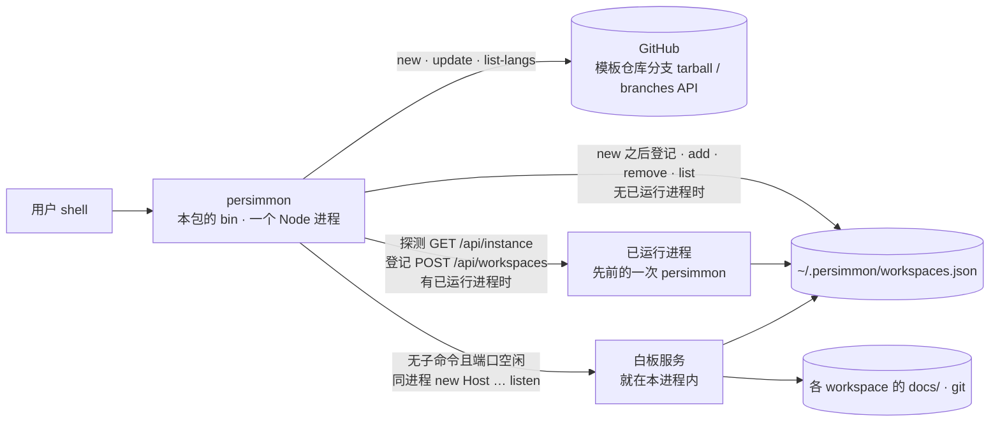
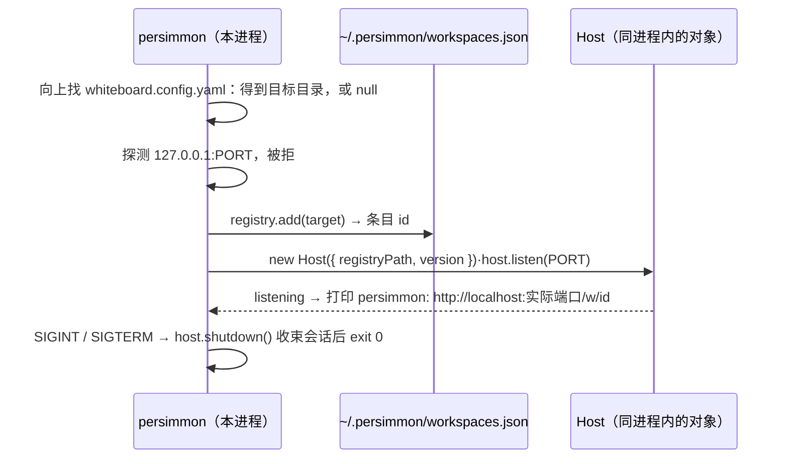
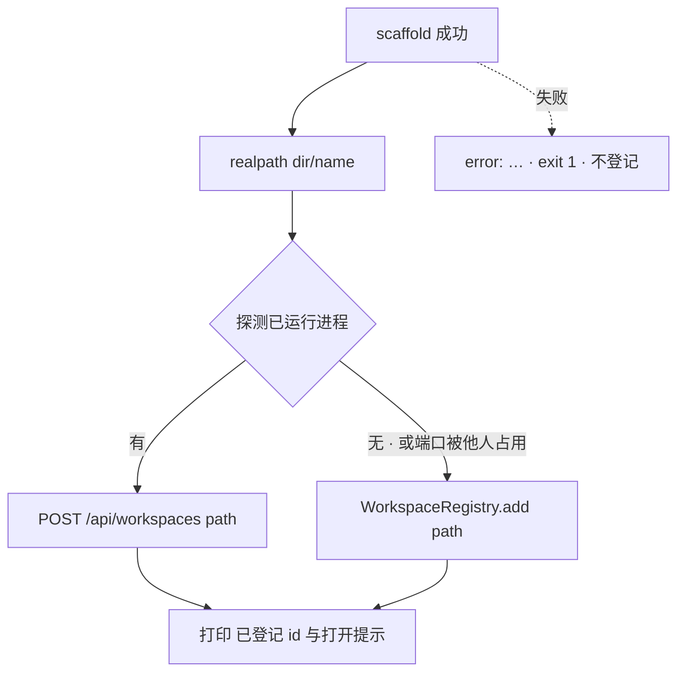

# Design: `persimmon` 命令——一个 npm 包，一个进程

> 本包的 bin 持有全部子命令、注册表读写、可用性判定与启动握手；脚手架自 ainpt
> 移植为本包的一个 TypeScript 模块，语义不改。没有第二个产物、没有第二种实现
> 语言、没有子进程。结构由 `decision-00020` 定，本文只写形状。
>
> **本文档经第三十二轮修订（2026-09-09）。** 原设计的两产物形态——Go 二进制
> `persimmon` 以 `npx` 按钉死版本拉起 npm host 包——整段作废
> （`decision-00020` §5 的裁定：§1 形态、§3 host 启动时序、§4 两份实现与
> `--judge`、§6 代码位置、§7 包改名、§8 发布线作废，§2 命令面与 §5 `new` 的
> 登记闭环存续）。**节号一一保留**（§1…§11），只换内容：`spec-00011` /
> `spec-00012`（十处）/ `spec-00013`（五处）/ `decision-00020`（一处）共
> **19 处**以「`design-00004` §N」为坐标引本文（`spec-00012` 十一、`spec-00013`
> 五、`spec-00011` 二、`decision-00020` 一），`design-00003` 另有五处，合计 24。被推翻的形状、它当初为什么成立、以及每处机制为什么不再需要，
> 见各节内的括注与文末第三十二轮追注。
>
> **支持平台是 linux 与 darwin；Windows 不在支持范围内**（域主 2026-09-09
> 裁定）。三条理由：模板产出的项目带 `CLAUDE.md -> AGENTS.md` 符号链接
> （本仓库根即一例），Windows 上建符号链接要 Developer Mode 或提权；解归档
> 改用外壳 `tar`（§6），它在 Windows 上不保证存在；node-pty 在 Windows 从未
> 实测。原 goreleaser 虽出过 windows 产物，那条路径同样从未验过——出过产物
> 不等于验过。凡本文涉及平台之处一律以这两个平台为准。

## 1. 形态



产物只剩一个，参与者如下：

- **persimmon 命令**（本包的 bin `bin/persimmon.js`）：解析命令、跑脚手架、
  读写注册表、判可用性、探测与接入已运行进程；无子命令且端口空闲时，
  **它自己成为**那个已运行进程——服务不是它拉起的另一个东西，是它自己。
- **已运行进程**：先前一次同样的 `persimmon`。接入它仍走 `design-00003` §5 的
  HTTP API，与本轮之前一致——变的只是它是谁起的。
- **模板仓库**：不变；`post_create` 仍只做 git 初始化两步。

原设计的第三个参与者「host 包」（`@ryan-alexander-zhang/persimmon-host`）
**不再存在**。它当初被拆出来，只是为了给 Go 二进制留一个可 `npx` 的服务本体；
命令与服务同属一个包之后，那条进程边界连同它上面的全部机制——版本配对、
stdio 与信号的跨进程转发、退出码透传、「命令取不到服务」这一类失败态——
一并没有了对象（`decision-00020` §2 第 1、2 条）。`CONTEXT.md` 的「host 包」
词条随之移除。

## 2. 命令面

（本节存续，`decision-00020` §5。逐行的执行者由 Go 二进制换回本包的 bin，
行为不变；`version` 与参数解析两处本轮据实改写。**「来源」一列记的是实现落点
`src/cli.ts`，不是入口文件**——`bin/persimmon.js` 是薄入口，只读 `process.argv`
并调 `lib/cli.js`，握手与 `add`/`remove`/`list` 那约 200 行一并落在 `src/cli.ts`
（§6）。）

| 命令 | 行为 | 来源 |
| --- | --- | --- |
| `persimmon` | `design-00003` §8 的握手原样：向上找 `whiteboard.config.yaml`；探 `/api/instance`；有进程则经 `POST /api/workspaces` 登记并打印其地址；端口被他人占用则报「port N is already in use」exit 1；无进程则直接写注册表并**在本进程内起服务**（§3） | `src/cli.ts` 的 `start()`（`40a5ca5` 之前 `bin/persimmon.js` 里的实现复位后挪入；`bin/persimmon.js` 只是薄入口，§6） |
| `persimmon new <name> [--lang] [--variant] [--dir] [--ref] [--set K=V]…` | ainpt `new` 原样；成功后以 `<dir>/<name>` 的 realpath 走 `add` 的路径登记（幂等），末行向 **stdout** 打印 `已登记为 workspace <id>——在项目内执行 persimmon 打开`（`cli/main.go:316` 的字面，**没有** `persimmon: ` 前缀；原文此处记错，据实改） | 自 `cli/main.go` `cmdNew` 移植（§6） |
| `persimmon update [--dir]` | ainpt `update` 原样（读 `.ainpt.json`，逐文件 `git merge-file` 三方合并） | 自 `cmdUpdate` 移植 |
| `persimmon list-langs` | ainpt 原样：GitHub branches API 列 `lang/*`，跟 `Link: rel="next"` 取完所有分支（`issue-00036`） | 自 `cmdLangs` + `getBranchPage` / `nextLink` 移植 |
| `persimmon add [path] [--name]` / `remove <id\|path>` / `list` | `design-00003` §8 子命令段原样，探测为**三态**：有已运行进程 → 经 API；端口被他人占用 → `add`/`remove` 报「port N is already in use」exit 1，`list` 退回读文件；无进程 → 直接读写文件。输出与退出码不变 | `src/cli.ts` 的 `add`/`remove`/`list`（同上，复位后挪入；`bin/persimmon.js` 只是薄入口，§6） |
| `persimmon version`（`-v` / `--version`） | 打印本包 `package.json` 的 `version`（当前 `0.0.0-dev`，`decision-00020` §2 第 6 条不发布）。**不再有第二个产物要跟它对版本**：原文的「同一值用于 §3 的 host 版本」随版本配对一并删除 | 本包 |
| `persimmon help`（`-h` / `--help`） | 用法出口（`spec-00012-FR-1`，`decision-00020` 第三十一轮追注补入子命令集） | 本包 |
| 第一个参数不是子命令 | stderr 打 `unknown command %q` 后跟一个空行与 usage，exit 1（`cli/main.go:168-171`） | `spec-00012-FR-2` |
| `config` | **不在本设计范围**（`decision-00020` §2 第 7 条 ⑥） | — |

参数解析用 Node 标准库的 `util.parseArgs`（原为 Go 的 `flag` + 每子命令一个
`FlagSet` 的两趟解析）：`allowPositionals: true`，`--set` 声明
`multiple: true`（可重复给出），其余为 `string`。`parseArgs` 本身就允许旗标
出现在位置参数前后，两趟解析那一层不需要。**解析之后统一断言「不得剩余未读的
位置参数」**——`issue-00037` 的 `new` 静默吞掉第二个位置参数、以及其 §4 记下的
`cmdUpdate` 同类缺陷，在解析器这一层一次覆盖（`decision-00020` §2 第 4 条）。
不引入解析框架：八个子命令、十来个旗标，标准库够用；本轮**不新增任何 npm
依赖**。

## 3. 启动：同进程监听



原 §3 的整条跨进程时序作废。逐条说明每处机制为什么不再需要：

- **`npx` 与版本配对**：命令与服务是同一个包里的同一份代码，跑起来的服务必然
  与命令同版本——「配对」这个问题不存在，也就不需要 goreleaser 的
  `-ldflags -X main.version` 注入、不需要「二进制拉不到 host 的窗口」这套顺序
  论证（`spec-00012-FR-5` 随之作废，`decision-00020` §5）。
- **`PERSIMMON_HOST` 开发覆盖**：它的用途是让开发态的 Go 二进制指向本地检出，
  而不是去 `npx` 一个尚未发布的版本。现在开发态跑的**就是**本地检出
  （`node bin/persimmon.js`），没有第二处可指（`spec-00012-FR-6` / `FR-8`
  作废）。
- **「找不到 npx」的一句话失败**：命令自己是 Node 程序，能执行到这一行就已经
  有 Node（`spec-00012-FR-7` 作废）。Node 版本下限仍由 `package.json` 的
  `engines` 声明，命令不自己判版本。
- **stdio 透传、信号转发、退出码透传**：只有一个进程。Ctrl-C 直接送到它，
  `host.shutdown()` 幂等收束会话后 `exit 0`（`spec-00012-FR-3` / `FR-4` 的
  需求文本据 `decision-00020` §5 改写为同进程直出）。
- **`PERSIMMON_WORKSPACE` 环境变量**：它存在只为把命令手里的条目 id 送进
  另一个进程。同一个进程里 id 与 `server.address().port` 都在手上，地址由
  `listening` 回调直接拼；不在任何项目内时印 `/`。接入已运行进程时地址仍由
  命令自己拼（端口已知）。
- **`PORT` 只有一处读法，但校验一并带过去**：口径是 `PORT` 或缺省 `4173`
  （`spec-00011-FR-13`），**不是**裸的 `Number(process.env.PORT ?? 4173)`
  ——原文这么写丢掉了 Go 的校验。`cli/main.go:122-131` 的 `resolvePort` 拒绝
  一切不是端口的值（非整数、`< 1`、`> 65535`），理由写在它自己的注释里：
  *silently serving somewhere else than the user asked is worse than one
  sentence*。TS 侧照搬：非法 `PORT` 报一句并以非 0 退出，**不得** `listen(NaN)`
  或悄悄折回缺省。探的与绑的天然是同一个 `(127.0.0.1, PORT)`——原 §3 追注要靠
  「把端口显式写进子进程环境」维持的那条不变式，现在是同一个变量，那段追注
  随之作废。
- **不需要注册表与端口的子命令排在前面**：`update` / `list-langs` / `version` /
  `help` 的分发在读用户目录与解析 `PORT` **之前**（`cli/main.go:136-152` 的
  提前 switch，其注释：这几条不该因为一个它们从不读的 home 目录或 `PORT` 而
  失败）。这条次序在 TS 侧同样成立、同样必须保持：上一条新加的 `PORT` 校验
  正是会让 `persimmon help` 无端失败的那种前置，排序把它挡在外面。
- **探测是三态，且「非拒绝」一律算被占用**：实现读的是连接错误的 code——
  `ECONNREFUSED` 判 `free`，**任何其他连接错误**（`ECONNRESET`、超时、
  非 200、答的 `app` 不是 `persimmon`）一律判 `occupied`
  （`40a5ca5^:bin/persimmon.js:142-148`，Go 侧 `hostproc.Probe` 同读法）。
  `design-00003` §8 的三态即此，不是「拒绝 / 连上 / 出错」的三分。
- **EADDRINUSE 兜底不变，其登记边承认**：探测与 `listen` 之间端口被抢，
  `server.on('error')` 以「port N is already in use」exit 1
  （`spec-00011-FR-15`）。此处有一条真实的竞态边：`40a5ca5^:bin/persimmon.js:53-61`
  先 `registry.add(target)` 再 `host.listen(port)`，所以探测判 `occupied` 时
  确实不登记，而探测之后才被抢、由 EADDRINUSE 兜底时，条目**已经写进注册表**。
  **承认这一点，不回滚**：`add` 幂等，项目也确实在那儿，为它加一次回滚等于为
  一个正确的条目写一段只在竞态里跑的删除代码。`design-00003` §8 那张图的 ERR
  节点标签现写「不登记 · exit 1」，对 `LISTEN --EADDRINUSE--> ERR` 这条边不
  为真，由 `design-00003` 的同轮修订改正。
- **pty 助手的可执行位**：`src/pty.ts` 的 `ensureExecutable` 在运行时补 chmod
  （`issue-00030`），不动。原 §3 把 `npx` 说成开板的唯一路径、并据此声明
  「不新增实测义务」——那句的前提没了，但该修复本身与取得方式无关，留着。

## 4. 注册表与可用性判定：一份实现

`design-00003` §2 是唯一契约，实现也只有一份：注册表读写是
`src/workspaceRegistry.ts`，可用性判定是 `src/workspaceAvailability.ts` 的
`AvailabilityJudge`（`decision-00020` §2 第 5、9 条）。

- `add` / `remove` / `list` 的无进程路径直接调这两个模块——与 host 自用的是
  同一份代码，不是同一份契约的第二份实现。
- `list` 在无已运行进程时：读注册表 → 对每条 `judge(entry, false)` → **五态
  一次算出**（`missing` / `noGit` / `noConfig` / `invalidConfig` /
  `available`），与 `GET /api/workspaces` 同源同序（`design-00003` §3）。
- **`--judge` 查询模式删除**。它存在的唯一理由是 Go 侧算不出 `invalidConfig`
  与 `available`——流程配置的完整校验器没有第二份，只能起一个 Node 子进程去
  问。校验器现在就在同一个进程里，问的人和答的人是同一个，中间那趟子进程与
  它的 JSON 协议一并没有对象。`bin/host.js` 的 `judge()` 随之删除。
- **随之删除的还有那条退让**：`spec-00011-FR-21` 于第三十一轮增的 `If` 分支
  ——取不到判定时只呈现三种不可用、可用性一列显示 `-`、附一句「完整判定需要
  Node」——不再有能触发它的情形，因为没有「取不到判定」这回事
  （`decision-00020` §5）。本节原第三十一轮追注（「Go 侧算得出的是三种
  **不可用**，不是三种态」）随其对象一并作废，其原文见文末追注。
- **两侧测试引用同一组用例名以防漂移**的约定同样撤销：没有两侧。
  `spec-00011-FR-2 / FR-3 / FR-4 / FR-6 / FR-18 / FR-21` 的用例回到 TS 一套。

## 5. `new` 与登记的闭环

（本节存续，`decision-00020` §5；节点名从 Go 换成 TS，语义一字不变。）



脚手架失败不登记；登记失败（注册表不合式）**不回滚**已创建的项目，只报
注册表问题——项目目录是主产物，登记是附带动作，用户修好文件后
`persimmon add` 即可。`new` 遇端口被他人占用时不像 `add` 那样失败，直接写
文件：项目已经建好，不该因为一个无关进程占了端口而少登记一步。

模板 `template.json` 的 `post_create` 保持现状（只做 git 初始化两步），
登记由 `new` 自己闭环（`decision-00020` §2 第 7 条 ②）。界面创建到来时，
Host **直接调用同进程的脚手架模块**（同条 §2 第 8 条）——同一个包里的模块，
起子进程只是多一层。

## 6. 代码位置与移植面

> **本节与 §7 是包结构、代码位置、移植面与开发命令的唯一权威。**
> `design-00003` §10 只保留与多 workspace 直接相关的事实（注册表路径、服务端
> 源码不随包分发、两条安装路径下的 `postinstall` 实测义务），其余指向本节；
> 两文档不各写一份包结构。这是本轮的归属裁定，不是对 `decision-00020` §2
> 第 2 条的改动。

```
persimmon/
├── bin/persimmon.js             # 命令入口：读 argv，调 lib/cli.js，以其返回码退出
│                                #（原 bin/host.js；host.js 是 40a5ca5 的产物，本轮回退）
├── src/
│   ├── cli.ts                   # 子命令分发 + 参数解析 + 启动握手 + add/remove/list
│   ├── scaffold.ts              # scaffold.go 全部移植（§6 对照表）
│   ├── workspaceRegistry.ts     # 不变，唯一实现（§4）
│   ├── workspaceAvailability.ts # 不变，唯一实现（§4）
│   ├── config.ts                # 不变；findRepoRoot 即 cli/internal/project 的等价物
│   └── host.ts server.ts …      # 不变
├── lib/ web/ test/ …            # 不变
```

- **`cli/` 整个目录删除**（`decision-00020` §5）：`main.go`、
  `internal/scaffold`、`internal/registry`、`internal/hostproc`、
  `internal/project` 与其测试，连同独立 `go.mod`。`internal/hostproc` 的
  410 行完全是为跨语言启动、探活、信号转发与 `--judge` 握手而存在，本轮之后
  一行也没有对应物。
- **分发入口薄，实现落 `src/`**：`bin/persimmon.js` 只解析 `process.argv`
  并调 `lib/cli.js`。理由是覆盖率门只看 `src/`（`vitest.config.ts` 的
  `include`，90% 行/分支/函数），而移植过来的命令层带着 `cli/main_test.go`
  的用例、必须落在门内；`40a5ca5` 之前散在 `bin/persimmon.js` 里的约 200 行
  握手与 `add`/`remove`/`list` 一并挪进 `src/cli.ts`，同一个理由。这是对
  `decision-00020` §2 第 2 条「`bin/persimmon.js` 承担子命令分发」的落实方式，
  不是对它的改动。
- **移植面按函数计**（`decision-00020` §2 第 3 条）：`scaffold.go` 全部
  （`resolveRef` / `fetch` / `loadManifest` / `resolveVars` / `excluded` /
  `copyTree` / `substitute` / `runSteps` / `writeLock` / `resolveSHA` /
  `mergeTree` / `mergeSymlink`）、`main.go` 的 `setFlag` / `cmdNew` /
  `register` / `cmdUpdate` / `cmdLangs` / `getBranchPage` / `nextLink`、
  以及 `cli/internal/project`。`new` / `update` 的语义、参数、三方合并算法、
  `.ainpt.json` 的内容与文件名一律不变。用户可见字串沿用已改好的 `persimmon`
  字样（原 §6 列举的四处 ainpt 字样已在 Go 侧改过，移植时照译）。

Go 标准库在 TS 侧没有一一对应，机制对照如下（这几处是移植里真正要做选择的
地方，其余是直译）：

| Go | TS | 为什么 |
| --- | --- | --- |
| `net/http` + `archive/tar` + `compress/gzip` + `stripFirst` 逐条解 tar | 全局 `fetch()` 取 codeload tarball，响应体管进外壳 `tar -xzf - --strip-components=1 -C <tmp>` | `--strip-components=1` 做的正是 `stripFirst` 那件事，那个函数连同它自己一起删；目录、普通文件、符号链接与权限位都由 tar 落地，Node 侧不需要第二份解包实现，也不新增依赖 |
| `exec.Command("git", "merge-file", "-L", …)` | `spawnSync('git', ['merge-file','-L','yours','-L','template (old)','-L','template (new)', mine, base, theirs])` | 参数与三个标签一字不变；退出码非 0 即冲突，与 Go 侧同读法（见下「`update` 在没有 git 的机器上」） |
| 祖先不存在时 `base = os.DevNull` | 一个**空临时文件** | `git merge-file` 要的是一个可读的普通文件路径；`/dev/null` 在 linux 与 darwin 上都在，空文件只是把「祖先为空」表达得更直白、也省掉一处对特殊文件的依赖（原文此处的理由是「`/dev/null` 在 Windows 上不存在」，Windows 已不在支持范围，该理由撤回，选择不变） |
| `filepath.Match` | 手写一个小翻译器把 glob 转成 `RegExp` | **不能用 `path.matchesGlob`**，但**不是**因为 `*` 跨 `/`——实测两者在这点上一致：Node 的 `matchesGlob('a/b','*')` 与 `matchesGlob('/','?')` 都是 `false`，`*` 与 `?` 同样不跨 `/`（原文的理由不实，据实换掉）。真分歧实测到两处：**否定字符类**——`filepath.Match("[^A-Z]x","ax")` 为 `true`，`matchesGlob('ax','[^A-Z]x')` 为 `false`；**反斜杠转义**——`filepath.Match("a\\*b","a*b")` 为 `true`，`matchesGlob('a*b','a\\*b')` 为 `false`。`excluded` 的模式里两者都在用（`mergeTree` 注释举的 `docs/*/[^A-Z]*` 就带一个否定类），换过去会静默改变 `exclude` 的含义：创建时排除掉的东西会在 `update` 时长回来。`excluded` 里前缀匹配那一半照抄 |
| `flag` + 每子命令一个 `FlagSet` 两趟解析 | `util.parseArgs`（§2） | 标准库，且旗标位置自由；剩余位置参数的统一断言就加在它之后。三处它覆盖不到、须自己补，见下 |
| `os.MkdirTemp("", "persimmon-*")` | `mkdtempSync` | 前缀不变 |
| `cli/internal/project.FindRoot` | 既有的 `src/config.ts` `findRepoRoot` | 语义相同（自 `dir` 向上找最近的 `whiteboard.config.yaml`）；唯一差别是「不在任何项目内」的表达——Go 返回 `("", false)`，TS 抛 `ConfigError`，命令侧按 `40a5ca5^` 的 `projectRoot()` 折成 `null`。不新写第二份（`decision-00020` §2 第 9 条） |
| `-ldflags -X main.version / main.owner / main.repo` | `version` 读 `package.json`；`owner` / `repo` 是源码常量，`AINPT_OWNER` / `AINPT_REPO` 覆盖 | 没有编译期，注入无从谈起。环境变量名保留（`decision-00020` §2 第 7 条 ④，已在用户 shell 配置里）；`CONTEXT.md`「模板仓库」词条里「缺省坐标编译期钉死」一句随之改写 |

**手写 glob 翻译器要照搬的 `filepath.Match` 语义**（下列取值均已在 Go 1.24
实测，翻译器与其测试按此对齐）：

- **只有 `*` 和 `?` 排除 `/`；字符类不受分隔符约束**。`Match("*","a/b")` 与
  `Match("?","/")` 都是 `false`，但 `Match("[^A-Z]","/")` 与 `Match("[/]","/")`
  都是 `true`。所以翻译 `*` / `?` 时写 `[^/]` 是对的，**不能**顺手把 `/` 从
  用户写的字符类里剔掉——那会改变语义。
- **`!` 在 Go 的字符类里是字面成员，不是否定**：`Match("[!A-Z]","A")` 为
  `true`（`A` 落在 `A-Z` 里，`!` 只是类中的又一个字符）；否定符只有 `^`。
  JS 的 `RegExp` 与 Go 一致（`/^[!A-Z]$/.test('A')` 为 `true`），而 minimatch
  把 `[!…]` 当否定。这条恰好排除「照 minimatch 的口径写」这条路——直译成
  `RegExp` 字符类反而是对的。
- **`Match` 整串锚定**：`Match("a","ab")` 为 `false`。翻译出的 `RegExp` 要带
  `^…$`。
- **非法模式的 `ErrBadPattern` 在调用处被吞掉**：`scaffold.go:233` 写的是
  `if ok, _ := filepath.Match(p, rel); ok`，错误丢弃。实测 `[a-`、`[]a]`、
  `*[` 三种模式 Go 都返回 `(false, ErrBadPattern)`，于是**既不匹配也不报错**。
  而 `new RegExp` 的行为不同：`new RegExp("[a-")` 直接抛
  `Invalid regular expression`，`new RegExp("[]a]")` 不抛却把 `[]` 读成空类、
  于是 `^[]a]$` 匹配不上 `"a"`。exclude 模式来自用户的 `template.json`，这条
  路径可达，**TS 侧必须明写行为**：翻译或编译失败的模式一律按「不匹配」处理
  并静默跳过，与 Go 侧逐字一致；不抛、不中止 `new` / `update`。

**三处 `util.parseArgs` 覆盖不到、须自己补**（均已实测）：

- **单横杠长旗标**。`parseArgs(['-lang','go'])` 抛
  `ERR_PARSE_ARGS_UNKNOWN_OPTION`，而 Go 的 `flag` 对 `-lang` 与 `--lang`
  一视同仁。裁定：**在调 `parseArgs` 之前把单横杠长旗标规范化为双横杠**
  （`-lang` → `--lang`，`-lang=go` 同理），保住既有形态；不改用户已在用的
  命令行写法。
- **`--set` 的 `KEY=VALUE` 校验**。`parseArgs(['--set','A'])` 成功、把 `"A"`
  收进数组，而 Go 的 `setFlag.Set`（`cli/main.go:256-263`）拒绝并报
  `expected KEY=VALUE, got %q`。这层校验必须在解析**之后**自己做，报同一句话。
- **解析失败的退出码**。Go 用 `flag.ExitOnError`，解析失败退 **2**；
  `parseArgs` 只抛异常。裁定：用法错误与解析错误一律退 **2**，保住 §2 声称的
  「退出码不变」。

已核实成立、不需要补的：旗标出现在位置参数前后都可用
（`parseArgs(['foo','--lang','go'])` 正常），`multiple: true` 跨位置参数累加
（`['--set','A=1','foo','--set','B=2']` 得两项）。§2 那句「两趟解析那一层不
需要」因此为真。

**`update` 在没有 git 的机器上**：`scaffold.go:520-535` 是**每个文件**外壳调
一次 `git merge-file`，二进制缺失会在第一个需要合并的文件上失败，而在此之前
可能已经落了若干新文件——**半截更新，且不回滚**。§6 原有的理由「`git` 本来
就是前置（`post_create` 要 `git init`）」对 `update` **不成立**：`post_create`
跑在创建那台机器上，`update` 可能在另一台。裁定：**保持 Go 的既有行为**
（`spec-00013-AC-12.1` / `AC-12.2` 已经这么规定：第一个文件上报错非 0 退出、
创建标记的基准不推进，重跑从同一基准开始），但这条半截树的事实写在设计里，
不靠一条假理由带过。

**`list-langs` 的两件事**：

- **不做速率限制处理**。`getBranchPage`（`cli/main.go:559`）是裸
  `http.Get`：无 token、无退避、无重试，而分页会把请求数乘上去。撞上 GitHub
  未认证的 60 次/小时之后，403 原样呈现为一句
  `error: <url> returned 403 Forbidden`。**保持这个选择**（加 token 就要谈
  凭据存放，加退避就要谈超时上限，都不在本轮范围），但它是一个选择，写在
  设计里而不是当作默认。
- **API base 是注入缝**。`cmdLangs(out, api)` 取 `api` 参数、生产值是常量
  `githubAPI`（`cli/main.go:27`），测试由此指向本地 server。移植过来的测试要
  同一条缝，故把 `cmdLangs` 的这个签名形状点进上面的按函数移植清单：译过去
  的 `listLangs` 同样以 API base 作参数，不在函数体里读常量。

- **四条缺陷不得重现**（`decision-00020` §2 第 4 条）：模板坐标「恰一个斜杠、
  owner 非空、repo 非空」三条件校验（`issue-00034`）；只有变体的语言不印
  `--lang <l>` 行（`issue-00035`）；`list-langs` 跟 `Link: rel="next"` 取完
  所有分支（`issue-00036`）；解析完不得剩余未读的位置参数（`issue-00037`，
  在 §2 的解析器层）。各留一条引其 issue id 的回归测试。
- **测试来源**：`cli/main_test.go`（1748 行）与 `scaffold_test.go`（1118 行）
  **等价**译过来，再在其上补足 90% 三项门槛所缺的用例——先等价翻译再叠加，
  是压制译错风险的做法（`decision-00020` §4）。`40a5ca5` 删除的
  `test/cli.test.ts`（482 行）只作骨架参考，不整体恢复。Go 侧
  `CODE_QUALITY.md` §3 的 82.8% legacy 棘轮不随代码迁移过来。

## 7. 包名与开发命令

（本节与 §6 一同是包结构与开发命令的唯一权威，见 §6 开头的归属说明。）

- `name` **改回** `@ryan-alexander-zhang/persimmon`，`bin` 改回
  `{ "persimmon": "./bin/persimmon.js" }`，`description` 改回描述整体
  （命令 + 白板服务），`engines` 不变（`decision-00020` §2 第 2 条）。
  原 §7 的「让出 bin 名」是为给 Go 二进制腾位置；没有第二个产物就不需要让名。
  该包名从未发布过（`npm view` 404），`40a5ca5` 的改名只落在仓库里，
  因此回退没有迁移成本，原 §7 的「旧包 `npm deprecate`」一条本就无对象、
  随本轮连同改名一并撤销。
- 同批补上缺失的 `"license": "MIT"`——`LICENSE` 是 MIT，字段一直缺，npm 会
  显示 UNLICENSED（`decision-00020` §2 第 6 条；这是发布线搭建时就该补的
  既有缺口，与本轮回退无关）。
- `files` 白名单不变（`bin/`、`lib/`、`dist/web/`、
  `scripts/fix-pty-permissions.js`）：仓库工具不进用户的 `node_modules`
  这条理由与本轮无关，留着；其中的 `scripts/go-coverage.sh` 随 §8 删除，
  本就不在白名单里。
- `scripts`：`start` 改回 `node bin/persimmon.js`；`test:install` 与
  `scripts/test-install.js` **保留并重写**（不删除）。原文写「删除」，其两条
  理由只有一条成立：该脚本今天确实以 `persimmon-host --judge` 作探针，那个
  查询模式随 §4 消失——这条成立；但「它要验的『装出来的包能跑』在不发布时
  无从谈起」**与史实相悖**：该文件头注写明它跑的是 `npm pack` 出的本地
  tarball（`scripts/test-install.js:1`），从不需要发布，而且它自己记着「全局
  安装与 `persimmon` bin 这两半是在 `plan-00033` T7 让出 bin 名时才去掉的」。
  重写内容：去掉 `--judge` 那一格，改为对**同一个** `npm pack` tarball 跑
  **三格**——`npx` 形态与全局安装形态各跑一次 `persimmon list` 并逐字比对
  输出（这正是复活的 `spec-00011-AC-20.2` 所断言的），外加一格 `npm link`
  下跑 `persimmon version`（`spec-00011-AC-20.1` 与 `spec-00012-AC-10.1` 的
  取数场景，发布前唯一的取得形态就是仓库检出，这一格是它的承载者）；
  保留起一次真 pty 的那一格，它承载 `spec-00011-AC-20.3` 与 `issue-00030`
  的 pty 实测义务。仍不进 `npm test`
  （网络绑定的分钟级 E2E，`TESTING.md`）。
- 开发本仓库：`npm run build && node bin/persimmon.js` 即完整握手 + 起服务
  （`npm start` 同）。原 §7 的两条命令（`npm start` 只起服务不登记 /
  `PERSIMMON_HOST=$PWD go -C cli run .` 完整握手）随两产物形态作废——只剩
  一条路径，也不再有 `go -C cli` 这类跨 module 的工作目录问题。
- **`npm start` 的可观察行为随之改变，点名在此**：`start` 此前是
  `node bin/host.js`，只起服务、不做握手、**不写注册表**；改回
  `node bin/persimmon.js` 后它走 §1 的完整握手——向上找
  `whiteboard.config.yaml`、探 `/api/instance`、无进程时**直接写
  `~/.persimmon/workspaces.json`** 再在本进程内起服务。也就是说在一个尚未登记
  的目录里跑 `npm start`，会把该目录登记为 workspace；端口被他人占用时它按
  三态报「port N is already in use」exit 1，而不是像原来那样径直监听失败。
  这是开发命令的行为变更，不是复位的副产品被忽略。

## 8. 发布线：撤除

**暂不发布任何版本**（`decision-00020` §2 第 6 条）。`version` 保持
`0.0.0-dev`。原 §8「一个 tag、一条 workflow、两个产物」整段作废，随之删除的
文件与配置：

- `.goreleaser.yaml`、`install.sh`、`.github/workflows/release.yml`、
  `scripts/go-coverage.sh` 删除；`.github/workflows/ci.yml` 去掉 Go job；
  `.gitignore` 的 Go / goreleaser 段删除。
- `test/install.test.ts` 六个用例同删（`scripts/test-install.js` **不**在此列，
  见 §7：它重写保留）。`issue-00038`（安装脚本装了一个它没能校验的归档）留
  `resolved`——缺陷确曾被修复——但其修复对象已不存在，由后续 plan 在该 issue
  上加一句追注。原 §6 的校验和口径追注（不符即中止、取不到校验文件则告警
  继续）随其对象作废。
- 原 §6 的 Windows 段落依附于 goreleaser 的三平台矩阵与 Release 页 zip，
  一并作废，**且不设替代**：Windows 不在支持范围（见文首）。原段落曾把
  goreleaser 出过 windows 产物当成 Windows 可用的证据——那条路径从未验过。
  支持矩阵是 linux 与 darwin；`new` / `update` 依赖的外壳 `tar` 与 `git` 在
  这两个平台上的一致性，仍列入 §10 的实测义务。

**取得形态**：发布之后是 `npx @ryan-alexander-zhang/persimmon` 或
`npm i -g @ryan-alexander-zhang/persimmon`（`decision-00020` §2 第 6 条）；
在那之前只有本仓库检出（`npm ci && npm run build`，而后 `node bin/persimmon.js`
或 `npm link`）。真要发布时是一个产物、一条 `npm publish`，不需要配对、
校验和与两步顺序；本设计不预先写那条 workflow——决定只裁定了「不发布」，
先写等于替将来做没人要求的选择。

## 9. 握手与 API 的不变项

`design-00003` §5 的 API 契约与 §8 的握手判定表一字不改。执行者回到
`bin/persimmon.js`。**这不是「`design-00003` §10 本来就这么写」**——原文这么
说不实：`design-00003` §10 在第三十一轮被改成了 `cli/` 加独立 `go.mod`，是
本轮同批改回 `bin/persimmon.js` 的，两份文档由此重新一致。§10 原先登记的那处
冲突已在同批关闭（见文末追注的同批清单）。

`/api/instance` 的 `version` 仍只用于打印，不参与判定：命令 `vX` 接入已运行
进程 `vY` 照样接入，打印「persimmon vY is already running」，用户自己决定是否
重启。（原文作「接入 persimmon-host vY」——那个名字随本轮消失。）

## 10. 仍未改写的冲突

以下 `active` 文档与文件的陈述在本设计落地后不再为真，且**本轮尚未动过**
（本轮同批已经改完的那些，见文末追注的同批清单，不再登记在此）。真未改的只剩
两类：**代码与配置**（实现期由后续 plan 承担），与**两个外部仓库的 README**
（模板仓库与 ainpt，见本节末的交付边界）。

`spec-00012-persimmon-command` 与 `spec-00013-persimmon-scaffold` **已于第三十二轮
同批改写**，不再登记为未改项——两份的逐条裁定见 `decision-00020` §5，改动落在
两份 spec 自身，同批清单见文末追注。

- 代码与配置（`decision-00020` §5 的清单，**实现期由后续 plan 承担**）：
  `cli/`、`.goreleaser.yaml`、`install.sh`、`.github/workflows/release.yml`、`scripts/go-coverage.sh`、
  `test/install.test.ts` 删除；`.github/workflows/ci.yml`（Go job）、
  `package.json`（包名、bin、`start`、缺失的 license）、
  `test/distribution.test.ts`（包名、以 `--judge` 作探针）、`test/host.test.ts`、
  `test/startup.test.ts`、`.gitignore`（Go / goreleaser 段）、
  `bin/host.js` → `bin/persimmon.js`。`scripts/test-install.js` 与
  `package.json` 的 `test:install` **重写而非删除**（§7）。

**交付边界（不是未决项）**：ainpt 仓库 README 改为指向本仓库并归档
（`decision-00020` §2 第 7 条 ①）；模板仓库 README 的安装说明现指向
`curl … install.sh | sh`，该脚本随 §8 删除，而在发布之前没有可替代的一行
安装法。**这两处改成什么由那两个仓库自己的修订持有**——它们在本仓库之外，
不是本设计能裁定的对象，因此登记为交付边界而不是 Open Question，本文据此
保持 `active`。

plan 的实测义务（仓库内无从确认，不写成断言；平台限 linux 与 darwin）：
外壳 `tar` 读标准输入 + `--strip-components=1` 在 macOS 的 bsdtar 与 Linux 的
GNU tar 上的一致性，含符号链接与权限位；`git merge-file` 以空临时文件作祖先
时的输出与退出码同 Go 侧 `os.DevNull` 等价；手写 glob 翻译器在
`scaffold_test.go` 既有用例上与 `filepath.Match` 逐例等价（含 §6 列出的字符类
与非法模式四条）；`npm pack` 出的 tarball 在 `npx` 与全局安装两种形态下输出
逐字相同、且 pty 起得来（§7 的 `test:install`）。node-pty 在 Windows 的行为
不再是未决义务——Windows 已出支持范围。

## 11. Trade-offs

- **无子命令时在本进程内起服务，而不是保留一个「只做服务」的可执行体**：
  进程边界上的全部机制（版本配对、stdio 与信号转发、退出码透传、拉不到服务的
  失败态）随边界一起消失。代价是 `bin` 对 `Host` 的引入要放在启动路径里
  （动态 `import()`），否则 `persimmon list` 也要为一个用不到的服务端模块图
  付启动时间。
- **注册表与可用性判定收回一份**：原 §11 的第一条（Go 复刻注册表读写，换一条
  独立于 Node 的 `new` → 登记链）随其前提消失——命令本身就是 Node。收回的
  同时也收回了「靠两侧用例名对齐防漂移」这笔债，以及 `list` 取不到判定时的
  降级。
- **外壳 `tar` 而不是 npm 依赖或第二份 tar 解析**：`decision-00020` §2 不新增
  依赖；`--strip-components`、符号链接与权限位都是 tar 已经做对的事。代价是
  多一个外部命令前提，以及 bsdtar 与 GNU tar 的行为要实测对齐（§10）。它同时
  是把 Windows 排除在支持范围外的三条理由之一（见文首）——外壳 `tar` 在
  Windows 上不保证存在。`git` 的前提对 `new` 成立（`post_create` 要
  `git init`），对 `update` 不成立，见 §6。
- **手写 glob 翻译器而不是 `path.matchesGlob`**：**不是**因为 `*` 是否跨 `/`
  ——实测两者在这点上一致，原文这条 trade-off 建立在假前提上，据实换掉。真
  分歧是否定字符类 `[^…]` 与反斜杠转义，两者 `matchesGlob` 都不认（§6 对照表
  的实测取值）；`excluded` 的模式两样都在用，换过去会静默改变 `exclude` 的
  含义。约二十行换一条与 Go 版逐例等价的语义，值。
- **`util.parseArgs` 而不是解析框架**：原 §11「不引入 cobra」的同一条理由，
  换了语言仍成立。
- **暂不发布**：代价是今天没有面向用户的取得方式，只有仓库检出；收益是不必
  维护配对、校验和、两步发布顺序与一条为它们而存在的 Go 工具链
  （`decision-00020` 第三十二轮追注：Go 的净收益全在分发形态上）。

## 第三十二轮追注（2026-09-09）：被推翻的形状，与为什么原地修订

**原地修订而不是归档另起。** `docs/README.md:23` 的缺省是原地修订，新文档只
留给「不可重写（已发布或被仓库之外引用）」的文档；本文档两者皆非。
`spec-00012`（十处）/ `spec-00013`（五处）/ `spec-00011`（一处）/
`decision-00020`（一处）共 **19 处**以「`design-00004` §N」为坐标引本文，
`design-00003` 另有五处，合计 24；归档另起会把这些坐标全部指向一份非现行
文档，而其中命令面（§2）与 `new` 的登记闭环（§5）本来就存续。故节号一一保留、
只换内容——与 `decision-00020` 自身第三十二轮的处理同法。标题里的
「Go 二进制承担入口，host 包只做服务」随内容改写；文件 id 与 slug
（`persimmon-cli`）不动，它是标识符，不是断言。

**被作废的原设计，其核心断言存此备考**（依据 `decision-00020` §5 的逐节裁定，
理由见该文第三十二轮追注：Go 的净收益只有「单文件二进制、`curl | sh`、目标
机器不需要 Node」一项，暂不发布把这一项整个抽走；且即使发布也只成立一半——
Go 二进制打开白板必须走 `npx`，而 Go 版的 `list` 比 Node 版更慢、还会降级）：

- §1：三个参与者——Go 二进制、npm host 包
  `@ryan-alexander-zhang/persimmon-host`、模板仓库。
- §3：命令以 `exec npx -y @…/persimmon-host@vX.Y.Z` 拉起 host，透传 stdio、
  透传 `PORT` 与 `PERSIMMON_WORKSPACE`、转发 SIGINT/SIGTERM、以子进程退出码
  退出；`vX.Y.Z` 由 `-ldflags -X main.version` 注入；开发态以
  `PERSIMMON_HOST` 指向本地检出；`exec.LookPath("npx")` 失败即一句话 exit 1。
  两条追注（`PORT` 由谁定；`go -C cli` 的开发命令校正）随之作废。
- §4：注册表两份实现（Go 的 `cli/internal/registry` 与 TS 的
  `workspaceRegistry.ts`）靠两侧用例名对齐防漂移；`list` 在无进程时调
  `persimmon-host --judge` 取五态，取不到则退到「三种不可用 + 未断言」并提示
  「完整判定需要 Node」。该退让的需求归属是 `spec-00011-FR-21` 第三十一轮增的
  `If` 分支，本轮与机制一并删除；本节原第三十一轮追注（申明 Go 侧算得出的是
  三种**不可用**而非三种「态」）随之作废。
- §6：`cli/` 独立 `go.mod`（Go 1.24，仅标准库），`main.go` + `internal/`
  的 `scaffold` / `registry` / `hostproc`；`.goreleaser.yaml`（含
  `dist: build/goreleaser` 一条追注）、`install.sh`、
  `.github/workflows/release.yml` 迁入；Windows 从 Release 页下载 zip。
  校验和口径追注（不符即中止、取不到则告警继续）随 `install.sh` 作废。
- §7：npm 包改名 host 包、bin 改 `persimmon-host`、旧包 `npm deprecate`
  （后经 plan 轮追注确认无对象，从未发布）。
- §8：一个 tag 触发一条 workflow，先 `npm publish` 再 `goreleaser release`
  出六个平台产物，顺序论证是「二进制钉死的版本必须先可 `npx` 到」。

**本轮同批已经改完的冲突**（原 §10 把它们登记为「存续的冲突」，那已不为真；
移到这里作历史记录，§10 只留仍未动的）：

- `CONTEXT.md` 七个词条（`persimmon 命令`、`已运行进程`、`模板仓库`、
  `创建标记`、`host 包`、`版本配对`、`开发覆盖`）已移除或改写。
- 六份根指南已撤除 Go 章节、Go 命令与 Go 覆盖率口径：`ARCHITECTURE.md`
  （含「两份注册表实现」的风险行，该风险随 §4 消失）、`DEVELOPMENT.md` 的
  Commands、`TESTING.md`、`CODE_QUALITY.md`（§2 的 Go gate、§3 的 82.8%
  legacy 记债）、`CODE_STYLE.md`、`README.md`（Quick Start 的 `curl | sh`、
  命令表、Repo Map）。
- `spec-00011-multi-workspace`：FR-20 的包名与安装形态、`AC-20.1` 的 Given、
  FR-21 第三十一轮增的 `If` 分支（随 `--judge` 删除，§4）、FR-13/14 的握手
  执行者，均已改。`AC-20.2` 同批复活（其断言由 §7 重写后的 `test:install`
  承载）。
- `prd-00003-multi-workspace`：角色表里的 `ainpt`、功能需求 6 与 10 的包名与
  安装形态、In scope 的「单命令启动」、风险与依赖里的模板依赖与发布依赖，
  已改。
- `spec-00012-persimmon-command`（`FR-3` / `FR-4` 改写为同进程模型；`FR-5` /
  `FR-6` / `FR-7` / `FR-8` / `FR-11` 作废；**`FR-10` 是改写而不是作废**——它有
  替代形态：今天只有本仓库检出，发布之后是 `npx` 与 `npm i -g`（§8），作废会
  让「怎么取得」在需求层失去归属，而 `FR-11`（校验和）随 `install.sh` 与
  Release 归档一并消失、没有替代对象；入口、子命令集、退出码、`version`、
  `help` 存续，§2 新登记的「第一个参数不是子命令」一行归 `FR-2`）与
  `spec-00013-persimmon-scaffold`（需求内容整体存续，实现语言从 Go 变 TS，
  文内以 `cli/` 路径与 Go 函数名为坐标处随 §6 改写；`AC-12.1` / `AC-12.2`
  不动，§6 已据其写明半截树不回滚），本轮同批改完。
- `design-00003-multi-workspace` 三条，逐条据实：**§8「`ainpt new` 的登记属
  模板仓库」不是存续的冲突**——它在第三十一轮就已关掉（`new` 自己登记），原
  §10 把它记成「这处冲突存续」不实；**§2 的注册表契约恢复单一实现已经写在
  `design-00003` 里**，不是待办；**§10 的包名、bin 名、入口文件是本轮同批改
  回去的**，不是「本轮之后重新为真」那种自动成立——原 §10 与 §9 的措辞都暗示
  后者，据实改。剩下的归属问题（§6/§7 的权威、§8 图里 ERR 节点的标签）见 §6
  开头与 §3。

**本轮不新增任何裁定，两条例外均为域主 2026-09-09 的裁定：** Windows 出支持
范围（见文首）；`up` / `down` 子命令不引入——`decision-00020` §3 那一行原写
「起草者判断，随本轮修订交域主确认」，域主已于同日确认，措辞由
`decision-00020` 的同轮修订改为已确认，本文按已确认对待。§6「分发入口薄、
实现落 `src/`」与 §8「不预先写发布 workflow」仍只是本设计对 `decision-00020`
§2 第 2、6 条的落实方式，不是新的选择。

**没有 Open Questions 小节。** 本轮唯二可能成为未决项的两条（Windows、
`up`/`down`）已由域主裁定；模板仓库与 ainpt README 的安装说明改成什么，归那
两个仓库持有，登记为 §10 的交付边界。故本文档保持 `active`。
