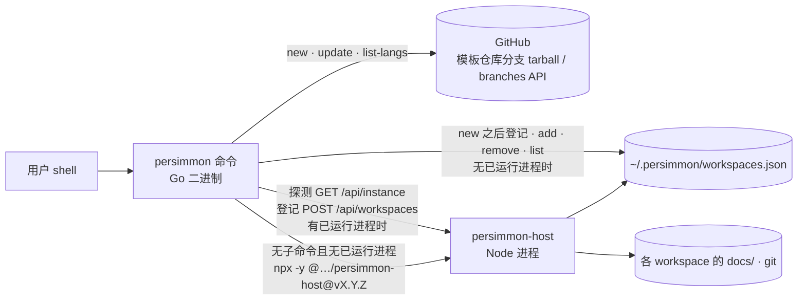
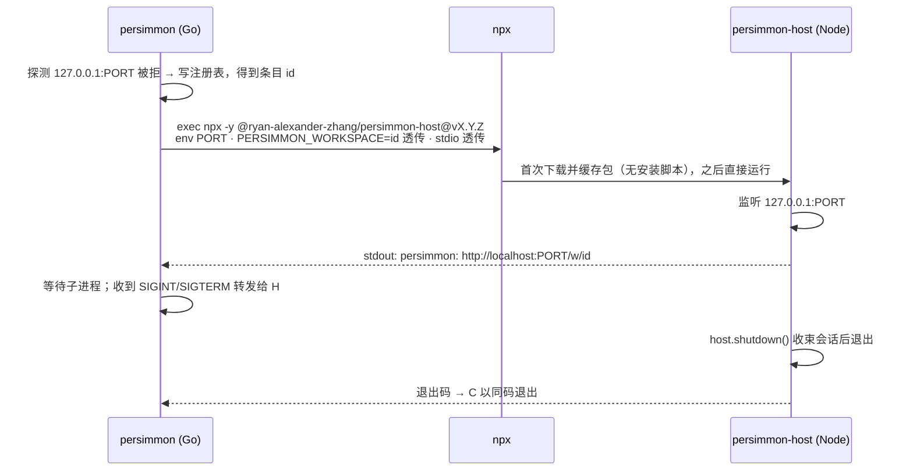
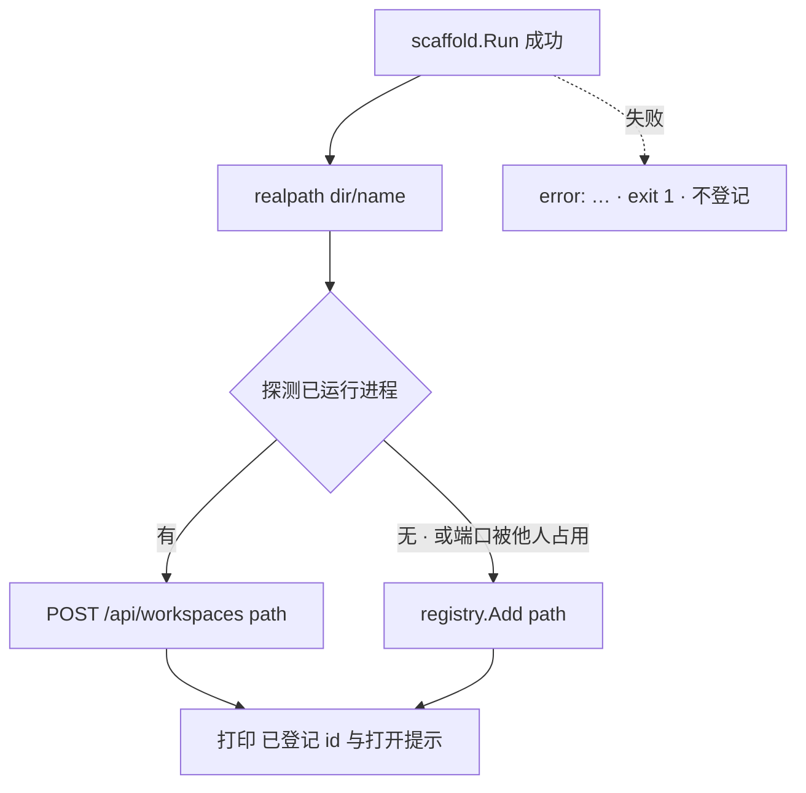

# Design: `persimmon` 命令——Go 二进制承担入口，host 包只做服务

> 一个 Go 二进制持有全部子命令、注册表的文件路径实现与启动握手，以 `npx`
> 按钉死版本拉起 Node 侧的 host 包；脚手架代码来自 ainpt，逻辑不改。结构由
> `decision-00020` 定，本文只写形状。

## 1. 形态



三个参与者，边界如下：

- **persimmon 命令**（`cli/`，Go）：解析命令、跑脚手架、直接读写注册表、
  探测与接入已运行进程、拉起 host。没有常驻状态。
- **host 包**（仓库根 npm 包 `@ryan-alexander-zhang/persimmon-host`）：今天的
  `Host` 类与 Web UI 原样；bin `persimmon-host` 只做「读 `PORT`、监听
  `127.0.0.1`、打印地址、SIGINT/SIGTERM 时 `host.shutdown()`」。不再有
  子命令、不再探测端口、不再登记。
- **模板仓库**：不变；`post_create` 仍只做 git 初始化两步。

## 2. 命令面

| 命令 | 行为 | 来源 |
| --- | --- | --- |
| `persimmon` | `design-00003` §8 的握手原样：向上找 `whiteboard.config.yaml`；探 `/api/instance`；有进程则经 `POST /api/workspaces` 登记并打印其地址；端口被他人占用则报「port N is already in use」exit 1；无进程则直接写注册表、**拉起 host**（§3）并转发其输出 | `bin/persimmon.js` `start()` |
| `persimmon new <name> [--lang] [--variant] [--dir] [--ref] [--set K=V]…` | ainpt `new` 原样；成功后以 `<dir>/<name>` 的 realpath 走 `add` 的路径登记（幂等），末行打印 `persimmon: 已登记 <id>，在项目内执行 persimmon 打开` | ainpt `cmdNew` + 本设计 |
| `persimmon update [--dir]` | ainpt `update` 原样（读 `.ainpt.json`，逐文件 `git merge-file` 三方合并） | ainpt `cmdUpdate` |
| `persimmon list-langs` | ainpt 原样：GitHub branches API 列 `lang/*` | ainpt `cmdLangs` |
| `persimmon add [path] [--name]` / `remove <id\|path>` / `list` | `design-00003` §8 子命令段原样，探测为**三态**：有已运行进程 → 经 API；端口被他人占用 → `add`/`remove` 报「port N is already in use」exit 1，`list` 退回读文件；无进程 → 直接读写文件。输出与退出码不变 | `bin/persimmon.js` `add/remove/list` |
| `persimmon version` | 打印编译期注入的版本；同一值用于 §3 的 host 版本 | ainpt |
| `config` | **不在本设计范围**（`decision-00020` §2 第 7 条） | — |

参数解析沿 ainpt 的做法：标准库 `flag`，每个子命令一个 `FlagSet`，两趟解析
让旗标可在位置参数前后。不引入 cobra 一类依赖——七个子命令不值一个框架。

## 3. 拉起 host



- **版本**：`vX.Y.Z` 由 goreleaser 以 `-ldflags -X main.version` 注入，与
  `persimmon version` 是同一个值；host 包在同一 tag 以同一版本号发布（§8）。
  开发态没有 tag 时 `version = dev`，此时**不**走 `npx`：`PERSIMMON_HOST`
  必须指向本地检出（值为目录，命令执行 `node <dir>/bin/host.js`，前置是
  该检出已 `npm run build` 出 `lib/` 与 `dist/web`）；设了 `PERSIMMON_HOST`
  时任何版本都优先它。
- **找不到 `npx`**（`exec.LookPath` 失败）：一句话 + exit 1——
  `persimmon: 打开白板需要 Node.js（未找到 npx）；new / update / add
  不受影响`。Node 版本下限由 host 包 `package.json` 的 `engines` 字段声明，
  命令不自己判版本。`new` / `update` / `add` / `remove` / `list` 不检查 Node。
- **地址打印**归 host：只有它知道实际监听到的端口（`PORT=0` 一类）；命令
  手里有的是条目 `id`（`registry.Add` 的返回值，同今天 `WorkspaceRegistry.add()`
  的签名），以环境变量 `PERSIMMON_WORKSPACE=<id>` 交给 host，host 打印时据此
  拼 `/w/<id>`；未设则印 `/`。接入已运行进程时地址由命令自己拼（端口已知）。
- **EADDRINUSE 兜底**不变：探测到监听之间端口被抢，host 以「port N is
  already in use」exit 1，命令同码退出。
- **pty 助手的可执行位**：npx 缓存安装不跑安装脚本，`src/pty.ts` 的
  `ensureExecutable` 已在运行时补 chmod（`issue-00030`），本设计把 `npx` 变成
  开板的唯一路径，正是该修复覆盖的形态；不新增实测义务。
- Node 端 `bin/host.js` 因此只剩约 40 行：构造 `Host({registryPath, version})`、
  `listen(PORT)`、`listening` 打印、`error` 报错、两个信号，外加 `--judge`
  查询模式（§4）。
  `WorkspaceRegistry`、`AvailabilityJudge`、`findRepoRoot` 留在 `lib/` 供
  Host 自用。

**追注（2026-09-08，`spec-00011` 第三十一轮修订轮）：`PORT` 由谁定。**
缺省值只有一处：**命令**解析 `PORT`（环境变量，缺省 4173，`spec-00011-FR-13`
的既有口径），探测用这个值，拉起 host 时把它**显式**写进子进程环境——host
因此从不需要知道缺省是多少。host 包单独启动时（`npm start`、`persimmon-host`
直接跑）照同一读法读 `PORT`，缺省仍是 4173，两处的常量是同一个值；这样
「命令起的 host」与「手起的 host」听同一个端口，而命令探的与 host 绑的永远
是同一个 `(127.0.0.1, PORT)`（`design-00003` §8 的「绑的地址与探的地址是
同一个」推广到端口）。

## 4. 注册表：两份实现，一份契约

`design-00003` §2 是唯一契约；Go 侧 `cli/internal/registry` 实现同一份：

- 读：整份校验（`version == 1`；每条 `id`/`name`/`path` 齐全；`id` 匹配
  `[a-z0-9-]+` 且不重复；`path` 绝对）；任一不合式即报错并指明文件路径与
  问题，**不改写文件**；文件不存在 = 空。
- 写：`MkdirAll` + `<path>.tmp` + `Rename`；失败尽力删暂存。
- `add`：`filepath.EvalSymlinks` 后查重，已有则返回既有条目、exit 0；`id`
  派生（小写、非 `[a-z0-9-]` 折 `-`、去首尾、合并连续、空取 `workspace`、
  冲突加 `-2`…）；`name` 缺省取 `id`。可登记的判定沿 `POST /api/workspaces`
  的 422 口径（路径存在、是目录、有 `whiteboard.config.yaml`）；配置非法与
  非 git 仓库不拒绝。
- `remove <id|path>`：路径形态先 realpath 再查到 `id`，其后按 `id` 删；不在
  注册表 → 报错 exit 1。`spec-00011-FR-5` 的「有运行中会话则拒绝」在无进程
  路径下**空成立**——没有进程就没有会话——不需要 Go 侧的实现或测试。
- `list`：无进程路径下的可用性判定次序同 `design-00003` §3 与
  `workspaceAvailability.ts`：missing → noGit → noConfig → invalidConfig。
  前三态 Go 复算（目录存在、`git rev-parse --show-toplevel` 等于该目录、
  配置文件存在）；**`invalidConfig` 需要流程配置的完整校验器**，Go 侧不复刻：
  命令改调 host 包的 `--judge` 模式（`persimmon-host --judge`：读注册表、跑
  `AvailabilityJudge`、以 JSON 印出五态即退，不监听）并原样呈现。这是一个
  查询模式，不是子命令；找不到 `npx` 时 `list` 退回 Go 复算的四态并把
  配置合法性显示为 `-`，同时提示需要 Node。FR-21 的五态口径因此在有 Node 的
  机器上保持不变。

**追注（2026-09-08，`spec-00011` 第三十一轮修订轮）：Go 侧算得出的是三种
**不可用**，不是三种「态」。** 上文的「前三态」指 `missing`、`noGit`、
`noConfig` 这三个**否定**结论：它们各自由一次本地检查独立判出，Go 复刻的就是
这三次检查。`available` 不在其中——它是走完包括配置校验在内的全部判定之后才
成立的结论，Go 侧无从产出。故找不到 `npx` 时的退让准确说是：命中三者之一的
条目照常标出原因，**没有命中的条目不断言「可用」**，其配置合法性一列显示 `-`
并附一句「完整判定需要 Node」（`spec-00011-FR-21` 的 `If` 分支持有这一行为，
本节持有它的机制）。**§4 上文与 §11 里剩下的三处「四态」一并按此读：
三种不可用 + 未断言。**

TS 侧 `workspaceRegistry.ts` 不改。两侧测试各自引用 `spec-00011-FR-2 / FR-3 /
FR-4 / FR-6 / FR-18 / FR-21` 的同一组用例名。不做跨语言共享 fixture——契约是
文档，两套用例名对齐已足够；漂移的代价是可见的（一侧红）。

## 5. `new` 与登记的闭环



脚手架失败不登记；登记失败（注册表不合式）**不回滚**已创建的项目，只报
注册表问题——项目目录是主产物，登记是附带动作，用户修好文件后
`persimmon add` 即可。`new` 遇端口被他人占用时不像 `add` 那样失败，直接写
文件：项目已经建好，不该因为一个无关进程占了端口而少登记一步。

## 6. 代码位置

```
persimmon/
├── cli/                         # Go；独立 go.mod，module github.com/ryan-alexander-zhang/persimmon/cli
│   ├── main.go                  # 子命令分发：ainpt main.go 迁入 + add/remove/list/无子命令
│   └── internal/
│       ├── scaffold/            # ainpt internal/scaffold 迁入，含 scaffold_test.go
│       ├── registry/            # §4
│       └── hostproc/            # 探测 /api/instance、经 API 登记、npx 拉起（§3）
├── .goreleaser.yaml             # 自 ainpt 迁入（改动见下）
├── install.sh                   # 自 ainpt 迁入：BIN=persimmon · REPO=persimmon；仍只 linux/darwin
├── .github/workflows/release.yml  # §8
├── bin/host.js                  # 原 bin/persimmon.js 瘦身（§3）
├── package.json                 # name @ryan-alexander-zhang/persimmon-host · bin { persimmon-host: bin/host.js }
├── src/ lib/ web/ test/ …       # 不变
```

- `go.mod` 放 `cli/` 而不是仓库根：根目录是 npm 包根，`files` 白名单已把
  `cli/` 排除在外；Go 工具链在 `cli/` 内自洽（`cd cli && go test ./...`）。
- 迁入的 Go 代码**逻辑不改**，改动穷举为：`main.go` 的 import 路径、`usage()`
  与 `version` 打印里的 `ainpt` 字样；`scaffold.go` 里四处用户可见字串——
  `:55` 提示 `ainpt list-langs`、`:331` 提示 `ainpt update`、`:374`
  「was this project created by ainpt?」、`:113` 临时目录前缀 `ainpt-*`。
  ainpt 的测试随行。
- `.goreleaser.yaml` 的改动：`project_name: persimmon`；`before.hooks` 的
  `go mod tidy` 在根目录没有 `go.mod` 会失败，改为在 `cli/` 内执行或删除；
  `builds[].dir: cli`；`release.github.name: persimmon`。`ldflags` 仍注入
  `main.version` / `main.owner` / `main.repo`。归档名模板不变，`install.sh`
  的 `${BIN}_${OS}_${ARCH}.tar.gz` 随 `BIN=persimmon` 对上。
- Windows：goreleaser 矩阵保留三平台；`new` / `update` / `add` 在 Windows 可用
  （ainpt 现状），安装方式是从 Release 页下载 zip；开板继承 host 包的平台
  支持（node-pty 在 Windows 未实测）。

**追注（2026-09-08，`spec-00012-persimmon-command` 定的校验和口径）：迁入的
`install.sh` 不照抄 ainpt 的尽力而为。** 本节只说「自 ainpt 迁入、改几处坐标」，
而校验和这一处口径是变的：**校验和不符，或校验和文件取到了却没有该归档那一行、
或该行不合式——中止并以非 0 退出，什么也不装**（ainpt 的脚本在这些情形下继续
安装）。**取不到校验和文件，或本机既无 `sha256sum` 也无 `shasum`——告警并继续
安装**：无从校验与校验失败是两件事，前者是环境缺件、后者是内容不对。此为
与迁入源的**有意偏离**，由 `spec-00012-persimmon-command` 持有条目与验收。

## 7. npm 包改名

- `name` → `@ryan-alexander-zhang/persimmon-host`；`bin` → `{ "persimmon-host":
  "bin/host.js" }`；`description` 改为服务本体；`files` 不变；`engines` 不变。
- 旧包 `@ryan-alexander-zhang/persimmon` 发一版 `npm deprecate`，消息指向新名与
  `install.sh`。
- 本仓库根 `README.md` 的安装段改为 `curl … install.sh | sh`。开发本仓库的
  两条命令：`npm start` = `node bin/host.js`（只起服务，不登记，前置
  `npm run build`）；`npm run build && PERSIMMON_HOST=$PWD go run ./cli` =
  完整握手 + 起服务。

> **追注（2026-09-08，根指南填充轮）**：上文 `go run ./cli` 在仓库根无法解析——
> `cli/` 是独立 module，仓库根没有 `go.mod`，`go` 报 `go.mod file not found`
> （以 ainpt 仓库在其父目录实测）。开发命令据实校正为
> `npm run build && PERSIMMON_HOST=$PWD go -C cli run .`（`go -C` 需 Go ≥ 1.21，
> 本设计钉 1.24）；`cd cli && go test ./...` 一类同理写作 `go -C cli …`。
> 同轮补记：§10 所列 Go 侧 gate 之外，`CODE_QUALITY.md` §2 另加一行覆盖率门
> （`go test -coverprofile` + 阈值脚本，随 plan 落地）——否则 `decision-00020` §4
> 的「新 Go 代码 90% 语句覆盖」没有可执行的把关。

## 8. 发布线

一个 tag、一条 workflow、两个产物：

```yaml
# .github/workflows/release.yml（形状，非最终文件）
on: { push: { tags: ['v*'] } }
jobs:
  release:
    steps:
      - checkout · setup-node 23 · npm ci · npm run build · npm test
      - npm version ${TAG#v} --no-git-tag-version · npm publish --access public   # NPM_TOKEN
      - setup-go 1.24 · goreleaser release --clean                              # GITHUB_TOKEN
```

- 顺序是 **npm 先、goreleaser 后**：Go 二进制钉死的版本必须在用户拿到二进制
  时已可 `npx` 到；反过来会有一段「二进制拉不到 host」的窗口。npm publish
  失败则整条 workflow 失败、不出 GitHub Release。npm 成功而 goreleaser 失败
  时 host 包多出一个没有配对二进制的版本——无害，重推 tag 即可。
- `package.json` 里的 `version` 不再手维护：发布时由 tag 写入。仓库内保留
  `0.0.0-dev` 一类占位。

## 9. 握手与 API 的不变项

`design-00003` §5 的 API 契约与 §8 的握手判定表一字不改；只有执行者从
`bin/persimmon.js` 换成 Go。`/api/instance` 的 `version` 仍只用于打印，不参与
判定：命令 `vX` 接入 host `vY` 照样接入，打印「接入 persimmon-host vY」，
用户自己决定是否重启。

## 10. 与本设计冲突的既有文档

以下 `active` 文档的陈述在本设计落地后不再为真，各随修订轮或 plan 据实改写
（改什么由那里持有，这里只登记冲突点）：

- `spec-00011` FR-20（包名 `@ryan-alexander-zhang/persimmon`、`npx @…/persimmon`
  安装形态）、FR-13/14 的执行者。
- `design-00003` §8「`ainpt new` 的登记属模板仓库」；§10 的包名、bin 名、
  入口文件、「代码位置」缺 `cli/`。
- `ARCHITECTURE.md` §2（无 Go 约束行；Node 约束行的主语是仓库而非 host 包）、
  §3（上下文图无命令节点与模板仓库邻居）、§5（目录树无 `cli/`）、§7
  「No CI pipeline yet」、§9（无 `decision-00020`）。
- `DEVELOPMENT.md` Commands、`TESTING.md`、`CODE_QUALITY.md` §2、
  `CODE_STYLE.md` Formatting：无 Go 口径。Go 侧的 gate 是 `gofmt -l`（format）
  与 `go vet`（static analysis）；复杂度/重复门在 TS 侧本就是 `(none yet)`
  （`CODE_QUALITY.md` §2 的既有空位），Go 侧不在本设计里补。
- `README.md` 安装段与命令表；ainpt 仓库与模板仓库 README 的安装说明。
- `CONTEXT.md`：词条「persimmon 命令」「host 包」已加入，「已运行进程」已改为
  指 host 进程。

plan 的实测义务（仓库内无从确认，不写成断言）：`npx -y <pkg>@<ver>` 在离线、
无 TTY 下的行为与是否把 stdio/信号透传给 bin；goreleaser `builds[].dir` 与
`before.hooks` 的工作目录；`npm version … && npm publish` 在同一 job 里对
「两产物配对」的保证；node-pty 在 Windows 的行为。

## 11. Trade-offs

- **Go 复刻注册表读写，而不是让 Go 在无进程时先拉起 host 再经 API 登记**：
  后者能把注册表实现收回一份，但 `add` 的语义就从「写一个文件」变成「起一个
  服务再关掉」，`persimmon new` 在无 Node 的机器上会因此失败。约百行 Go
  换一条独立于 Node 的 `new` → 登记链，值。
- **`npx` 而不是全局安装或内嵌**：见 `decision-00020` §3。代价是首次开板的
  下载时间。
- **`PERSIMMON_WORKSPACE` 环境变量而不是让命令自己打印地址**：命令有 id、
  host 有端口，两者只有一方能拼出完整地址；一个环境变量把 id 送过去比
  命令去解析 host 的输出稳。
- **无进程 `list` 借 host 包判可用性，而不是把流程配置校验器移植到 Go**：
  移植等于每次改配置 schema 改两处；接受 FR-21 退到四态则是需求回退。代价是
  `list` 在无进程时需要 Node——开板用户本来就有，无 Node 的机器退回四态并
  提示。域主于 2026-09-08 接受此读法。
- **不引入 cobra**：七个子命令、十来个旗标，标准库 `flag` 两趟解析（ainpt
  现状）够用；一个 CLI 框架带来的依赖与生成式帮助不值。
